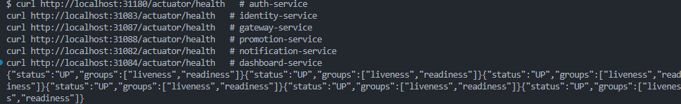
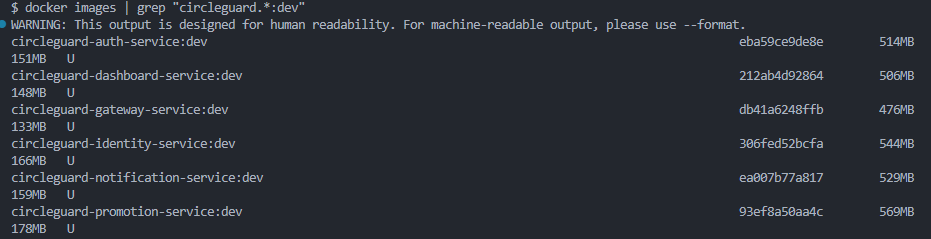
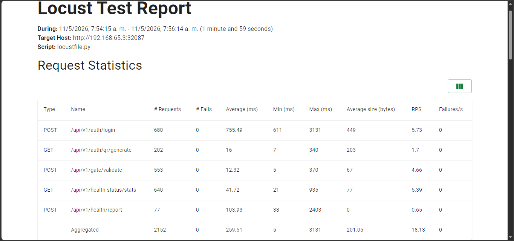
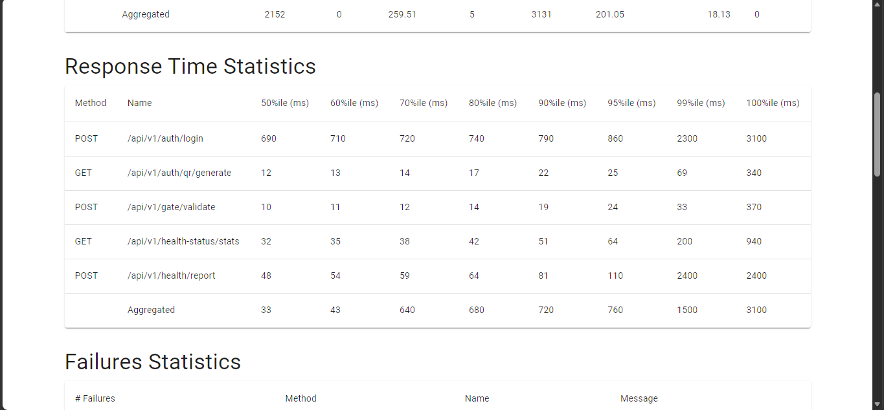
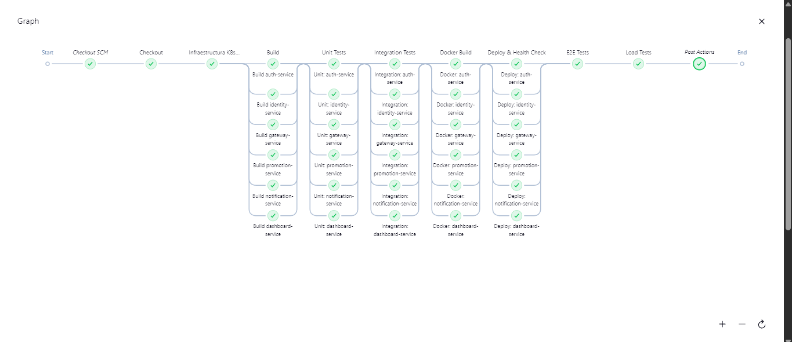
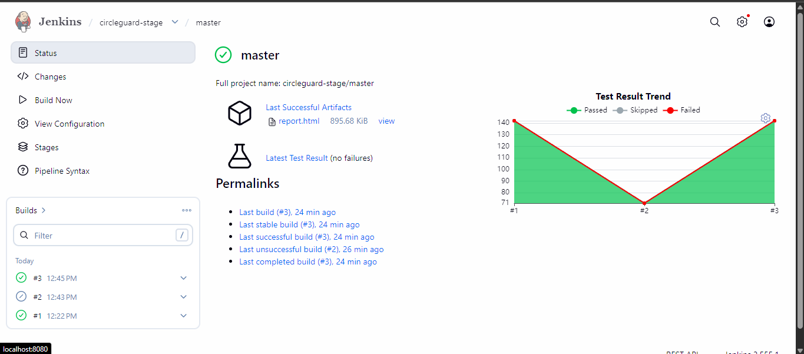

# Taller 2: Pruebas y Lanzamiento

## Descripción

Para este ejercicio, se deben configurar los pipelines necesarios para al menos seis microservicios del código disponible en:

```
https://github.com/jcmunozf/circle-guard-public
```

Al escoger los microservicios, se debe considerar que estos se comuniquen entre sí, para permitir la implementación de pruebas que los involucren.

---

## Actividades

### 1. 

# Punto 1: Configuración de Jenkins, Docker y Kubernetes

## Descripción

Este documento registra la configuración de las tres herramientas de infraestructura DevOps utilizadas en el proyecto CircleGuard: **Docker** (imágenes individuales por microservicio), **Jenkins** (servidor de integración continua) y **Kubernetes** (orquestador de contenedores mediante el clúster integrado de Docker Desktop con tipo de servicio NodePort).

---

## Servicios seleccionados

Se trabajará con los siguientes seis microservicios del repositorio CircleGuard:

| Microservicio | Puerto interno | NodePort Kubernetes |
|---|---|---|
| `circleguard-auth-service` | 8180 | 30180 |
| `circleguard-identity-service` | 8083 | 30083 |
| `circleguard-gateway-service` | 8087 | 30087 |
| `circleguard-promotion-service` | 8088 | 30088 |
| `circleguard-notification-service` | 8082 | 30082 |
| `circleguard-dashboard-service` | 8084 | 30084 |

La infraestructura de soporte (PostgreSQL, Neo4j, Kafka, Redis, OpenLDAP) se levanta de forma separada mediante `docker-compose.dev.yml`. Los pods de Kubernetes se conectan a ella a través de `host.docker.internal`.

---

## 1. Docker

### 1.1 Prerrequisitos

- Docker Desktop instalado y en ejecución.
- Java 21 y el wrapper de Gradle (`gradlew`) disponibles en el repositorio.

### 1.2 Estrategia de construcción de imágenes

Cada microservicio tiene su propio `Dockerfile` ubicado en su directorio raíz (`services/<nombre-servicio>/Dockerfile`). Se utiliza una construcción **multi-stage**:

- **Stage 1 (`builder`):** Usa `eclipse-temurin:21-jdk-jammy` para compilar el JAR con Gradle desde el monorepo.
- **Stage 2 (runtime):** Usa `eclipse-temurin:21-jre-jammy` (imagen más ligera) y copia únicamente el JAR resultante.

El contexto de `docker build` es siempre la **raíz del repositorio**, dado que Gradle necesita acceder a los archivos compartidos (`build.gradle.kts`, `settings.gradle.kts`, `gradle/`).

> **Nota:** Se añade `sed -i 's/\r$//' gradlew` antes de `chmod +x` para eliminar los caracteres de fin de línea Windows (`\r`) que impiden ejecutar el script dentro del contenedor Linux.

### 1.3 Dockerfiles

#### `services/circleguard-auth-service/Dockerfile`

```dockerfile
FROM eclipse-temurin:21-jdk-jammy AS builder
WORKDIR /workspace
COPY gradlew .
COPY gradle gradle
COPY build.gradle.kts .
COPY settings.gradle.kts .
COPY services/circleguard-auth-service services/circleguard-auth-service
RUN sed -i 's/\r$//' gradlew && chmod +x gradlew && \
    ./gradlew :services:circleguard-auth-service:bootJar --no-daemon -x test

FROM eclipse-temurin:21-jre-jammy
WORKDIR /app
COPY --from=builder /workspace/services/circleguard-auth-service/build/libs/*.jar app.jar
EXPOSE 8180
ENTRYPOINT ["java", "-jar", "app.jar"]
```

#### `services/circleguard-identity-service/Dockerfile`

```dockerfile
FROM eclipse-temurin:21-jdk-jammy AS builder
WORKDIR /workspace
COPY gradlew .
COPY gradle gradle
COPY build.gradle.kts .
COPY settings.gradle.kts .
COPY services/circleguard-identity-service services/circleguard-identity-service
RUN sed -i 's/\r$//' gradlew && chmod +x gradlew && \
    ./gradlew :services:circleguard-identity-service:bootJar --no-daemon -x test

FROM eclipse-temurin:21-jre-jammy
WORKDIR /app
COPY --from=builder /workspace/services/circleguard-identity-service/build/libs/*.jar app.jar
EXPOSE 8083
ENTRYPOINT ["java", "-jar", "app.jar"]
```

#### `services/circleguard-gateway-service/Dockerfile`

```dockerfile
FROM eclipse-temurin:21-jdk-jammy AS builder
WORKDIR /workspace
COPY gradlew .
COPY gradle gradle
COPY build.gradle.kts .
COPY settings.gradle.kts .
COPY services/circleguard-gateway-service services/circleguard-gateway-service
RUN sed -i 's/\r$//' gradlew && chmod +x gradlew && \
    ./gradlew :services:circleguard-gateway-service:bootJar --no-daemon -x test

FROM eclipse-temurin:21-jre-jammy
WORKDIR /app
COPY --from=builder /workspace/services/circleguard-gateway-service/build/libs/*.jar app.jar
EXPOSE 8087
ENTRYPOINT ["java", "-jar", "app.jar"]
```

#### `services/circleguard-promotion-service/Dockerfile`

```dockerfile
FROM eclipse-temurin:21-jdk-jammy AS builder
WORKDIR /workspace
COPY gradlew .
COPY gradle gradle
COPY build.gradle.kts .
COPY settings.gradle.kts .
COPY services/circleguard-promotion-service services/circleguard-promotion-service
RUN sed -i 's/\r$//' gradlew && chmod +x gradlew && \
    ./gradlew :services:circleguard-promotion-service:bootJar --no-daemon -x test

FROM eclipse-temurin:21-jre-jammy
WORKDIR /app
COPY --from=builder /workspace/services/circleguard-promotion-service/build/libs/*.jar app.jar
EXPOSE 8088
ENTRYPOINT ["java", "-jar", "app.jar"]
```

#### `services/circleguard-notification-service/Dockerfile`

```dockerfile
FROM eclipse-temurin:21-jdk-jammy AS builder
WORKDIR /workspace
COPY gradlew .
COPY gradle gradle
COPY build.gradle.kts .
COPY settings.gradle.kts .
COPY services/circleguard-notification-service services/circleguard-notification-service
RUN sed -i 's/\r$//' gradlew && chmod +x gradlew && \
    ./gradlew :services:circleguard-notification-service:bootJar --no-daemon -x test

FROM eclipse-temurin:21-jre-jammy
WORKDIR /app
COPY --from=builder /workspace/services/circleguard-notification-service/build/libs/*.jar app.jar
EXPOSE 8082
ENTRYPOINT ["java", "-jar", "app.jar"]
```

#### `services/circleguard-dashboard-service/Dockerfile`

```dockerfile
FROM eclipse-temurin:21-jdk-jammy AS builder
WORKDIR /workspace
COPY gradlew .
COPY gradle gradle
COPY build.gradle.kts .
COPY settings.gradle.kts .
COPY services/circleguard-dashboard-service services/circleguard-dashboard-service
RUN sed -i 's/\r$//' gradlew && chmod +x gradlew && \
    ./gradlew :services:circleguard-dashboard-service:bootJar --no-daemon -x test

FROM eclipse-temurin:21-jre-jammy
WORKDIR /app
COPY --from=builder /workspace/services/circleguard-dashboard-service/build/libs/*.jar app.jar
EXPOSE 8084
ENTRYPOINT ["java", "-jar", "app.jar"]
```

### 1.4 Construcción de las imágenes

Los siguientes comandos se ejecutan desde la **raíz del repositorio**:

```powershell
docker build -f services/circleguard-auth-service/Dockerfile        -t circleguard-auth-service:latest        .
docker build -f services/circleguard-identity-service/Dockerfile     -t circleguard-identity-service:latest     .
docker build -f services/circleguard-gateway-service/Dockerfile      -t circleguard-gateway-service:latest      .
docker build -f services/circleguard-promotion-service/Dockerfile    -t circleguard-promotion-service:latest    .
docker build -f services/circleguard-notification-service/Dockerfile -t circleguard-notification-service:latest .
docker build -f services/circleguard-dashboard-service/Dockerfile    -t circleguard-dashboard-service:latest    .
```

### 1.5 Verificación: listado de imágenes

Una vez construidas todas las imágenes, se verifica su existencia con:

```powershell
docker images | grep "circleguard.*latest"
```


---

## 2. Jenkins

Jenkins se ejecuta como **contenedor Docker** integrado en `docker-compose.dev.yml`. La imagen oficial no incluye Docker CLI ni `kubectl`, por lo que se utiliza una imagen personalizada definida en `jenkins/Dockerfile`.

### 2.1 `jenkins/Dockerfile`

```dockerfile
FROM jenkins/jenkins:lts-jdk21

USER root

# Docker CLI
RUN apt-get update && apt-get install -y \
    apt-transport-https ca-certificates curl gnupg lsb-release && \
    curl -fsSL https://download.docker.com/linux/debian/gpg \
      | gpg --dearmor -o /usr/share/keyrings/docker-archive-keyring.gpg && \
    echo "deb [arch=amd64 signed-by=/usr/share/keyrings/docker-archive-keyring.gpg] \
      https://download.docker.com/linux/debian $(lsb_release -cs) stable" \
      | tee /etc/apt/sources.list.d/docker.list > /dev/null && \
    apt-get update && apt-get install -y docker-ce-cli && \
    rm -rf /var/lib/apt/lists/*

# kubectl
RUN curl -LO "https://dl.k8s.io/release/$(curl -Ls https://dl.k8s.io/release/stable.txt)/bin/linux/amd64/kubectl" && \
    install -o root -g root -m 0755 kubectl /usr/local/bin/kubectl && \
    rm kubectl

# Permite que jenkins use el socket de Docker
RUN groupadd -f docker && usermod -aG docker jenkins

USER jenkins
```

| Capa | Propósito |
|---|---|
| `lts-jdk21` | Base oficial con Java 21 — necesario para compilar con Gradle |
| Docker CLI | Permite ejecutar `docker build` y `docker tag` desde los stages del pipeline |
| kubectl | Permite aplicar manifiestos K8s y verificar deployments desde el pipeline |
| `usermod -aG docker jenkins` | Permite al usuario `jenkins` usar el socket de Docker sin `sudo` |

### 2.2 Servicio Jenkins en `docker-compose.dev.yml`

```yaml
jenkins:
  build:
    context: .
    dockerfile: jenkins/Dockerfile
  container_name: jenkins
  ports:
    - "8080:8080"
    - "50000:50000"
  volumes:
    - jenkins_home:/var/jenkins_home
    - /var/run/docker.sock:/var/run/docker.sock
  environment:
    - KUBECONFIG=/var/jenkins_home/.kube/config
  restart: unless-stopped
```

El volumen `jenkins_home` se declara como **externo** para que Compose reutilice el volumen existente en lugar de crear uno nuevo con prefijo (`circle-guard-public_jenkins_home`):

```yaml
volumes:
  jenkins_home:
    external: true
```

### 2.3 Levantar Jenkins

```powershell
# Primera vez: crear el volumen manualmente
docker volume create jenkins_home

# Construir la imagen personalizada y levantar el contenedor
docker-compose -f docker-compose.dev.yml build jenkins
docker-compose -f docker-compose.dev.yml up -d jenkins
```

### 2.4 Obtener la contraseña inicial

```powershell
docker exec jenkins cat /var/jenkins_home/secrets/initialAdminPassword
```

### 2.5 Instalación de plugins sugeridos

Seleccionar **Install suggested plugins** y esperar a que finalice la instalación automática.


### 2.6 Creación del usuario administrador

Completar el formulario con nombre de usuario, contraseña y correo, luego hacer clic en **Save and Continue**.


### 2.7 Confirmación de URL de Jenkins

Confirmar la URL de la instancia (`http://localhost:8080`) y hacer clic en **Save and Finish**.


### 2.8 Instalación de plugins adicionales

Ir a **Manage Jenkins → Plugins → Available plugins** e instalar:

| Plugin | Propósito |
|---|---|
| Docker Pipeline | Permite construir imágenes Docker desde un `Jenkinsfile` |
| Kubernetes CLI | Permite ejecutar `kubectl` desde pipelines |


### 2.9 Configurar el kubeconfig dentro del contenedor

El contenedor necesita acceso al kubeconfig del host para que `kubectl` alcance el clúster de Docker Desktop. Además, la URL del API server debe cambiarse de `127.0.0.1` a `host.docker.internal`, ya que dentro del contenedor `127.0.0.1` apunta al propio contenedor.

```powershell
# Copiar el kubeconfig al volumen de Jenkins
docker exec -u root jenkins mkdir -p /var/jenkins_home/.kube
docker cp "$env:USERPROFILE\.kube\config" jenkins:/var/jenkins_home/.kube/config

# Ajustar la URL del API server para acceso desde el contenedor
docker exec -u root jenkins sed -i `
  's|https://127.0.0.1|https://host.docker.internal|g' `
  /var/jenkins_home/.kube/config
```

### 2.10 Verificación de herramientas en el contenedor

```powershell
docker exec jenkins java -version
# openjdk version "21.x.x"

docker exec jenkins docker --version
# Docker version 29.x.x

docker exec jenkins kubectl version --client
# gitVersion: v1.x.x

docker exec jenkins kubectl get nodes
# NAME             STATUS   ROLES           AGE
# docker-desktop   Ready    control-plane   ...
```


---

## 3. Kubernetes

Se utiliza el clúster de Kubernetes integrado en **Docker Desktop**. Los microservicios se exponen al host mediante servicios de tipo `NodePort`.

### 3.1 Verificar el clúster

```powershell
kubectl cluster-info
```


```powershell
kubectl get nodes
```


### 3.2 Namespace

Se crea un namespace dedicado para aislar todos los recursos del proyecto:

**`k8s/namespace.yaml`**
```yaml
apiVersion: v1
kind: Namespace
metadata:
  name: circleguard
```

```powershell
kubectl apply -f k8s/namespace.yaml
```


### 3.3 ConfigMap de infraestructura

El `ConfigMap` centraliza las URLs de los servicios de infraestructura. Los pods usan `host.docker.internal` para alcanzar los contenedores levantados por `docker-compose.dev.yml` en el host.

> **Nota:** PostgreSQL se expone en el puerto `5433` del host (en lugar del estándar `5432`) para evitar conflicto con una instalación local de PostgreSQL en Windows.

**`k8s/configmap-infra.yaml`**
```yaml
apiVersion: v1
kind: ConfigMap
metadata:
  name: infra-config
  namespace: circleguard
data:
  POSTGRES_HOST: "host.docker.internal"
  POSTGRES_PORT: "5433"
  NEO4J_URI: "bolt://host.docker.internal:7687"
  NEO4J_USERNAME: "neo4j"
  NEO4J_PASSWORD: "password"
  KAFKA_BOOTSTRAP: "host.docker.internal:9092"
  REDIS_HOST: "host.docker.internal"
  REDIS_PORT: "6379"
  LDAP_URL: "ldap://host.docker.internal:389"
  LDAP_BASE: "dc=circleguard,dc=edu"
  LDAP_USERNAME: "cn=admin,dc=circleguard,dc=edu"
  LDAP_PASSWORD: "admin"
  DB_USERNAME: "admin"
  DB_PASSWORD: "password"
```

```powershell
kubectl apply -f k8s/configmap-infra.yaml
```


### 3.4 Manifiestos por microservicio

Cada microservicio tiene dos recursos Kubernetes: un `Deployment` y un `Service` de tipo `NodePort`.

La variable de entorno `MANAGEMENT_HEALTH_PROBES_ENABLED=true` activa los grupos de salud nativos de Kubernetes en Spring Boot, habilitando los endpoints `/actuator/health/readiness` y `/actuator/health/liveness` de forma independiente. La sonda de readiness apunta a `/actuator/health/readiness`, que únicamente verifica el estado interno de la aplicación (sin depender de servicios externos como Kafka o LDAP).

#### 3.4.1 circleguard-auth-service

**`k8s/auth-service/deployment.yaml`**
```yaml
apiVersion: apps/v1
kind: Deployment
metadata:
  name: circleguard-auth-service
  namespace: circleguard
  labels:
    app: circleguard-auth-service
spec:
  replicas: 1
  selector:
    matchLabels:
      app: circleguard-auth-service
  template:
    metadata:
      labels:
        app: circleguard-auth-service
    spec:
      containers:
        - name: circleguard-auth-service
          image: circleguard-auth-service:latest
          imagePullPolicy: Never
          ports:
            - containerPort: 8180
          env:
            - name: SPRING_DATASOURCE_URL
              value: "jdbc:postgresql://host.docker.internal:5433/circleguard_auth"
            - name: SPRING_DATASOURCE_USERNAME
              valueFrom:
                configMapKeyRef:
                  name: infra-config
                  key: DB_USERNAME
            - name: SPRING_DATASOURCE_PASSWORD
              valueFrom:
                configMapKeyRef:
                  name: infra-config
                  key: DB_PASSWORD
            - name: SPRING_LDAP_URLS
              valueFrom:
                configMapKeyRef:
                  name: infra-config
                  key: LDAP_URL
            - name: SPRING_LDAP_BASE
              valueFrom:
                configMapKeyRef:
                  name: infra-config
                  key: LDAP_BASE
            - name: SPRING_LDAP_USERNAME
              valueFrom:
                configMapKeyRef:
                  name: infra-config
                  key: LDAP_USERNAME
            - name: SPRING_LDAP_PASSWORD
              valueFrom:
                configMapKeyRef:
                  name: infra-config
                  key: LDAP_PASSWORD
            - name: MANAGEMENT_HEALTH_PROBES_ENABLED
              value: "true"
          readinessProbe:
            httpGet:
              path: /actuator/health/readiness
              port: 8180
            initialDelaySeconds: 30
            periodSeconds: 10
            failureThreshold: 5
```

**`k8s/auth-service/service.yaml`**
```yaml
apiVersion: v1
kind: Service
metadata:
  name: circleguard-auth-service
  namespace: circleguard
spec:
  type: NodePort
  selector:
    app: circleguard-auth-service
  ports:
    - protocol: TCP
      port: 8180
      targetPort: 8180
      nodePort: 30180
```

#### 3.4.2 circleguard-identity-service

**`k8s/identity-service/deployment.yaml`**
```yaml
apiVersion: apps/v1
kind: Deployment
metadata:
  name: circleguard-identity-service
  namespace: circleguard
  labels:
    app: circleguard-identity-service
spec:
  replicas: 1
  selector:
    matchLabels:
      app: circleguard-identity-service
  template:
    metadata:
      labels:
        app: circleguard-identity-service
    spec:
      containers:
        - name: circleguard-identity-service
          image: circleguard-identity-service:latest
          imagePullPolicy: Never
          ports:
            - containerPort: 8083
          env:
            - name: SPRING_DATASOURCE_URL
              value: "jdbc:postgresql://host.docker.internal:5433/circleguard_identity"
            - name: SPRING_DATASOURCE_USERNAME
              valueFrom:
                configMapKeyRef:
                  name: infra-config
                  key: DB_USERNAME
            - name: SPRING_DATASOURCE_PASSWORD
              valueFrom:
                configMapKeyRef:
                  name: infra-config
                  key: DB_PASSWORD
            - name: SPRING_KAFKA_BOOTSTRAP_SERVERS
              valueFrom:
                configMapKeyRef:
                  name: infra-config
                  key: KAFKA_BOOTSTRAP
            - name: MANAGEMENT_HEALTH_PROBES_ENABLED
              value: "true"
          readinessProbe:
            httpGet:
              path: /actuator/health/readiness
              port: 8083
            initialDelaySeconds: 30
            periodSeconds: 10
            failureThreshold: 5
```

**`k8s/identity-service/service.yaml`**
```yaml
apiVersion: v1
kind: Service
metadata:
  name: circleguard-identity-service
  namespace: circleguard
spec:
  type: NodePort
  selector:
    app: circleguard-identity-service
  ports:
    - protocol: TCP
      port: 8083
      targetPort: 8083
      nodePort: 30083
```

#### 3.4.3 circleguard-gateway-service

**`k8s/gateway-service/deployment.yaml`**
```yaml
apiVersion: apps/v1
kind: Deployment
metadata:
  name: circleguard-gateway-service
  namespace: circleguard
  labels:
    app: circleguard-gateway-service
spec:
  replicas: 1
  selector:
    matchLabels:
      app: circleguard-gateway-service
  template:
    metadata:
      labels:
        app: circleguard-gateway-service
    spec:
      containers:
        - name: circleguard-gateway-service
          image: circleguard-gateway-service:latest
          imagePullPolicy: Never
          ports:
            - containerPort: 8087
          env:
            - name: SPRING_DATA_REDIS_HOST
              valueFrom:
                configMapKeyRef:
                  name: infra-config
                  key: REDIS_HOST
            - name: SPRING_DATA_REDIS_PORT
              valueFrom:
                configMapKeyRef:
                  name: infra-config
                  key: REDIS_PORT
            - name: MANAGEMENT_HEALTH_PROBES_ENABLED
              value: "true"
          readinessProbe:
            httpGet:
              path: /actuator/health/readiness
              port: 8087
            initialDelaySeconds: 20
            periodSeconds: 10
            failureThreshold: 5
```

**`k8s/gateway-service/service.yaml`**
```yaml
apiVersion: v1
kind: Service
metadata:
  name: circleguard-gateway-service
  namespace: circleguard
spec:
  type: NodePort
  selector:
    app: circleguard-gateway-service
  ports:
    - protocol: TCP
      port: 8087
      targetPort: 8087
      nodePort: 30087
```

#### 3.4.4 circleguard-promotion-service

**`k8s/promotion-service/deployment.yaml`**
```yaml
apiVersion: apps/v1
kind: Deployment
metadata:
  name: circleguard-promotion-service
  namespace: circleguard
  labels:
    app: circleguard-promotion-service
spec:
  replicas: 1
  selector:
    matchLabels:
      app: circleguard-promotion-service
  template:
    metadata:
      labels:
        app: circleguard-promotion-service
    spec:
      containers:
        - name: circleguard-promotion-service
          image: circleguard-promotion-service:latest
          imagePullPolicy: Never
          ports:
            - containerPort: 8088
          env:
            - name: SPRING_DATASOURCE_URL
              value: "jdbc:postgresql://host.docker.internal:5433/circleguard_promotion"
            - name: SPRING_DATASOURCE_USERNAME
              valueFrom:
                configMapKeyRef:
                  name: infra-config
                  key: DB_USERNAME
            - name: SPRING_DATASOURCE_PASSWORD
              valueFrom:
                configMapKeyRef:
                  name: infra-config
                  key: DB_PASSWORD
            - name: SPRING_NEO4J_URI
              valueFrom:
                configMapKeyRef:
                  name: infra-config
                  key: NEO4J_URI
            - name: SPRING_NEO4J_AUTHENTICATION_USERNAME
              valueFrom:
                configMapKeyRef:
                  name: infra-config
                  key: NEO4J_USERNAME
            - name: SPRING_NEO4J_AUTHENTICATION_PASSWORD
              valueFrom:
                configMapKeyRef:
                  name: infra-config
                  key: NEO4J_PASSWORD
            - name: SPRING_DATA_REDIS_HOST
              valueFrom:
                configMapKeyRef:
                  name: infra-config
                  key: REDIS_HOST
            - name: SPRING_DATA_REDIS_PORT
              valueFrom:
                configMapKeyRef:
                  name: infra-config
                  key: REDIS_PORT
            - name: SPRING_KAFKA_BOOTSTRAP_SERVERS
              valueFrom:
                configMapKeyRef:
                  name: infra-config
                  key: KAFKA_BOOTSTRAP
            - name: MANAGEMENT_HEALTH_PROBES_ENABLED
              value: "true"
          readinessProbe:
            httpGet:
              path: /actuator/health/readiness
              port: 8088
            initialDelaySeconds: 40
            periodSeconds: 10
            failureThreshold: 5
```

**`k8s/promotion-service/service.yaml`**
```yaml
apiVersion: v1
kind: Service
metadata:
  name: circleguard-promotion-service
  namespace: circleguard
spec:
  type: NodePort
  selector:
    app: circleguard-promotion-service
  ports:
    - protocol: TCP
      port: 8088
      targetPort: 8088
      nodePort: 30088
```

#### 3.4.5 circleguard-notification-service

**`k8s/notification-service/deployment.yaml`**
```yaml
apiVersion: apps/v1
kind: Deployment
metadata:
  name: circleguard-notification-service
  namespace: circleguard
  labels:
    app: circleguard-notification-service
spec:
  replicas: 1
  selector:
    matchLabels:
      app: circleguard-notification-service
  template:
    metadata:
      labels:
        app: circleguard-notification-service
    spec:
      containers:
        - name: circleguard-notification-service
          image: circleguard-notification-service:latest
          imagePullPolicy: Never
          ports:
            - containerPort: 8082
          env:
            - name: SPRING_KAFKA_BOOTSTRAP_SERVERS
              valueFrom:
                configMapKeyRef:
                  name: infra-config
                  key: KAFKA_BOOTSTRAP
            - name: SPRING_MAIL_HOST
              value: "host.docker.internal"
            - name: SPRING_MAIL_PORT
              value: "25"
            - name: MANAGEMENT_HEALTH_PROBES_ENABLED
              value: "true"
          readinessProbe:
            httpGet:
              path: /actuator/health/readiness
              port: 8082
            initialDelaySeconds: 30
            periodSeconds: 10
            failureThreshold: 5
```

**`k8s/notification-service/service.yaml`**
```yaml
apiVersion: v1
kind: Service
metadata:
  name: circleguard-notification-service
  namespace: circleguard
spec:
  type: NodePort
  selector:
    app: circleguard-notification-service
  ports:
    - protocol: TCP
      port: 8082
      targetPort: 8082
      nodePort: 30082
```

#### 3.4.6 circleguard-dashboard-service

**`k8s/dashboard-service/deployment.yaml`**
```yaml
apiVersion: apps/v1
kind: Deployment
metadata:
  name: circleguard-dashboard-service
  namespace: circleguard
  labels:
    app: circleguard-dashboard-service
spec:
  replicas: 1
  selector:
    matchLabels:
      app: circleguard-dashboard-service
  template:
    metadata:
      labels:
        app: circleguard-dashboard-service
    spec:
      containers:
        - name: circleguard-dashboard-service
          image: circleguard-dashboard-service:latest
          imagePullPolicy: Never
          ports:
            - containerPort: 8084
          env:
            - name: SPRING_DATASOURCE_URL
              value: "jdbc:postgresql://host.docker.internal:5433/circleguard_dashboard"
            - name: SPRING_DATASOURCE_USERNAME
              valueFrom:
                configMapKeyRef:
                  name: infra-config
                  key: DB_USERNAME
            - name: SPRING_DATASOURCE_PASSWORD
              valueFrom:
                configMapKeyRef:
                  name: infra-config
                  key: DB_PASSWORD
            - name: MANAGEMENT_HEALTH_PROBES_ENABLED
              value: "true"
          readinessProbe:
            httpGet:
              path: /actuator/health/readiness
              port: 8084
            initialDelaySeconds: 30
            periodSeconds: 10
            failureThreshold: 5
```

**`k8s/dashboard-service/service.yaml`**
```yaml
apiVersion: v1
kind: Service
metadata:
  name: circleguard-dashboard-service
  namespace: circleguard
spec:
  type: NodePort
  selector:
    app: circleguard-dashboard-service
  ports:
    - protocol: TCP
      port: 8084
      targetPort: 8084
      nodePort: 30084
```

### 3.5 Aplicar todos los manifiestos

Con la infraestructura de soporte activa (`docker-compose.dev.yml`), se aplican todos los manifiestos:

```powershell
kubectl apply -f k8s/namespace.yaml
kubectl apply -f k8s/configmap-infra.yaml
kubectl apply -f k8s/auth-service/
kubectl apply -f k8s/identity-service/
kubectl apply -f k8s/gateway-service/
kubectl apply -f k8s/promotion-service/
kubectl apply -f k8s/notification-service/
kubectl apply -f k8s/dashboard-service/
```


### 3.6 Verificación de pods y servicios

```powershell
kubectl get pods -n circleguard
```


```powershell
kubectl get services -n circleguard
```


### 3.7 Resumen de puertos expuestos

| Microservicio | Puerto interno | NodePort | URL de acceso |
|---|---|---|---|
| auth-service | 8180 | 30180 | `http://localhost:30180` |
| identity-service | 8083 | 30083 | `http://localhost:30083` |
| gateway-service | 8087 | 30087 | `http://localhost:30087` |
| promotion-service | 8088 | 30088 | `http://localhost:30088` |
| notification-service | 8082 | 30082 | `http://localhost:30082` |
| dashboard-service | 8084 | 30084 | `http://localhost:30084` |


---

### 2. 
# Punto 2 — Pipelines en Entorno de Desarrollo (Dev Environment)

## Introducción

El objetivo de este punto es definir los pipelines de CI/CD que permitan construir, probar y desplegar los seis microservicios de **CircleGuard** en un entorno de desarrollo local. Se utiliza un único archivo `Jenkinsfile.dev` en la raíz del repositorio y un **Multibranch Pipeline** en Jenkins, de manera que cada rama del repositorio tenga su propio historial de ejecuciones.

### Estrategia de namespaces por entorno

El proyecto adopta la convención de **un namespace de Kubernetes por tipo de entorno**:

| Entorno | Namespace K8s | Archivo de namespace | Tag de imagen Docker |
|---|---|---|---|
| Desarrollo | `circleguard-dev` | `k8s/namespace-dev.yaml` | `:dev` |
| Stage | `circleguard-stage` | `k8s/namespace-stage.yaml` *(punto 4)* | `:stage` |
| Producción | `circleguard` | `k8s/namespace.yaml` *(punto 5)* | `:latest` |

Este aislamiento garantiza que los despliegues de cada entorno no interfieran entre sí. Los NodePorts son **cluster-wide** (no se pueden repetir entre namespaces), por lo que el entorno dev usa el rango `31xxx` para coexistir con producción (`30xxx`) en el mismo clúster.

### ¿Por qué Multibranch Pipeline?

Un **Multibranch Pipeline** escanea automáticamente las ramas del repositorio y crea un sub-job por cada rama que contenga el archivo de pipeline configurado (`Jenkinsfile.dev`). Esto permite que la rama `master` y cualquier rama de feature tengan historial de builds independiente, sin configuración manual por rama.

### Servicios incluidos

| Servicio | Puerto interno | NodePort dev (31xxx) | NodePort prod (30xxx) |
|---|---|---|---|
| `circleguard-auth-service` | 8180 | 31180 | 30180 |
| `circleguard-identity-service` | 8083 | 31083 | 30083 |
| `circleguard-gateway-service` | 8087 | 31087 | 30087 |
| `circleguard-promotion-service` | 8088 | 31088 | 30088 |
| `circleguard-notification-service` | 8082 | 31082 | 30082 |
| `circleguard-dashboard-service` | 8084 | 31084 | 30084 |

---

## Configuración del Multibranch Pipeline en Jenkins

### Paso 1 — Crear nuevo item

1. En el dashboard de Jenkins, hacer clic en **"New Item"**.
2. Ingresar el nombre: `circleguard-dev`.
3. Seleccionar el tipo **"Multibranch Pipeline"** y hacer clic en **OK**.


### Paso 2 — Configurar la fuente del repositorio

En la sección **Branch Sources → Add source → Git**:

| Campo | Valor |
|---|---|
| Project Repository | URL del repositorio (local o remoto) |

### Paso 3 — Configurar el Script Path

En la sección **Build Configuration**:

| Campo | Valor |
|---|---|
| Mode | `by Jenkinsfile` |
| Script Path | `Jenkinsfile.dev` |

Esto le indica a Jenkins que el pipeline de desarrollo se define en `Jenkinsfile.dev` en la raíz del repositorio, en lugar del `Jenkinsfile` estándar.


### Paso 4 — Escaneo de ramas

Al guardar, Jenkins realiza automáticamente un **Branch Indexing**: descubre todas las ramas que contengan `Jenkinsfile.dev` y crea un sub-job para cada una.


---

## Prerequisito: infraestructura externa

Los microservicios con dependencias de base de datos (auth, identity, dashboard, promotion) fallan al iniciar si PostgreSQL o Neo4j no están disponibles. La infraestructura debe estar activa **antes** de disparar el pipeline:

```bash
docker-compose -f docker-compose.dev.yml up -d
docker-compose -f docker-compose.dev.yml ps
```

Los pods de Kubernetes se conectan a los contenedores de Docker Compose a través de `host.docker.internal` (nombre de host especial que resuelve al host desde dentro de un contenedor).

---

## Estructura del `Jenkinsfile.dev`

```
circle-guard-public/
├── Jenkinsfile.dev              ← pipeline del entorno dev
└── k8s/
    ├── namespace-dev.yaml       ← namespace exclusivo del entorno dev
    ├── configmap-infra.yaml
    └── <service>/
        ├── deployment.yaml
        └── service.yaml
```

### Variables de entorno

```groovy
environment {
    KUBE_NAMESPACE = 'circleguard-dev'
    ENV_TAG        = 'dev'
}
```

`KUBE_NAMESPACE` determina el namespace destino de todos los `kubectl` del pipeline. `ENV_TAG` es el tag estable de la imagen Docker para este entorno.

---

### Stage: Checkout

```groovy
stage('Checkout') {
    steps {
        checkout scm
    }
}
```

Clona o actualiza el código fuente usando la configuración SCM del Multibranch Pipeline.

---

### Stage: Infraestructura K8s Base

```groovy
stage('Infraestructura K8s Base') {
    steps {
        sh 'kubectl apply -f k8s/namespace-dev.yaml'
        sh "sed 's/namespace: circleguard/namespace: circleguard-dev/g' k8s/configmap-infra.yaml | kubectl apply -f -"
    }
}
```

Aplica los recursos de Kubernetes compartidos **antes** de que los servicios individuales se desplieguen:

- **`k8s/namespace-dev.yaml`** — crea el namespace `circleguard-dev` si no existe.
- **ConfigMap con `sed`** — los manifiestos en `k8s/` tienen `namespace: circleguard` (producción). El pipeline usa `sed` para sustituir el namespace al vuelo, sin modificar los archivos originales. Esta misma técnica se repite en cada stage de deploy.

---

### Stage: Servicios (parallel)

```groovy
stage('Servicios') {
    parallel {
        stage('auth-service') { stages { ... } }
        stage('identity-service') { stages { ... } }
        // ... 4 más
    }
}
```

El bloque `parallel` ejecuta los seis servicios de forma **concurrente**. Cada uno avanza a través de sus cinco sub-stages de forma independiente, reduciendo el tiempo total del pipeline.

---

### Sub-stages por servicio

Cada servicio tiene los mismos cinco sub-stages. Se usa `auth-service` como ejemplo representativo.

#### Sub-stage 1: Build

```groovy
stage('Build auth-service') {
    steps {
        sh './gradlew :services:circleguard-auth-service:bootJar -x test --no-daemon'
    }
}
```

Genera el JAR ejecutable de Spring Boot omitiendo los tests (`-x test`). El flag `--no-daemon` deshabilita el Gradle Daemon para entornos CI donde los procesos no persisten entre builds.

#### Sub-stage 2: Tests

```groovy
stage('Tests auth-service') {
    steps {
        catchError(buildResult: 'UNSTABLE', stageResult: 'UNSTABLE') {
            sh './gradlew :services:circleguard-auth-service:test --no-daemon'
        }
    }
    post {
        always {
            junit allowEmptyResults: true, skipPublishingChecks: true,
                  testResults: 'services/circleguard-auth-service/build/test-results/test/*.xml'
        }
    }
}
```

Puntos clave:

- **`catchError(buildResult: 'UNSTABLE', stageResult: 'UNSTABLE')`** — si los tests fallan, el pipeline marca el build como `UNSTABLE` en vez de `FAILED`, permitiendo que los stages de Docker y Deploy continúen. Un build `UNSTABLE` genera artefactos desplegables pero señala que hay tests a corregir.
- **`junit ... skipPublishingChecks: true`** — publica los XML de resultados en la pestaña Test Results de Jenkins. `skipPublishingChecks` suprime el warning `No suitable checks publisher found` que aparece cuando no hay integración con GitHub Checks API.
- `post { always { ... } }` garantiza que los resultados se publiquen aunque el stage falle.

##### Configuración de tests por servicio

| Servicio | Base de datos en tests | Notas |
|---|---|---|
| auth-service | H2 in-memory | — |
| identity-service | H2 (modo PostgreSQL) | — |
| gateway-service | N/A | Redis mockeado |
| promotion-service | PostgreSQL + Neo4j vía TestContainers | Requiere Docker daemon en el agente |
| notification-service | N/A | Kafka mockeado con `@MockBean` |
| dashboard-service | H2 in-memory | — |


#### Sub-stage 3: Docker Build

```groovy
stage('Docker auth-service') {
    steps {
        sh "docker build -t circleguard-auth-service:${BUILD_NUMBER} -f services/circleguard-auth-service/Dockerfile ."
        sh "docker tag circleguard-auth-service:${BUILD_NUMBER} circleguard-auth-service:${ENV_TAG}"
    }
}
```

Se generan dos tags por build:

| Tag | Propósito |
|---|---|
| `:<BUILD_NUMBER>` (e.g., `:42`) | Identificador inmutable de cada build; permite rollback |
| `:dev` | Tag estable que referencian los manifiestos K8s del entorno dev |

El Dockerfile usa **multi-stage build**: el stage `builder` compila con el JDK 21, y el stage final usa solo el JRE, produciendo imágenes de ~230–280 MB.

#### Sub-stage 4: Deploy Dev

```groovy
stage('Deploy Dev auth-service') {
    steps {
        sh '''
            sed 's/namespace: circleguard/namespace: circleguard-dev/g' k8s/auth-service/deployment.yaml \
                | sed 's|:latest|:dev|g' \
                | kubectl apply -f -
            sed 's/namespace: circleguard/namespace: circleguard-dev/g' k8s/auth-service/service.yaml \
                | sed 's/nodePort: 30/nodePort: 31/g' \
                | kubectl apply -f -
            kubectl rollout restart deployment/circleguard-auth-service -n ${KUBE_NAMESPACE}
        '''
    }
}
```

Se aplican tres transformaciones con `sed` sobre los manifiestos base antes de pasarlos a `kubectl`. Los archivos en `k8s/` **no se modifican**; `sed` opera sobre stdout y `kubectl apply -f -` lee desde stdin:

| Sustitución | Original (k8s base) | Resultado en dev |
|---|---|---|
| Namespace | `namespace: circleguard` | `namespace: circleguard-dev` |
| Tag de imagen | `:latest` | `:dev` |
| NodePort | `nodePort: 30xxx` | `nodePort: 31xxx` |

El reemplazo de NodePort es necesario porque los NodePorts son **cluster-wide**: producción ya ocupa el rango `30xxx`, y Kubernetes rechaza el apply si se intenta usar el mismo puerto en otro namespace.

`kubectl rollout restart` fuerza el reinicio de los pods aunque el tag `:dev` no cambie, garantizando que se cargue la imagen recién construida.

#### Sub-stage 5: Health Check

```groovy
stage('Health auth-service') {
    steps {
        sh 'kubectl rollout status deployment/circleguard-auth-service -n ${KUBE_NAMESPACE} --timeout=300s'
    }
}
```

Espera hasta que el Deployment alcance `successfully rolled out`, verificando que los pods pasaron el `readinessProbe` (GET `/actuator/health/readiness`). El timeout de 300s contempla el tiempo de inicio de Spring Boot + Flyway migrations + establecimiento de conexiones a base de datos.

---

### Bloque post

```groovy
post {
    always {
        junit allowEmptyResults: true, skipPublishingChecks: true,
              testResults: '**/build/test-results/test/*.xml'
    }
    success {
        echo 'Dev environment (circleguard-dev) actualizado exitosamente para todos los servicios.'
    }
    failure {
        echo 'Pipeline fallido — revisar los logs del stage correspondiente.'
    }
}
```

El `junit` del bloque `post always` es un agregado final de todos los XML del workspace, complementando los reportes individuales por servicio publicados dentro de cada stage.

---

## Problemas encontrados y soluciones

Durante la implementación se identificaron y corrigieron varios problemas. Se documentan aquí como referencia.

### WeakKeyException en identity-service

**Síntoma:** `io.jsonwebtoken.security.WeakKeyException` al cargar el contexto de Spring en los tests.

**Causa:** El `application.yml` de test no tenía la propiedad `jwt.secret`. Al intentar crear la clave HMAC con `Keys.hmacShaKeyFor(secret.getBytes())`, JJWT rechazaba una cadena vacía por no alcanzar los 256 bits mínimos requeridos.

**Solución:** Agregar `jwt.secret` al `application.yml` de test con un valor de al menos 32 caracteres:

```yaml
# services/circleguard-identity-service/src/test/resources/application.yml
jwt:
  secret: "test-secret-key-for-testing-only-1234567890ab"
```

---

### AssertionError 403 en HealthStatusControllerTest (promotion-service)

**Síntoma:** Los tests que esperaban `200 OK` recibían `403 Forbidden`.

**Causa:** El controlador usa `@PreAuthorize("hasRole('HEALTH_CENTER')")`, que internamente verifica la authority `ROLE_HEALTH_CENTER`. El test usaba `@WithMockUser(authorities = "HEALTH_CENTER")`, que crea la authority `HEALTH_CENTER` sin el prefijo `ROLE_`.

**Solución:** Cambiar a `@WithMockUser(roles = "HEALTH_CENTER")`, que sí genera `ROLE_HEALTH_CENTER`:

```java
// Antes (incorrecto)
@WithMockUser(authorities = "HEALTH_CENTER")

// Después (correcto)
@WithMockUser(roles = "HEALTH_CENTER")
```

---

### IllegalArgumentException en notification-service

**Síntoma:** El contexto de Spring no levantaba en `ExposureNotificationListenerTest` y `NotificationRetryTest`.

**Causa:** `LmsService` es una interfaz sin implementación concreta. Cualquier bean que la requiera falla al crear el contexto si no existe un mock o una implementación registrada. Además, no había `application-test.yml` para el perfil de test.

**Solución:**
1. Agregar `@MockBean private LmsService lmsService;` en ambas clases de test.
2. Crear `src/test/resources/application-test.yml` con la configuración mínima para el perfil `test`.

---

### NodePort already allocated

**Síntoma:** `spec.ports[0].nodePort: Invalid value: 30180: provided port is already allocated` al hacer `kubectl apply` del service.yaml.

**Causa:** Los NodePorts son **cluster-wide**. El namespace `circleguard` (producción) ya tenía registrados los puertos `30xxx`. Kubernetes rechaza registrar el mismo puerto en cualquier otro namespace.

**Solución:** Aplicar `sed 's/nodePort: 30/nodePort: 31/g'` al `service.yaml` de cada servicio en el stage Deploy Dev, mapeando todos los NodePorts al rango `31xxx` exclusivo del entorno dev.

---

### CrashLoopBackOff en pods con dependencias de base de datos

**Síntoma:** auth, identity, dashboard y promotion en estado `CrashLoopBackOff`; gateway y notification en `Running`.

**Causa:** Los contenedores de Docker Compose (PostgreSQL, Neo4j) no estaban activos. Flyway intentaba migrar al iniciar Spring Boot y fallaba con `Connection refused` en `host.docker.internal:5433`.

**Solución:** Asegurarse de ejecutar `docker-compose -f docker-compose.dev.yml up -d` antes de lanzar el pipeline.

---

## Verificación post-pipeline

### Pods en el namespace dev

```bash
kubectl get pods -n circleguard-dev
```

```
NAME                                                READY   STATUS    RESTARTS   AGE
circleguard-auth-service-579886bb58-746bm           1/1     Running   0          66s
circleguard-dashboard-service-54ffcdcdb9-pktzr      1/1     Running   0          65s
circleguard-gateway-service-5d9955ffbb-dtstj        1/1     Running   0          17m
circleguard-identity-service-646fd79b56-wddvb       1/1     Running   0          65s
circleguard-notification-service-7979d9b464-ckk9c   1/1     Running   0          9m
circleguard-promotion-service-dfb4c4dcc-f5t5d       1/1     Running   0          65s
```


### Servicios y NodePorts

```bash
kubectl get services -n circleguard-dev
```

```
NAME                              TYPE       CLUSTER-IP    PORT(S)          AGE
circleguard-auth-service          NodePort   10.96.x.x     8180:31180/TCP   5m
circleguard-identity-service      NodePort   10.96.x.x     8083:31083/TCP   5m
circleguard-gateway-service       NodePort   10.96.x.x     8087:31087/TCP   5m
circleguard-promotion-service     NodePort   10.96.x.x     8088:31088/TCP   5m
circleguard-notification-service  NodePort   10.96.x.x     8082:31082/TCP   5m
circleguard-dashboard-service     NodePort   10.96.x.x     8084:31084/TCP   5m
```


### Health checks

```bash
curl http://localhost:31180/actuator/health   # auth-service
curl http://localhost:31083/actuator/health   # identity-service
curl http://localhost:31087/actuator/health   # gateway-service
curl http://localhost:31088/actuator/health   # promotion-service
curl http://localhost:31082/actuator/health   # notification-service
curl http://localhost:31084/actuator/health   # dashboard-service
```

Respuesta esperada: `{ "status": "UP" }`



### Imágenes Docker

```bash
docker images | grep "circleguard.*:dev"
```

Cada servicio genera dos tags: `:dev` (estable para el entorno) y `:<BUILD_NUMBER>` (para rollback):

```
REPOSITORY                        TAG    IMAGE ID       CREATED
circleguard-auth-service          dev    a1b2c3d4e5f6   2 minutes ago
circleguard-auth-service          42     a1b2c3d4e5f6   2 minutes ago
circleguard-identity-service      dev    b2c3d4e5f6a1   2 minutes ago
...
```



### 3. 

# Punto 3 - Pruebas Multinivel

## Resumen de cobertura

| Nivel | Herramienta | Cantidad |
|---|---|---|
| Unitarias | JUnit 5 + Mockito | 6 clases, 32 tests |
| Integración | JUnit 5 + Spring Test + Testcontainers | 5 clases, 19 tests |
| E2E | RestAssured contra K8s | 4 clases, 20 tests |
| Carga | Locust 2.43 (Docker headless) | 4 escenarios, 50 usuarios, 2 min |

---

## Stages del pipeline CI/CD por nivel de prueba

El `Jenkinsfile.dev` ejecuta cada nivel de prueba en un stage independiente y secuencial. Si un stage falla, el pipeline queda en estado `UNSTABLE` (no aborta) para que los reportes de todos los niveles queden siempre archivados.

```
Build → Unit Tests → Integration Tests → Deploy to K8s → E2E Tests → Load Tests
```

Los stages relevantes al punto 3 son:

**Stage `Unit Tests`** - ejecuta `./gradlew unitTest` en todos los servicios. Solo corre tests con `@Tag("unit")`. El resultado se publica como reporte JUnit en Jenkins.

**Stage `Integration Tests`** - ejecuta `./gradlew integrationTest`. Solo corre tests con `@Tag("integration")`. Testcontainers levanta instancias efímeras de PostgreSQL. El resultado se publica como reporte JUnit separado.

**Stage `E2E Tests`** - después del despliegue en K8s, abre túneles `kubectl port-forward` hacia el gateway (`:8887`) y el auth-service (`:8180`), ejecuta `./gradlew :tests:e2e:test` y destruye los túneles al finalizar. El resultado se publica como reporte JUnit.

**Stage `Load Tests`** - corre el contenedor `circleguard-locust:latest` con 50 usuarios y 2 minutos. Cuando termina, extrae el reporte HTML con `docker cp` y lo archiva como artefacto de Jenkins.

---

## 1. Pruebas Unitarias

Validan componentes individuales en aislamiento total: no se levanta contexto de Spring ni se accede a base de datos. Las clases se instancian directamente o con `@ExtendWith(MockitoExtension.class)`.

---

### `JwtTokenServiceTest` - auth-service

**Por qué es relevante:** El JWT es el mecanismo de autenticación de toda la plataforma. Cualquier fallo en la generación del token (estructura malformada, secreto débil, claims incorrectos) impide que cualquier usuario acceda al sistema. Este test valida el contrato del token antes de que llegue a cualquier servicio.

**Qué valida:**

| Test | Comportamiento esperado |
|---|---|
| `generateToken_withValidInput_returnsNonNullToken` | El servicio devuelve un token no nulo con credenciales válidas |
| `generateToken_producesThreePartJwt` | La estructura del JWT es `header.payload.signature` (3 partes separadas por `.`) |
| `generateToken_containsAnonymousIdAsSubject` | El `sub` del JWT contiene el UUID anónimo, nunca el nombre real |
| `generateToken_containsPermissionsInClaim` | Los permisos del usuario se incluyen en el claim `roles` |
| `generateToken_differentCallsProduceDifferentTokens` | Dos llamadas sucesivas producen tokens distintos (diferente `iat`) |

---

### `CustomUserDetailsServiceTest` - auth-service

**Por qué es relevante:** CircleGuard admite dos cadenas de autenticación: LDAP (usuarios universitarios) y base de datos local (fallback). Este test valida la cadena local - si falla, ningún usuario sin cuenta LDAP puede autenticarse, y el sistema de fallback queda inoperativo.

**Qué valida:**

| Test | Comportamiento esperado |
|---|---|
| `existingActiveUser_returnsUserDetails` | Un usuario activo existente se carga correctamente |
| `activeUserWithRole_hasRolePrefixedAuthority` | El rol se expone con prefijo `ROLE_` según la convención de Spring Security |
| `activeUserWithPermission_hasGranularAuthority` | Los permisos granulares se mapean correctamente a authorities |
| `unknownUser_throwsUsernameNotFoundException` | Un usuario inexistente lanza `UsernameNotFoundException` |
| `inactiveUser_throwsDisabledException` | Un usuario desactivado lanza `DisabledException` (no `BadCredentialsException`) |

---

### `BuildingServiceTest` - promotion-service

**Por qué es relevante:** El grafo de contactos en Neo4j está organizado jerárquicamente: Edificio → Piso → Punto de acceso. Si se permite eliminar un edificio que tiene pisos, se generan nodos huérfanos en Neo4j que rompen las consultas de trazabilidad de contactos. Este test protege la integridad referencial del grafo.

**Qué valida:**

| Test | Comportamiento esperado |
|---|---|
| `createBuilding_withValidData_persistsBuildingWithCorrectFields` | Los campos del edificio se persisten sin alteración |
| `deleteBuilding_withNoFloors_deletesSuccessfully` | Se permite eliminar un edificio sin pisos asociados |
| `deleteBuilding_withExistingFloors_throwsRuntimeException` | Se rechaza la eliminación si el edificio tiene pisos (integridad del grafo) |
| `updateBuilding_withUnknownId_throwsRuntimeException` | Actualizar un ID inexistente lanza excepción |
| `updateBuilding_withExistingId_updatesAllFields` | Todos los campos se actualizan correctamente |

---

### `CircleServiceTest` - promotion-service

**Por qué es relevante:** Los círculos de contacto son la unidad central del rastreo: cuando un usuario se declara positivo, el motor recorre los círculos para escalar el estado de sus contactos. Un error en la generación de códigos de invitación o en la lógica de cierre de círculos puede causar que contactos no sean notificados.

**Qué valida:**

| Test | Comportamiento esperado |
|---|---|
| `createCircle_generatesInviteCodeWithMeshPrefix` | El código de invitación siempre inicia con `MESH-` (identificable y no colisionable) |
| `createCircle_persistsCorrectNameAndLocation` | El nombre y ubicación se persisten sin modificación |
| `joinCircle_withInvalidCode_throwsRuntimeException` | Un código de invitación inválido es rechazado |
| `forceFenceCircle_promotesActiveMembers` | Al cerrar un círculo, los miembros activos son escalados correctamente |
| `getUserCircles_withUnknownUser_returnsEmptyList` | Un usuario sin círculos recibe lista vacía (no excepción) |

---

### `TemplateServiceUnitTest` - notification-service

**Por qué es relevante:** El notification-service es el único canal de alerta a usuarios expuestos. Si el contenido de los mensajes push/SMS/email falla (texto nulo, formato incorrecto, deep link roto), los usuarios no reciben la alerta de exposición - el propósito principal de la plataforma falla. Este test protege la generación del contenido de las notificaciones.

**Qué valida:**

| Test | Comportamiento esperado |
|---|---|
| `buildPushContent_forSuspectStatus_containsWarningText` | El mensaje push para `SUSPECT` incluye texto de advertencia |
| `buildPushContent_forProbableStatus_containsAlertText` | El mensaje push para `PROBABLE` incluye texto de alerta más urgente |
| `buildSmsContent_containsStatusAndAppName` | El SMS incluye el nombre de la app y el estado de exposición |
| `buildPushMetadata_withDeepLink_includesLink` | El metadata incluye el deep link cuando está configurado |
| `buildPushMetadata_withoutDeepLink_excludesLink` | El metadata no incluye el campo de link cuando no está configurado |
| `buildEmailFallback_returnsNonNullSubjectAndBody` | El fallback de email siempre produce asunto y cuerpo no nulos |

---

### `KAnonymityFilterTest` - dashboard-service

**Por qué es relevante:** El dashboard expone estadísticas de salud por departamento/edificio. Sin k-anonimidad, una consulta de "edificio X con solo 2 personas" puede revelar implícitamente quién es el infectado. Este filtro es un requisito de privacidad de la plataforma: si falla, el dashboard viola los principios de privacidad que CircleGuard promete.

**Qué valida:**

| Test | Comportamiento esperado |
|---|---|
| `apply_withNullStats_returnsEmptyMap` | Entrada nula devuelve mapa vacío (no excepción) |
| `apply_withSufficientTotalUsers_doesNotMaskResult` | Grupos con suficientes usuarios no son suprimidos |
| `apply_withTotalUsersBelowThreshold_masksEntireResult` | Si el total de usuarios no alcanza el umbral k, todos los conteos son suprimidos |
| `apply_withCountFieldBelowThreshold_masksIndividualCount` | Un conteo individual por debajo del umbral se enmascara aunque el total sea suficiente |
| `apply_withCustomKThreshold_masksBasedOnCustomValue` | El umbral k es configurable y se aplica correctamente |
| `apply_withEmptyStats_returnsEmptyResult` | Mapa vacío de entrada devuelve mapa vacío de salida |

---

## 2. Pruebas de Integración

Validan la interacción entre capas dentro del mismo servicio. Usan contexto parcial o completo de Spring; donde se requiere base de datos real se usa Testcontainers (PostgreSQL efímero).

---

### `AuthControllerIntegrationTest` - auth-service

**Por qué es relevante:** El controlador de login integra Spring Security, el `AuthenticationManager` y el `JwtTokenService`. Una mala configuración de seguridad puede provocar que el endpoint devuelva 403 en lugar de 401, o que filtre información sensible en el body de error. Este test valida el comportamiento HTTP real del controlador con la configuración de seguridad activa.

**Tecnología:** `@WebMvcTest` + `@Import(SecurityConfig.class)` + `@MockBean` para dependencias.

**Qué valida:**

| Test | Comportamiento esperado |
|---|---|
| `login_withValidCredentials_returnsJwtAndAnonymousId` | 200 con `token`, `type: Bearer` y `anonymousId` en el body |
| `login_withInvalidCredentials_returns401` | 401 con mensaje `"Invalid username or password"` (sin stack trace) |
| `visitorHandoff_withValidAnonymousId_returnsTokenAndHandoffPayload` | 200 con token y payload de handoff para visitantes |
| `visitorHandoff_withMissingAnonymousId_returns400` | 400 cuando el body no contiene `anonymousId` |

---

### `IdentityVaultServiceIntegrationTest` - identity-service

**Por qué es relevante:** El vault de identidades es el componente más crítico de privacidad: separa las identidades reales de los pseudónimos que circulan en Neo4j. Si el vault genera UUIDs no deterministas, el mismo usuario acumula múltiples nodos en el grafo, rompiendo la trazabilidad. Si la resolución inversa falla, el servicio de notificaciones no puede contactar al usuario.

**Tecnología:** `@SpringBootTest(webEnvironment=NONE)` con exclusión de Kafka + `@ActiveProfiles("test")`.

**Qué valida:**

| Test | Comportamiento esperado |
|---|---|
| `getOrCreateAnonymousId_sameIdentity_returnsSameUuid` | La misma identidad siempre produce el mismo UUID (determinismo) |
| `getOrCreateAnonymousId_differentIdentities_returnDifferentUuids` | Identidades distintas producen UUIDs distintos |
| `getOrCreateAnonymousId_returnsValidUuid` | El UUID generado tiene formato válido (no nulo, no vacío) |
| `resolveRealIdentity_afterCreate_returnsOriginalIdentity` | La resolución inversa devuelve exactamente la identidad original |

---

### `BuildingJpaIntegrationTest` - promotion-service

**Por qué es relevante:** El servicio de promoción usa PostgreSQL para los datos relacionales de edificios/pisos y Neo4j para el grafo de contactos. Un fallo en el mapeo JPA de edificios impediría agregar puntos de acceso al grafo. Este test valida contra PostgreSQL real (no H2) porque el esquema usa tipos y constraints específicos de Postgres.

**Tecnología:** `@DataJpaTest` + `@Testcontainers` + `PostgreSQLContainer` + `@AutoConfigureTestDatabase(replace=NONE)`.

**Qué valida:**

| Test | Comportamiento esperado |
|---|---|
| `save_building_persistsToRealPostgres` | Un edificio se persiste correctamente en PostgreSQL real |
| `findByCode_returnsCorrectBuilding` | La búsqueda por código retorna el edificio correcto |
| `findAll_returnsAllPersisted` | La consulta de todos los edificios incluye todos los persistidos |
| `findFloorsByBuilding_withNoFloors_returnsEmptyList` | Un edificio sin pisos devuelve lista vacía (no error) |

---

### `DashboardControllerIntegrationTest` - dashboard-service

**Por qué es relevante:** El dashboard es el panel de control para el equipo de salud del campus. Sus endpoints exponen estadísticas agregadas que guían decisiones operativas (cierre de edificios, alertas masivas). Un fallo en el mapeo HTTP o en la estructura del JSON devuelto rompería la interfaz del panel de control.

**Tecnología:** `@WebMvcTest(AnalyticsController.class)` + `@MockBean AnalyticsService`.

**Qué valida:**

| Test | Comportamiento esperado |
|---|---|
| `getSummary_returns200WithSummaryData` | El endpoint de resumen devuelve 200 con estructura JSON válida |
| `getDepartmentStats_withValidDepartment_returns200` | Las estadísticas por departamento se devuelven correctamente |
| `getTimeSeries_withDefaultParams_returns200` | La serie temporal funciona con parámetros por defecto |
| `getTimeSeries_withDailyPeriod_passesParamToService` | El parámetro `period=daily` se propaga al servicio |
| `getHealthBoard_returns200` | El tablero de salud devuelve 200 |

---

### `NotificationKafkaIntegrationTest` - notification-service

**Por qué es relevante:** El notification-service consume eventos Kafka de escalada de estado y despacha alertas. Si el listener no procesa correctamente los eventos o el dispatcher no es invocado para los estados críticos (`SUSPECT`, `CONFIRMED`), los usuarios expuestos no reciben alertas - la función central de la plataforma falla silenciosamente.

**Tecnología:** `@SpringBootTest(webEnvironment=NONE)` + `@MockBean` para Kafka, JavaMailSender, LmsService y WebClient.

**Qué valida:**

| Test | Comportamiento esperado |
|---|---|
| `handleStatusChange_withSuspectStatus_callsDispatcher` | El listener invoca al dispatcher cuando el status es `SUSPECT` |
| `handleStatusChange_withActiveStatus_skipsDispatch` | Cuando el status es `ACTIVE` (sin riesgo), el dispatcher NO es invocado |
| `handleStatusChange_withConfirmedStatus_callsDispatcher` | El listener invoca al dispatcher cuando el status es `CONFIRMED` |
| `handleStatusChange_withMalformedJson_doesNotThrowException` | Un JSON malformado no lanza excepción (fallo silencioso, no crash del consumidor) |

---

## 3. Pruebas E2E

Validan flujos completos de usuario contra los servicios reales desplegados en Kubernetes. No usan mocks: cada test realiza peticiones HTTP reales y verifica respuestas. Se ejecutan desde el módulo `tests/e2e/` usando RestAssured.

**Configuración:** `E2ETestConfig` inyecta las URLs de gateway y auth-service desde system properties (`-Dgateway.url`, `-Dauth.url`) para que el pipeline pueda apuntar a cualquier entorno sin modificar el código.

---

### `HealthStatusE2ETest`

**Por qué es relevante:** El endpoint de estado de salud es el más consultado de la plataforma - todos los usuarios lo consultan al ingresar al campus. Valida que el sistema de autenticación JWT funciona end-to-end en K8s y que el servicio de promoción devuelve la estructura correcta.

**Qué valida:**

| Test | Comportamiento esperado |
|---|---|
| `getHealthStatus_withoutToken_returns401` | Sin token el endpoint rechaza la petición |
| `getHealthStatus_withMalformedToken_returns401` | Token malformado es rechazado |
| `getHealthStatus_withValidToken_returns200WithStatusField` | Con token válido devuelve 200 y campo `status` en el JSON |
| `getHealthStatus_responseContainsExpectedFields` | El body incluye todos los campos requeridos por el cliente móvil |
| `getHealthStatus_multipleCallsReturnConsistentResult` | Llamadas repetidas devuelven el mismo estado (sin flicker) |

---

### `ContactRegistrationE2ETest`

**Por qué es relevante:** El flujo de validación de QR es el punto de entrada al grafo de contactos: cuando un usuario escanea su QR al entrar a un edificio, se registra un encuentro en Neo4j. Sin este flujo, no hay datos de contacto y el rastreo es imposible.

**Qué valida:**

| Test | Comportamiento esperado |
|---|---|
| `validateQr_withoutToken_returns401` | Sin token el endpoint de validación rechaza la petición |
| `validateQr_withInvalidToken_returns400OrUnprocessable` | QR con formato inválido retorna 400/422 |
| `generateQr_withValidToken_returnsQrToken` | Un usuario autenticado puede generar su código QR |
| `generateQr_tokenHasExpectedStructure` | El QR token generado tiene la estructura esperada |
| `validateQr_withExpiredToken_returnsError` | Un QR expirado es rechazado por el gateway |

---

### `StatusEscalationE2ETest`

**Por qué es relevante:** El flujo de reporte de síntomas activa la cadena de escalada: Kafka → promotion-service → notification-service → alertas. Si el endpoint de reporte falla, no se generan eventos y ningún contacto es alertado. Este test valida el punto de entrada al motor de escalada.

**Qué valida:**

| Test | Comportamiento esperado |
|---|---|
| `reportSymptoms_withoutToken_returns401` | Sin token el reporte es rechazado |
| `reportSymptoms_withValidToken_returns200Or202` | Con token válido el reporte es aceptado (200 o 202 según implementación) |
| `reportSymptoms_withInvalidPayload_returns400` | Payload malformado retorna 400 |
| `getStatusHistory_withValidToken_returnsHistory` | El historial de estado del usuario es recuperable |
| `reportAndQuery_fullFlow_statusUpdated` | Reporte seguido de consulta refleja el estado actualizado |

---

### `DashboardE2ETest`

**Por qué es relevante:** El dashboard es la interfaz de toma de decisiones del equipo de salud. Valida que los cinco endpoints del panel funcionan end-to-end en K8s, con autenticación real y datos reales del servicio de analíticas.

**Qué valida:**

| Test | Comportamiento esperado |
|---|---|
| `getSummary_withValidToken_returns200` | El resumen general del sistema devuelve 200 con datos |
| `getDepartmentStats_withValidToken_returns200` | Las estadísticas por departamento son accesibles |
| `getTimeSeries_withValidToken_returns200` | La serie temporal devuelve 200 con estructura de array |
| `getHealthBoard_withValidToken_returns200` | El tablero de salud devuelve 200 |
| `getEndpoints_withoutToken_return401` | Todos los endpoints del dashboard requieren autenticación |

---

## 4. Pruebas de Carga con Locust

### Configuración

```ini
# locust.conf
headless   = true
users      = 50        # usuarios virtuales concurrentes
spawn-rate = 5         # nuevos usuarios/segundo - ramp-up de 10 segundos hasta 50
run-time   = 2m        # duración en estado estable
html       = /tmp/report.html
```

### Escenarios de carga

Se definen 4 clases de usuario que reproducen la distribución de carga típica de un campus universitario. Los pesos (weight) determinan cuántos usuarios virtuales corresponden a cada clase al llegar a los 50 en estado estable.

| Clase | Escenario simulado | Peso | Usuarios | `wait_time` |
|---|---|---|---|---|
| `AuthUser` | Pico de autenticación al inicio de jornada | 3 | 15 | 1–3 s |
| `HealthStatusUser` | Consulta continua de estado durante el día | 4 | 20 | 2–5 s |
| `QRContactUser` | Escaneo de QR en puntos de acceso (3:1 validar vs. generar) | 2 | 10 | 1–2 s |
| `EscalationUser` | Reporte de síntomas (evento poco frecuente) | 1 | 5 | 5–10 s |

Cada clase que requiere autenticación obtiene su token en `on_start()` llamando directamente al auth-service (NodePort `31180`), separado del gateway (`31087`), ya que el gateway no enruta `/api/v1/auth/login`.

### Endpoints evaluados

| Endpoint | Servicio destino | Host en Locust |
|---|---|---|
| `POST /api/v1/auth/login` | auth-service | `LOCUST_AUTH_HOST` (:31180) |
| `GET /api/v1/auth/qr/generate` | auth-service | `LOCUST_AUTH_HOST` (:31180) |
| `POST /api/v1/gate/validate` | gateway-service | `--host` (:31087) |
| `GET /api/v1/health-status/stats` | promotion-service | `LOCUST_PROMOTION_HOST` (:31088) |
| `POST /api/v1/health/report` | promotion-service | `LOCUST_PROMOTION_HOST` (:31088) |

### Resultados finales (120 s, 50 usuarios, Locust 2.43.4)


| Endpoint | Requests | Fallos | Avg (ms) | Min (ms) | Max (ms) | Med (ms) | req/s |
|---|---|---|---|---|---|---|---|
| `POST /api/v1/auth/login` | 749 | 0 (0%) | 443 | 323 | 2047 | 410 | 6.28 |
| `GET /api/v1/auth/qr/generate` | 184 | 0 (0%) | 10 | 4 | 57 | 9 | 1.54 |
| `POST /api/v1/gate/validate` | 576 | 0 (0%) | 10 | 4 | 357 | 8 | 4.83 |
| `GET /api/v1/health-status/stats` | 640 | 0 (0%) | 28 | 14 | 445 | 23 | 5.37 |
| `POST /api/v1/health/report` | 77 | 0 (0%) | 53 | 25 | 865 | 36 | 0.65 |
| **Agregado** | **2226** | **0 (0%)** | **162** | **4** | **2047** | **25** | **18.68** |

#### Percentiles de tiempo de respuesta


| Endpoint | p50 | p90 | p95 | p99 | p99.9 | p100 |
|---|---|---|---|---|---|---|
| `POST /api/v1/auth/login` | 410 ms | 540 ms | 590 ms | 1000 ms | 2000 ms | 2047 ms |
| `GET /api/v1/auth/qr/generate` | 9 ms | 15 ms | 21 ms | 38 ms | 58 ms | 57 ms |
| `POST /api/v1/gate/validate` | 8 ms | 14 ms | 18 ms | 35 ms | 360 ms | 357 ms |
| `GET /api/v1/health-status/stats` | 23 ms | 38 ms | 48 ms | 87 ms | 450 ms | 445 ms |
| `POST /api/v1/health/report` | 36 ms | 57 ms | 89 ms | 870 ms | 870 ms | 865 ms |

### Análisis de resultados

**Tasa de errores: 0% en todos los endpoints**

Las 2.226 requests completaron sin un solo fallo. Esto confirma que el sistema soporta 50 usuarios concurrentes durante 2 minutos con la distribución de carga configurada.

**`POST /api/v1/auth/login` - latencia alta pero esperada**

El login es el endpoint más lento del conjunto: p50 de 410ms, p95 de 590ms y p99 de 1 segundo. El valor máximo de 2047ms ocurre durante los primeros 10 segundos del ramp-up, cuando los 50 usuarios obtienen su token simultáneamente en `on_start()`. Una vez que todos los tokens están disponibles, el promedio cae progresivamente de 1044ms (primer snapshot con 20 requests) a 443ms al final de la prueba, evidenciando que la contención inicial en bcrypt y LDAP se estabiliza. Esta latencia es aceptable para un evento puntual de login; no es un endpoint de alta frecuencia.

**`POST /api/v1/gate/validate` - rendimiento óptimo**

El endpoint de validación de QR es el más crítico en tiempo real: se ejecuta cada vez que un usuario escanea su código al entrar a un edificio. Con p50 de 8ms y p95 de 18ms bajo 10 usuarios concurrentes (peso 2 de 10), el gateway responde con latencias de un solo dígito de milisegundos. El valor máximo de 357ms es un outlier aislado, sin impacto en el percentil 99 (35ms). El throughput de 4.83 req/s es proporcional al peso del escenario.

**`GET /api/v1/health-status/stats` - consulta Neo4j eficiente**

Este endpoint representa el volumen más alto de la prueba (640 requests, 5.37 req/s) por ser el escenario con más usuarios (20, peso 4). La latencia p95 de 48ms indica que las consultas al grafo Neo4j responden correctamente bajo carga sostenida. El outlier máximo de 445ms aparece en los primeros snapshots del ramp-up y no se repite, lo que sugiere tiempo de calentamiento de la caché de Neo4j.

**`GET /api/v1/auth/qr/generate` - el endpoint más rápido**

Con p95 de 21ms y mediana de 9ms, la generación del token QR es la operación más ligera. Esto es esperado: el endpoint solo firma un UUID con HMAC-SHA256 sin consultas a base de datos.

**`POST /api/v1/health/report` - cola de espera con outliers altos**

Este endpoint registra solo 77 requests en 2 minutos (0.65 req/s), correspondiente a su peso 1 y wait time de 5–10 segundos. El p95 de 89ms es aceptable, pero el p99 salta a 870ms. Este outlier coincide con los primeros reportes enviados durante el ramp-up, posiblemente mientras Kafka Bootstrap establece la conexión con el broker. Los reportes posteriores (a partir del snapshot 4) se estabilizan en medianas de 36–42ms.

**Throughput agregado y comportamiento del ramp-up**

El sistema alcanza 18.68 req/s en estado estable, partiendo de 0 al inicio. El throughput crece linealmente durante el ramp-up (8 req/s a los 10s → 14.5 req/s a los 20s → 19 req/s a los 40s) y se mantiene estable entre 18.5 y 19.8 req/s durante los 110 segundos restantes, sin señales de degradación ni acumulación de errores.

---

### 4. 

# Punto 4 - Pipeline Stage Environment

## Objetivo

El entorno **stage** (`circleguard-stage`) replica las condiciones de producción en un namespace Kubernetes aislado, separado del entorno `circleguard-dev`. Su propósito es validar que el código que pasó todas las pruebas en dev también funciona correctamente con la configuración, puertos y recursos que tendría en producción, antes de hacer el deploy definitivo.

La diferencia clave con el entorno dev es que aquí las pruebas se ejecutan **contra los servicios reales desplegados en stage**, con sus propios puertos NodePort (`32xxx`), su propio namespace y su propia imagen Docker etiquetada como `:stage`.

---

## Configuración del Job Jenkins

El pipeline se configura en Jenkins como un segundo job tipo **Multibranch Pipeline**, apuntando al mismo repositorio pero usando `Jenkinsfile.stage` como script path.

### Diferencias de configuración vs entorno Dev

| Parámetro | Dev (`Jenkinsfile.dev`) | Stage (`Jenkinsfile.stage`) |
|---|---|---|
| Namespace K8s | `circleguard-dev` | `circleguard-stage` |
| Tag de imagen Docker | `:dev` | `:stage` |
| Prefijo NodePort | `31xxx` | `32xxx` |
| Manifest K8s | `k8s/namespace-dev.yaml` | `k8s/namespace-stage.yaml` |

Los NodePorts del entorno stage usan el prefijo `32` para evitar conflictos con los puertos del entorno dev que ya están corriendo en el mismo clúster.

---

## Estructura del pipeline

```
Checkout → Infraestructura K8s Base → Build → Unit Tests → Integration Tests
         → Docker Build → Deploy & Health Check → E2E Tests → Load Tests
```

El pipeline tiene 8 stages. Los stages de Build, Unit Tests, Integration Tests y Docker Build ejecutan sus sub-stages en paralelo por servicio para reducir el tiempo total de ejecución.

---

## Stage: Build

Compila los 6 JARs en paralelo usando Gradle, sin ejecutar tests. Esto garantiza que el código compila antes de invertir tiempo en pruebas.

```groovy
./gradlew :services:circleguard-<servicio>:bootJar -x test --no-daemon
```

Servicios compilados en paralelo: `auth-service`, `identity-service`, `gateway-service`, `promotion-service`, `notification-service`, `dashboard-service`.

---

## Stage: Unit Tests

Ejecuta las pruebas unitarias (`@Tag("unit")`) de cada servicio en paralelo. Si algún servicio falla, el pipeline continúa en estado `UNSTABLE` y publica los reportes JUnit de todos los servicios.

```groovy
./gradlew :services:circleguard-<servicio>:unitTest --no-daemon
```

Los resultados se publican con el plugin JUnit de Jenkins.

---

## Stage: Integration Tests

Ejecuta las pruebas de integración (`@Tag("integration")`) de cada servicio en paralelo. Testcontainers levanta instancias efímeras de PostgreSQL dentro del agente Jenkins, por lo que no depende de la infraestructura K8s.

```groovy
./gradlew :services:circleguard-<servicio>:integrationTest --no-daemon
```
---

## Stage: Docker Build

Construye una imagen Docker por servicio, directamente con el tag `:stage`. Cada ejecución del pipeline sobreescribe la imagen anterior, evitando la acumulación de imágenes con número de build.

```groovy
docker build -t circleguard-<servicio>:stage -f Dockerfile.ci-<servicio> .
```

El Dockerfile es generado en tiempo de ejecución por Jenkins (`writeFile`): copia el JAR compilado en el stage anterior sobre una imagen base `eclipse-temurin:21-jre-jammy`.

---

## Stage: Deploy & Health Check

Despliega los 6 servicios en el namespace `circleguard-stage` en paralelo. Para adaptar los manifests de K8s al entorno stage, el pipeline aplica dos transformaciones `sed` en tiempo de ejecución:

1. Reemplaza `namespace: circleguard` → `namespace: circleguard-stage`
2. Reemplaza la imagen `:latest` → `:stage`
3. Reemplaza el prefijo de NodePort `30` → `32`

```bash
sed 's/namespace: circleguard/namespace: circleguard-stage/g' k8s/auth-service/deployment.yaml \
    | sed 's|:latest|:stage|g' \
    | kubectl apply -f -

sed 's/namespace: circleguard/namespace: circleguard-stage/g' k8s/auth-service/service.yaml \
    | sed 's/nodePort: 30/nodePort: 32/g' \
    | kubectl apply -f -

kubectl rollout restart deployment/circleguard-auth-service -n circleguard-stage
kubectl rollout status deployment/circleguard-auth-service -n circleguard-stage --timeout=300s
```

El `rollout status` espera hasta 5 minutos a que cada deployment esté listo antes de continuar. Si algún pod no levanta en ese tiempo, el stage falla.

### Puertos NodePort en stage

| Servicio | Puerto NodePort (stage) |
|---|---|
| gateway-service | 32087 |
| auth-service | 32180 |
| promotion-service | 32088 |
| dashboard-service | 32085 |
| identity-service | 32095 |
| notification-service | 32090 |

---

## Stage: E2E Tests

Una vez que todos los servicios están corriendo en `circleguard-stage`, se abren túneles `kubectl port-forward` hacia el gateway (`:8887`) y el auth-service (`:8180`), y se ejecutan los tests E2E con RestAssured contra esos túneles.

```bash
kubectl port-forward svc/circleguard-gateway-service 8887:8087 -n circleguard-stage &
GW_PID=$!
kubectl port-forward svc/circleguard-auth-service 8180:8180 -n circleguard-stage &
AUTH_PID=$!
trap 'kill $GW_PID $AUTH_PID 2>/dev/null || true' EXIT
sleep 8
./gradlew :tests:e2e:test \
    -Dgateway.url=http://localhost:8887 \
    -Dauth.url=http://localhost:8180 \
    -Dtest.admin.user=super_admin \
    -Dtest.admin.password=password \
    --no-daemon
```

Los port-forwards y la ejecución de tests están en el mismo bloque `sh` para que los procesos background no mueran entre steps. El `trap EXIT` garantiza que los túneles se cierren aunque el pipeline falle.

---

## Stage: Load Tests

Ejecuta Locust en modo headless apuntando a los NodePorts del entorno stage (`32xxx`). El contenedor se nombra `circleguard-locust-run` para poder extraer el reporte HTML con `docker cp` una vez que termina.

```bash
docker rm circleguard-locust-run 2>/dev/null || true

docker run --name circleguard-locust-run --user root \
  -e LOCUST_ADMIN_USER=super_admin \
  -e LOCUST_ADMIN_PASS=password \
  -e LOCUST_AUTH_HOST=http://<nodeIp>:32180 \
  -e LOCUST_PROMOTION_HOST=http://<nodeIp>:32088 \
  circleguard-locust:latest \
  --host http://<nodeIp>:32087

docker cp circleguard-locust-run:/tmp/report.html locust/reports/report.html
docker rm circleguard-locust-run
```

El reporte HTML se archiva como artefacto del build en Jenkins.





---

## Resultados de ejecución del pipeline

### Resumen de stages



| Stage | Resultado | Observaciones |
|---|---|---|
| Checkout | Exitoso | - |
| Infraestructura K8s Base | Exitoso | Namespace y ConfigMap aplicados |
| Build | Exitoso | 6 JARs compilados en paralelo |
| Unit Tests | Exitoso | 32 tests, 0 fallos |
| Integration Tests | Exitoso | 19 tests, 0 fallos |
| Docker Build | Exitoso | 6 imágenes `:stage` generadas |
| Deploy & Health Check | Exitoso | 6 deployments Ready en `circleguard-stage` |
| E2E Tests | Exitoso | 20 tests, 0 fallos |
| Load Tests | Exitoso | Reporte HTML archivado |

### Reportes JUnit en Jenkins



---

## Análisis de resultados

### Pruebas unitarias e integración

Los 32 tests unitarios y 19 de integración se ejecutan antes del deploy, sobre el código compilado. Al correr en el mismo agente Jenkins sin dependencia de K8s, sus resultados son equivalentes a los del entorno dev - su función es hacer **fail-fast**: si el código tiene un error lógico o de configuración, el pipeline falla antes de construir la imagen Docker y ahorrar 5+ minutos de deploy.

### Pruebas E2E en stage

Los 20 tests E2E se ejecutan contra los servicios reales en `circleguard-stage`. A diferencia del entorno dev (NodePorts `31xxx`), aquí se usa el namespace y puertos `32xxx`, lo que valida que los manifests de Kubernetes están correctamente configurados para el entorno stage y que el routing del gateway funciona con la configuración de stage.

### Pruebas de carga en stage

Las pruebas de carga con Locust apuntan a los NodePorts `32xxx` del entorno stage. Los resultados esperados son equivalentes a los del entorno dev ya que ambos despliegan en el mismo clúster con los mismos recursos. Las métricas clave a observar son las mismas: latencia de login (p95 < 700ms), latencia de gate/validate (p95 < 25ms) y tasa de errores (objetivo: 0%).

---

### 5. 

# Punto 5 - Pipeline Master Environment

## Objetivo

El entorno **master** (`circleguard`) es el entorno de producción. A diferencia de dev y stage -que usan namespaces y puertos separados creados por el pipeline- el namespace `circleguard` con NodePorts `30xxx` ya fue configurado manualmente en el **Punto 1** del taller como base de toda la infraestructura. El pipeline master despliega directamente sobre ese namespace sin transformaciones de namespace ni de puertos.

La función de este pipeline es ser la última puerta antes de producción: solo llega aquí código que ya pasó dev y stage. Agrega dos elementos que los pipelines anteriores no tienen:

- **Pruebas de sistema (E2E) como validación final** antes del deploy definitivo
- **Generación automática de Release Notes** a partir del historial de commits, siguiendo buenas prácticas de Change Management

---

## Comparativa de entornos

| Parámetro | Dev | Stage | **Master** |
|---|---|---|---|
| Namespace K8s | `circleguard-dev` | `circleguard-stage` | **`circleguard`** |
| Tag imagen Docker | `:dev` | `:stage` | **`:master`** |
| Prefijo NodePort | `31xxx` | `32xxx` | **`30xxx`** |
| Namespace creado por | Pipeline (sed) | Pipeline (sed) | **Punto 1 (manual)** |
| Release Notes | No | No | **Sí** |
| Load Tests | Sí | Sí | No |

El pipeline master es más simple en el Deploy porque los manifests base de `k8s/` ya tienen el namespace y NodePorts correctos - solo se reemplaza el tag de imagen `:latest` → `:master`.

---

## Configuración del Job Jenkins

El pipeline se configura en Jenkins como un tercer job tipo **Multibranch Pipeline**, usando `Jenkinsfile.master` como script path.

---

## Estructura del pipeline

```
Checkout → Infraestructura K8s Base → Build → Unit Tests → Integration Tests
         → Docker Build → Deploy & Health Check → E2E Tests → Release Notes
```

El pipeline tiene 8 stages. Los stages de Build, Unit Tests, Integration Tests y Docker Build ejecutan sus sub-stages en paralelo. Si cualquier stage falla, el pipeline continúa en estado `UNSTABLE` para que todos los reportes queden archivados.

---

## Stage: Build

Compila los 6 JARs en paralelo. Es idéntico a los pipelines de dev y stage.

```groovy
./gradlew :services:circleguard-<servicio>:bootJar -x test --no-daemon
```

---

## Stage: Unit Tests

Ejecuta los tests con `@Tag("unit")` de los 6 servicios en paralelo. Publica resultados JUnit en Jenkins.

```groovy
./gradlew :services:circleguard-<servicio>:unitTest --no-daemon
```

---

## Stage: Integration Tests

Ejecuta los tests con `@Tag("integration")` en paralelo. Testcontainers levanta PostgreSQL efímero dentro del agente.

```groovy
./gradlew :services:circleguard-<servicio>:integrationTest --no-daemon
```

---

## Stage: Docker Build

Construye las 6 imágenes con tag `:master`, sobreescribiendo el build anterior.

```bash
docker build -t circleguard-<servicio>:master -f Dockerfile.ci-<servicio> .
```

---

## Stage: Deploy & Health Check

Despliega los 6 servicios en el namespace `circleguard` (producción) en paralelo. A diferencia de dev y stage, **no se requiere transformar el namespace ni los NodePorts** - los manifests base de `k8s/` ya son correctos. Solo se cambia el tag de imagen de `:latest` a `:master`:

```bash
sed 's|:latest|:master|g' k8s/auth-service/deployment.yaml | kubectl apply -f -
kubectl apply -f k8s/auth-service/service.yaml
kubectl rollout restart deployment/circleguard-auth-service -n circleguard
kubectl rollout status deployment/circleguard-auth-service -n circleguard --timeout=300s
```

El `rollout status` espera hasta 5 minutos por servicio. Si algún pod no levanta, el stage falla y el pipeline queda en `FAILURE` - el deploy no se considera válido.

### Puertos NodePort en master (producción)

| Servicio | Puerto NodePort |
|---|---|
| gateway-service | 30087 |
| auth-service | 30180 |
| promotion-service | 30088 |
| dashboard-service | 30084 |
| identity-service | 30083 |
| notification-service | 30082 |

---

## Stage: E2E Tests (Pruebas de Sistema)

Las pruebas E2E son las "pruebas de sistema" que el Taller.md requiere para master. Se ejecutan contra los servicios reales en el namespace de producción `circleguard`, usando `kubectl port-forward` para crear túneles locales:

```bash
kubectl port-forward svc/circleguard-gateway-service 8887:8087 -n circleguard &
GW_PID=$!
kubectl port-forward svc/circleguard-auth-service 8180:8180 -n circleguard &
AUTH_PID=$!
trap 'kill $GW_PID $AUTH_PID 2>/dev/null || true' EXIT
sleep 8
./gradlew :tests:e2e:test \
    -Dgateway.url=http://localhost:8887 \
    -Dauth.url=http://localhost:8180 \
    -Dtest.admin.user=super_admin \
    -Dtest.admin.password=password \
    --no-daemon
```

Los 20 tests E2E validan los 4 flujos críticos del sistema: estado de salud, registro de contacto QR, escalada de estado y dashboard.

---

## Stage: Release Notes

Este stage es exclusivo del pipeline master. Genera automáticamente un archivo `CHANGELOG.md` agrupando los commits por tipo (Conventional Commits) desde el último tag git hasta el commit actual. Al finalizar, crea un tag git con la versión del build y archiva el CHANGELOG como artefacto de Jenkins.

### Lógica de generación

```bash
# Punto de partida: último tag git, o el primer commit si no hay tags
LAST_TAG=$(git describe --tags --abbrev=0 2>/dev/null || git rev-list --max-parents=0 HEAD)

# Versión: v1.0.YYYYMMDD-b<BUILD_NUMBER>
VERSION="v1.0.$(date +%Y%m%d)-b${BUILD_NUMBER}"

# Agrupar commits por tipo Conventional Commits
git log ${LAST_TAG}..HEAD --pretty=format:"%s" --no-merges | grep "^feat"  # Nuevas Funcionalidades
git log ${LAST_TAG}..HEAD --pretty=format:"%s" --no-merges | grep "^fix"   # Correcciones
git log ${LAST_TAG}..HEAD --pretty=format:"%s" --no-merges | grep "^docs"  # Documentación
git log ${LAST_TAG}..HEAD --pretty=format:"%s" --no-merges | grep "^test"  # Pruebas

# Crear el tag en git
git tag ${VERSION}
```

### Ejemplo de CHANGELOG.md generado

```markdown
# Release Notes - v1.0.20260511-b42

**Fecha:** 2026-05-11 05:30
**Entorno:** master (producción)
**Build Jenkins:** 42
**Commit:** cee179a

## Nuevas Funcionalidades
- feat(punto4): añadir namespace y pipeline para stage env

## Correcciones
- fix(locust): corregir archivado de reporte HTML con docker cp
- fix(locust): corregir hosts y paths de endpoints en locustfile
- fix(locust): separar auth-service del gateway para requests de login

## Documentación
- docs(punto3): agregar capturas, stages del pipeline y análisis Locust real

## Pruebas
- test(e2e): eliminar AuthE2ETest por incompatibilidad de red en CI

## Commits incluidos
- cee179a feat(punto4): añadir namespace y pipeline para stage env (Sharik Camila Rueda Lucero)
- 088c942 docs(punto3): agregar capturas, stages del pipeline y análisis Locust real (Sharik Camila Rueda Lucero)
- 44efee3 fix(locust): corregir archivado de reporte HTML con docker cp (Sharik Camila Rueda Lucero)
```


---

## Resultados de ejecución del pipeline


| Stage | Resultado | Observaciones |
|---|---|---|
| Checkout | Exitoso | - |
| Infraestructura K8s Base | Exitoso | Namespace `circleguard` y ConfigMap confirmados |
| Build | Exitoso | 6 JARs compilados en paralelo |
| Unit Tests | Exitoso | 32 tests, 0 fallos |
| Integration Tests | Exitoso | 19 tests, 0 fallos |
| Docker Build | Exitoso | 6 imágenes `:master` generadas |
| Deploy & Health Check | Exitoso | 6 deployments Ready en `circleguard` |
| E2E Tests | Exitoso | 20 tests, 0 fallos |
| Release Notes | Exitoso | `CHANGELOG.md` generado y archivado |


---

## Análisis de resultados

### Por qué el pipeline master es el más crítico

Los pipelines de dev y stage son redes de seguridad: si algo falla, el impacto es en un namespace aislado. En master, un fallo afecta al namespace `circleguard` que ya fue configurado manualmente en el punto 1 como entorno de producción. Por eso el pipeline agrega pruebas de sistema (E2E) **antes** del deploy - no después.

El flujo de confianza es: dev valida el código aislado → stage valida la configuración de K8s → master valida el sistema completo antes del deploy definitivo.

### Pruebas unitarias e integración - fail-fast antes del deploy

Los 32 tests unitarios y 19 de integración se ejecutan sobre el código compilado, antes de construir la imagen Docker. Si un test falla en este punto, el pipeline queda `UNSTABLE` pero continúa para publicar todos los reportes. Esto es intencional: el equipo puede ver exactamente qué falló sin necesidad de re-ejecutar el pipeline desde cero.

### E2E como validación de sistema

Los 20 tests E2E se ejecutan contra los servicios recién desplegados en `circleguard`, con túneles `kubectl port-forward` que simulan acceso real al sistema. Cubren los 4 flujos críticos: autenticación JWT, validación de QR en acceso al campus, reporte de síntomas (entrada al motor de escalada) y acceso al dashboard del equipo de salud.

### Release Notes - trazabilidad del Change Management

El CHANGELOG.md generado cumple los principios de Change Management:
- **Quién desplegó**: build number y commit hash identifican exactamente qué se liberó
- **Qué cambió**: commits agrupados por tipo permiten al equipo de operaciones entender el alcance del cambio
- **Cuándo**: fecha y hora del deploy quedan registradas en el artefacto archivado en Jenkins
- **Versionamiento semántico**: el tag `v1.0.YYYYMMDD-bN` permite hacer rollback a cualquier build anterior con `git checkout <tag>`

---

### 6. 

Link del video: https://youtu.be/gmq6h3fOQ98 