# Punto 1: Configuración de Jenkins, Docker y Kubernetes

## Descripción

Este documento registra la configuración de las tres herramientas de infraestructura DevOps utilizadas en el proyecto CircleGuard: **Docker** (imágenes individuales por microservicio), **Jenkins** (servidor de integración continua) y **Kubernetes** (orquestador de contenedores mediante el clúster integrado de Docker Desktop con tipo de servicio NodePort).

---

## Servicios seleccionados

Se trabajará con los siguientes seis microservicios del repositorio CircleGuard:

| Microservicio | Puerto interno | NodePort Kubernetes |
|---|---|---|
| `circleguard-auth-service` | 8180 | 30180 |
| `circleguard-identity-service` | 8083 | 30083 |
| `circleguard-gateway-service` | 8087 | 30087 |
| `circleguard-promotion-service` | 8088 | 30088 |
| `circleguard-notification-service` | 8082 | 30082 |
| `circleguard-dashboard-service` | 8084 | 30084 |

La infraestructura de soporte (PostgreSQL, Neo4j, Kafka, Redis, OpenLDAP) se levanta de forma separada mediante `docker-compose.dev.yml`. Los pods de Kubernetes se conectan a ella a través de `host.docker.internal`.

---

## 1. Docker

### 1.1 Prerrequisitos

- Docker Desktop instalado y en ejecución.
- Java 21 y el wrapper de Gradle (`gradlew`) disponibles en el repositorio.

### 1.2 Estrategia de construcción de imágenes

Cada microservicio tiene su propio `Dockerfile` ubicado en su directorio raíz (`services/<nombre-servicio>/Dockerfile`). Se utiliza una construcción **multi-stage**:

- **Stage 1 (`builder`):** Usa `eclipse-temurin:21-jdk-jammy` para compilar el JAR con Gradle desde el monorepo.
- **Stage 2 (runtime):** Usa `eclipse-temurin:21-jre-jammy` (imagen más ligera) y copia únicamente el JAR resultante.

El contexto de `docker build` es siempre la **raíz del repositorio**, dado que Gradle necesita acceder a los archivos compartidos (`build.gradle.kts`, `settings.gradle.kts`, `gradle/`).

> **Nota:** Se añade `sed -i 's/\r$//' gradlew` antes de `chmod +x` para eliminar los caracteres de fin de línea Windows (`\r`) que impiden ejecutar el script dentro del contenedor Linux.

### 1.3 Dockerfiles

#### `services/circleguard-auth-service/Dockerfile`

```dockerfile
FROM eclipse-temurin:21-jdk-jammy AS builder
WORKDIR /workspace
COPY gradlew .
COPY gradle gradle
COPY build.gradle.kts .
COPY settings.gradle.kts .
COPY services/circleguard-auth-service services/circleguard-auth-service
RUN sed -i 's/\r$//' gradlew && chmod +x gradlew && \
    ./gradlew :services:circleguard-auth-service:bootJar --no-daemon -x test

FROM eclipse-temurin:21-jre-jammy
WORKDIR /app
COPY --from=builder /workspace/services/circleguard-auth-service/build/libs/*.jar app.jar
EXPOSE 8180
ENTRYPOINT ["java", "-jar", "app.jar"]
```

#### `services/circleguard-identity-service/Dockerfile`

```dockerfile
FROM eclipse-temurin:21-jdk-jammy AS builder
WORKDIR /workspace
COPY gradlew .
COPY gradle gradle
COPY build.gradle.kts .
COPY settings.gradle.kts .
COPY services/circleguard-identity-service services/circleguard-identity-service
RUN sed -i 's/\r$//' gradlew && chmod +x gradlew && \
    ./gradlew :services:circleguard-identity-service:bootJar --no-daemon -x test

FROM eclipse-temurin:21-jre-jammy
WORKDIR /app
COPY --from=builder /workspace/services/circleguard-identity-service/build/libs/*.jar app.jar
EXPOSE 8083
ENTRYPOINT ["java", "-jar", "app.jar"]
```

#### `services/circleguard-gateway-service/Dockerfile`

```dockerfile
FROM eclipse-temurin:21-jdk-jammy AS builder
WORKDIR /workspace
COPY gradlew .
COPY gradle gradle
COPY build.gradle.kts .
COPY settings.gradle.kts .
COPY services/circleguard-gateway-service services/circleguard-gateway-service
RUN sed -i 's/\r$//' gradlew && chmod +x gradlew && \
    ./gradlew :services:circleguard-gateway-service:bootJar --no-daemon -x test

FROM eclipse-temurin:21-jre-jammy
WORKDIR /app
COPY --from=builder /workspace/services/circleguard-gateway-service/build/libs/*.jar app.jar
EXPOSE 8087
ENTRYPOINT ["java", "-jar", "app.jar"]
```

#### `services/circleguard-promotion-service/Dockerfile`

```dockerfile
FROM eclipse-temurin:21-jdk-jammy AS builder
WORKDIR /workspace
COPY gradlew .
COPY gradle gradle
COPY build.gradle.kts .
COPY settings.gradle.kts .
COPY services/circleguard-promotion-service services/circleguard-promotion-service
RUN sed -i 's/\r$//' gradlew && chmod +x gradlew && \
    ./gradlew :services:circleguard-promotion-service:bootJar --no-daemon -x test

FROM eclipse-temurin:21-jre-jammy
WORKDIR /app
COPY --from=builder /workspace/services/circleguard-promotion-service/build/libs/*.jar app.jar
EXPOSE 8088
ENTRYPOINT ["java", "-jar", "app.jar"]
```

#### `services/circleguard-notification-service/Dockerfile`

```dockerfile
FROM eclipse-temurin:21-jdk-jammy AS builder
WORKDIR /workspace
COPY gradlew .
COPY gradle gradle
COPY build.gradle.kts .
COPY settings.gradle.kts .
COPY services/circleguard-notification-service services/circleguard-notification-service
RUN sed -i 's/\r$//' gradlew && chmod +x gradlew && \
    ./gradlew :services:circleguard-notification-service:bootJar --no-daemon -x test

FROM eclipse-temurin:21-jre-jammy
WORKDIR /app
COPY --from=builder /workspace/services/circleguard-notification-service/build/libs/*.jar app.jar
EXPOSE 8082
ENTRYPOINT ["java", "-jar", "app.jar"]
```

#### `services/circleguard-dashboard-service/Dockerfile`

```dockerfile
FROM eclipse-temurin:21-jdk-jammy AS builder
WORKDIR /workspace
COPY gradlew .
COPY gradle gradle
COPY build.gradle.kts .
COPY settings.gradle.kts .
COPY services/circleguard-dashboard-service services/circleguard-dashboard-service
RUN sed -i 's/\r$//' gradlew && chmod +x gradlew && \
    ./gradlew :services:circleguard-dashboard-service:bootJar --no-daemon -x test

FROM eclipse-temurin:21-jre-jammy
WORKDIR /app
COPY --from=builder /workspace/services/circleguard-dashboard-service/build/libs/*.jar app.jar
EXPOSE 8084
ENTRYPOINT ["java", "-jar", "app.jar"]
```

### 1.4 Construcción de las imágenes

Los siguientes comandos se ejecutan desde la **raíz del repositorio**:

```powershell
docker build -f services/circleguard-auth-service/Dockerfile        -t circleguard-auth-service:latest        .
docker build -f services/circleguard-identity-service/Dockerfile     -t circleguard-identity-service:latest     .
docker build -f services/circleguard-gateway-service/Dockerfile      -t circleguard-gateway-service:latest      .
docker build -f services/circleguard-promotion-service/Dockerfile    -t circleguard-promotion-service:latest    .
docker build -f services/circleguard-notification-service/Dockerfile -t circleguard-notification-service:latest .
docker build -f services/circleguard-dashboard-service/Dockerfile    -t circleguard-dashboard-service:latest    .
```

### 1.5 Verificación: listado de imágenes

Una vez construidas todas las imágenes, se verifica su existencia con:

```powershell
docker images | grep "circleguard.*latest"
```

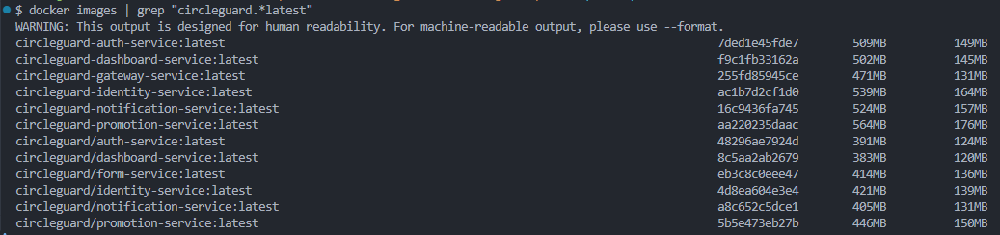

---

## 2. Jenkins

Jenkins se ejecuta como **contenedor Docker** integrado en `docker-compose.dev.yml`. La imagen oficial no incluye Docker CLI ni `kubectl`, por lo que se utiliza una imagen personalizada definida en `jenkins/Dockerfile`.

### 2.1 `jenkins/Dockerfile`

```dockerfile
FROM jenkins/jenkins:lts-jdk21

USER root

# Docker CLI
RUN apt-get update && apt-get install -y \
    apt-transport-https ca-certificates curl gnupg lsb-release && \
    curl -fsSL https://download.docker.com/linux/debian/gpg \
      | gpg --dearmor -o /usr/share/keyrings/docker-archive-keyring.gpg && \
    echo "deb [arch=amd64 signed-by=/usr/share/keyrings/docker-archive-keyring.gpg] \
      https://download.docker.com/linux/debian $(lsb_release -cs) stable" \
      | tee /etc/apt/sources.list.d/docker.list > /dev/null && \
    apt-get update && apt-get install -y docker-ce-cli && \
    rm -rf /var/lib/apt/lists/*

# kubectl
RUN curl -LO "https://dl.k8s.io/release/$(curl -Ls https://dl.k8s.io/release/stable.txt)/bin/linux/amd64/kubectl" && \
    install -o root -g root -m 0755 kubectl /usr/local/bin/kubectl && \
    rm kubectl

# Permite que jenkins use el socket de Docker
RUN groupadd -f docker && usermod -aG docker jenkins

USER jenkins
```

| Capa | Propósito |
|---|---|
| `lts-jdk21` | Base oficial con Java 21 — necesario para compilar con Gradle |
| Docker CLI | Permite ejecutar `docker build` y `docker tag` desde los stages del pipeline |
| kubectl | Permite aplicar manifiestos K8s y verificar deployments desde el pipeline |
| `usermod -aG docker jenkins` | Permite al usuario `jenkins` usar el socket de Docker sin `sudo` |

### 2.2 Servicio Jenkins en `docker-compose.dev.yml`

```yaml
jenkins:
  build:
    context: .
    dockerfile: jenkins/Dockerfile
  container_name: jenkins
  ports:
    - "8080:8080"
    - "50000:50000"
  volumes:
    - jenkins_home:/var/jenkins_home
    - /var/run/docker.sock:/var/run/docker.sock
  environment:
    - KUBECONFIG=/var/jenkins_home/.kube/config
  restart: unless-stopped
```

El volumen `jenkins_home` se declara como **externo** para que Compose reutilice el volumen existente en lugar de crear uno nuevo con prefijo (`circle-guard-public_jenkins_home`):

```yaml
volumes:
  jenkins_home:
    external: true
```

### 2.3 Levantar Jenkins

```powershell
# Primera vez: crear el volumen manualmente
docker volume create jenkins_home

# Construir la imagen personalizada y levantar el contenedor
docker-compose -f docker-compose.dev.yml build jenkins
docker-compose -f docker-compose.dev.yml up -d jenkins
```

### 2.4 Obtener la contraseña inicial

```powershell
docker exec jenkins cat /var/jenkins_home/secrets/initialAdminPassword
```

### 2.5 Instalación de plugins sugeridos

Seleccionar **Install suggested plugins** y esperar a que finalice la instalación automática.

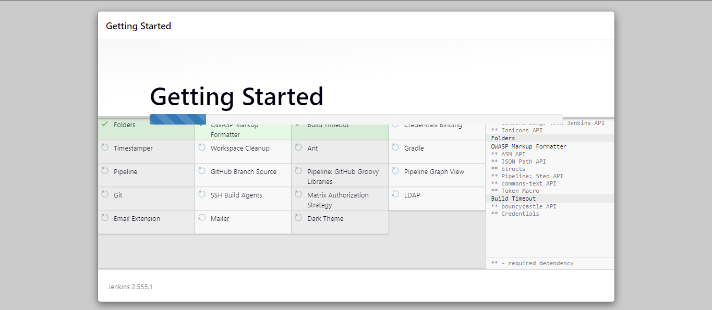

### 2.6 Creación del usuario administrador

Completar el formulario con nombre de usuario, contraseña y correo, luego hacer clic en **Save and Continue**.

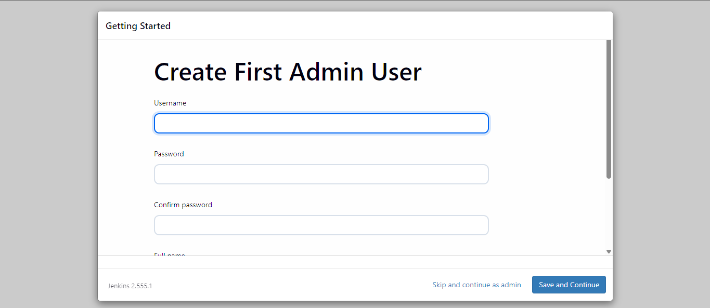

### 2.7 Confirmación de URL de Jenkins

Confirmar la URL de la instancia (`http://localhost:8080`) y hacer clic en **Save and Finish**.

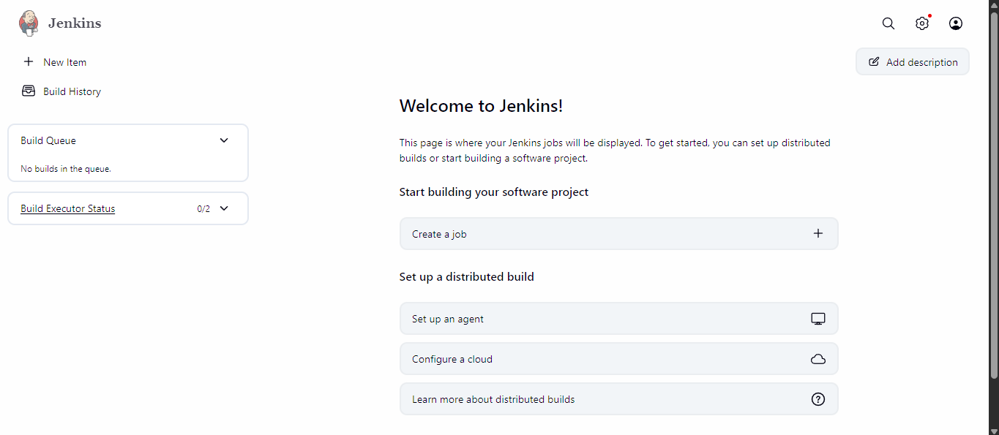

### 2.8 Instalación de plugins adicionales

Ir a **Manage Jenkins → Plugins → Available plugins** e instalar:

| Plugin | Propósito |
|---|---|
| Docker Pipeline | Permite construir imágenes Docker desde un `Jenkinsfile` |
| Kubernetes CLI | Permite ejecutar `kubectl` desde pipelines |

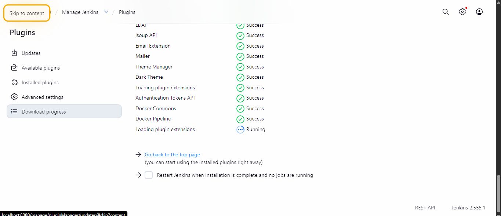

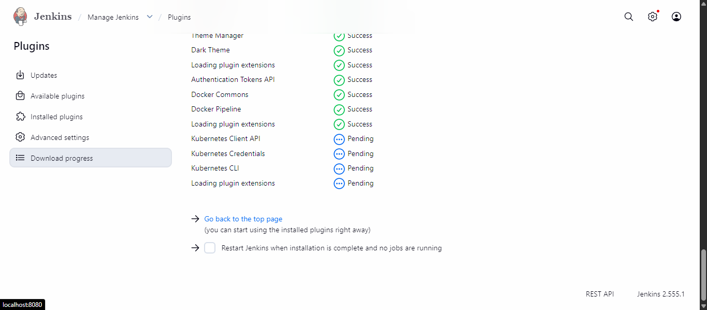

### 2.9 Configurar el kubeconfig dentro del contenedor

El contenedor necesita acceso al kubeconfig del host para que `kubectl` alcance el clúster de Docker Desktop. Además, la URL del API server debe cambiarse de `127.0.0.1` a `host.docker.internal`, ya que dentro del contenedor `127.0.0.1` apunta al propio contenedor.

```powershell
# Copiar el kubeconfig al volumen de Jenkins
docker exec -u root jenkins mkdir -p /var/jenkins_home/.kube
docker cp "$env:USERPROFILE\.kube\config" jenkins:/var/jenkins_home/.kube/config

# Ajustar la URL del API server para acceso desde el contenedor
docker exec -u root jenkins sed -i `
  's|https://127.0.0.1|https://host.docker.internal|g' `
  /var/jenkins_home/.kube/config
```

### 2.10 Verificación de herramientas en el contenedor

```powershell
docker exec jenkins java -version
# openjdk version "21.x.x"

docker exec jenkins docker --version
# Docker version 29.x.x

docker exec jenkins kubectl version --client
# gitVersion: v1.x.x

docker exec jenkins kubectl get nodes
# NAME             STATUS   ROLES           AGE
# docker-desktop   Ready    control-plane   ...
```


---

## 3. Kubernetes

Se utiliza el clúster de Kubernetes integrado en **Docker Desktop**. Los microservicios se exponen al host mediante servicios de tipo `NodePort`.

### 3.1 Verificar el clúster

```powershell
kubectl cluster-info
```

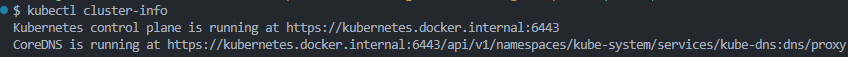

```powershell
kubectl get nodes
```

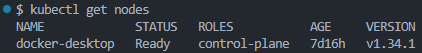

### 3.2 Namespace

Se crea un namespace dedicado para aislar todos los recursos del proyecto:

**`k8s/namespace.yaml`**
```yaml
apiVersion: v1
kind: Namespace
metadata:
  name: circleguard
```

```powershell
kubectl apply -f k8s/namespace.yaml
```

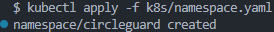

### 3.3 ConfigMap de infraestructura

El `ConfigMap` centraliza las URLs de los servicios de infraestructura. Los pods usan `host.docker.internal` para alcanzar los contenedores levantados por `docker-compose.dev.yml` en el host.

> **Nota:** PostgreSQL se expone en el puerto `5433` del host (en lugar del estándar `5432`) para evitar conflicto con una instalación local de PostgreSQL en Windows.

**`k8s/configmap-infra.yaml`**
```yaml
apiVersion: v1
kind: ConfigMap
metadata:
  name: infra-config
  namespace: circleguard
data:
  POSTGRES_HOST: "host.docker.internal"
  POSTGRES_PORT: "5433"
  NEO4J_URI: "bolt://host.docker.internal:7687"
  NEO4J_USERNAME: "neo4j"
  NEO4J_PASSWORD: "password"
  KAFKA_BOOTSTRAP: "host.docker.internal:9092"
  REDIS_HOST: "host.docker.internal"
  REDIS_PORT: "6379"
  LDAP_URL: "ldap://host.docker.internal:389"
  LDAP_BASE: "dc=circleguard,dc=edu"
  LDAP_USERNAME: "cn=admin,dc=circleguard,dc=edu"
  LDAP_PASSWORD: "admin"
  DB_USERNAME: "admin"
  DB_PASSWORD: "password"
```

```powershell
kubectl apply -f k8s/configmap-infra.yaml
```

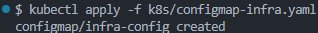

### 3.4 Manifiestos por microservicio

Cada microservicio tiene dos recursos Kubernetes: un `Deployment` y un `Service` de tipo `NodePort`.

La variable de entorno `MANAGEMENT_HEALTH_PROBES_ENABLED=true` activa los grupos de salud nativos de Kubernetes en Spring Boot, habilitando los endpoints `/actuator/health/readiness` y `/actuator/health/liveness` de forma independiente. La sonda de readiness apunta a `/actuator/health/readiness`, que únicamente verifica el estado interno de la aplicación (sin depender de servicios externos como Kafka o LDAP).

#### 3.4.1 circleguard-auth-service

**`k8s/auth-service/deployment.yaml`**
```yaml
apiVersion: apps/v1
kind: Deployment
metadata:
  name: circleguard-auth-service
  namespace: circleguard
  labels:
    app: circleguard-auth-service
spec:
  replicas: 1
  selector:
    matchLabels:
      app: circleguard-auth-service
  template:
    metadata:
      labels:
        app: circleguard-auth-service
    spec:
      containers:
        - name: circleguard-auth-service
          image: circleguard-auth-service:latest
          imagePullPolicy: Never
          ports:
            - containerPort: 8180
          env:
            - name: SPRING_DATASOURCE_URL
              value: "jdbc:postgresql://host.docker.internal:5433/circleguard_auth"
            - name: SPRING_DATASOURCE_USERNAME
              valueFrom:
                configMapKeyRef:
                  name: infra-config
                  key: DB_USERNAME
            - name: SPRING_DATASOURCE_PASSWORD
              valueFrom:
                configMapKeyRef:
                  name: infra-config
                  key: DB_PASSWORD
            - name: SPRING_LDAP_URLS
              valueFrom:
                configMapKeyRef:
                  name: infra-config
                  key: LDAP_URL
            - name: SPRING_LDAP_BASE
              valueFrom:
                configMapKeyRef:
                  name: infra-config
                  key: LDAP_BASE
            - name: SPRING_LDAP_USERNAME
              valueFrom:
                configMapKeyRef:
                  name: infra-config
                  key: LDAP_USERNAME
            - name: SPRING_LDAP_PASSWORD
              valueFrom:
                configMapKeyRef:
                  name: infra-config
                  key: LDAP_PASSWORD
            - name: MANAGEMENT_HEALTH_PROBES_ENABLED
              value: "true"
          readinessProbe:
            httpGet:
              path: /actuator/health/readiness
              port: 8180
            initialDelaySeconds: 30
            periodSeconds: 10
            failureThreshold: 5
```

**`k8s/auth-service/service.yaml`**
```yaml
apiVersion: v1
kind: Service
metadata:
  name: circleguard-auth-service
  namespace: circleguard
spec:
  type: NodePort
  selector:
    app: circleguard-auth-service
  ports:
    - protocol: TCP
      port: 8180
      targetPort: 8180
      nodePort: 30180
```

#### 3.4.2 circleguard-identity-service

**`k8s/identity-service/deployment.yaml`**
```yaml
apiVersion: apps/v1
kind: Deployment
metadata:
  name: circleguard-identity-service
  namespace: circleguard
  labels:
    app: circleguard-identity-service
spec:
  replicas: 1
  selector:
    matchLabels:
      app: circleguard-identity-service
  template:
    metadata:
      labels:
        app: circleguard-identity-service
    spec:
      containers:
        - name: circleguard-identity-service
          image: circleguard-identity-service:latest
          imagePullPolicy: Never
          ports:
            - containerPort: 8083
          env:
            - name: SPRING_DATASOURCE_URL
              value: "jdbc:postgresql://host.docker.internal:5433/circleguard_identity"
            - name: SPRING_DATASOURCE_USERNAME
              valueFrom:
                configMapKeyRef:
                  name: infra-config
                  key: DB_USERNAME
            - name: SPRING_DATASOURCE_PASSWORD
              valueFrom:
                configMapKeyRef:
                  name: infra-config
                  key: DB_PASSWORD
            - name: SPRING_KAFKA_BOOTSTRAP_SERVERS
              valueFrom:
                configMapKeyRef:
                  name: infra-config
                  key: KAFKA_BOOTSTRAP
            - name: MANAGEMENT_HEALTH_PROBES_ENABLED
              value: "true"
          readinessProbe:
            httpGet:
              path: /actuator/health/readiness
              port: 8083
            initialDelaySeconds: 30
            periodSeconds: 10
            failureThreshold: 5
```

**`k8s/identity-service/service.yaml`**
```yaml
apiVersion: v1
kind: Service
metadata:
  name: circleguard-identity-service
  namespace: circleguard
spec:
  type: NodePort
  selector:
    app: circleguard-identity-service
  ports:
    - protocol: TCP
      port: 8083
      targetPort: 8083
      nodePort: 30083
```

#### 3.4.3 circleguard-gateway-service

**`k8s/gateway-service/deployment.yaml`**
```yaml
apiVersion: apps/v1
kind: Deployment
metadata:
  name: circleguard-gateway-service
  namespace: circleguard
  labels:
    app: circleguard-gateway-service
spec:
  replicas: 1
  selector:
    matchLabels:
      app: circleguard-gateway-service
  template:
    metadata:
      labels:
        app: circleguard-gateway-service
    spec:
      containers:
        - name: circleguard-gateway-service
          image: circleguard-gateway-service:latest
          imagePullPolicy: Never
          ports:
            - containerPort: 8087
          env:
            - name: SPRING_DATA_REDIS_HOST
              valueFrom:
                configMapKeyRef:
                  name: infra-config
                  key: REDIS_HOST
            - name: SPRING_DATA_REDIS_PORT
              valueFrom:
                configMapKeyRef:
                  name: infra-config
                  key: REDIS_PORT
            - name: MANAGEMENT_HEALTH_PROBES_ENABLED
              value: "true"
          readinessProbe:
            httpGet:
              path: /actuator/health/readiness
              port: 8087
            initialDelaySeconds: 20
            periodSeconds: 10
            failureThreshold: 5
```

**`k8s/gateway-service/service.yaml`**
```yaml
apiVersion: v1
kind: Service
metadata:
  name: circleguard-gateway-service
  namespace: circleguard
spec:
  type: NodePort
  selector:
    app: circleguard-gateway-service
  ports:
    - protocol: TCP
      port: 8087
      targetPort: 8087
      nodePort: 30087
```

#### 3.4.4 circleguard-promotion-service

**`k8s/promotion-service/deployment.yaml`**
```yaml
apiVersion: apps/v1
kind: Deployment
metadata:
  name: circleguard-promotion-service
  namespace: circleguard
  labels:
    app: circleguard-promotion-service
spec:
  replicas: 1
  selector:
    matchLabels:
      app: circleguard-promotion-service
  template:
    metadata:
      labels:
        app: circleguard-promotion-service
    spec:
      containers:
        - name: circleguard-promotion-service
          image: circleguard-promotion-service:latest
          imagePullPolicy: Never
          ports:
            - containerPort: 8088
          env:
            - name: SPRING_DATASOURCE_URL
              value: "jdbc:postgresql://host.docker.internal:5433/circleguard_promotion"
            - name: SPRING_DATASOURCE_USERNAME
              valueFrom:
                configMapKeyRef:
                  name: infra-config
                  key: DB_USERNAME
            - name: SPRING_DATASOURCE_PASSWORD
              valueFrom:
                configMapKeyRef:
                  name: infra-config
                  key: DB_PASSWORD
            - name: SPRING_NEO4J_URI
              valueFrom:
                configMapKeyRef:
                  name: infra-config
                  key: NEO4J_URI
            - name: SPRING_NEO4J_AUTHENTICATION_USERNAME
              valueFrom:
                configMapKeyRef:
                  name: infra-config
                  key: NEO4J_USERNAME
            - name: SPRING_NEO4J_AUTHENTICATION_PASSWORD
              valueFrom:
                configMapKeyRef:
                  name: infra-config
                  key: NEO4J_PASSWORD
            - name: SPRING_DATA_REDIS_HOST
              valueFrom:
                configMapKeyRef:
                  name: infra-config
                  key: REDIS_HOST
            - name: SPRING_DATA_REDIS_PORT
              valueFrom:
                configMapKeyRef:
                  name: infra-config
                  key: REDIS_PORT
            - name: SPRING_KAFKA_BOOTSTRAP_SERVERS
              valueFrom:
                configMapKeyRef:
                  name: infra-config
                  key: KAFKA_BOOTSTRAP
            - name: MANAGEMENT_HEALTH_PROBES_ENABLED
              value: "true"
          readinessProbe:
            httpGet:
              path: /actuator/health/readiness
              port: 8088
            initialDelaySeconds: 40
            periodSeconds: 10
            failureThreshold: 5
```

**`k8s/promotion-service/service.yaml`**
```yaml
apiVersion: v1
kind: Service
metadata:
  name: circleguard-promotion-service
  namespace: circleguard
spec:
  type: NodePort
  selector:
    app: circleguard-promotion-service
  ports:
    - protocol: TCP
      port: 8088
      targetPort: 8088
      nodePort: 30088
```

#### 3.4.5 circleguard-notification-service

**`k8s/notification-service/deployment.yaml`**
```yaml
apiVersion: apps/v1
kind: Deployment
metadata:
  name: circleguard-notification-service
  namespace: circleguard
  labels:
    app: circleguard-notification-service
spec:
  replicas: 1
  selector:
    matchLabels:
      app: circleguard-notification-service
  template:
    metadata:
      labels:
        app: circleguard-notification-service
    spec:
      containers:
        - name: circleguard-notification-service
          image: circleguard-notification-service:latest
          imagePullPolicy: Never
          ports:
            - containerPort: 8082
          env:
            - name: SPRING_KAFKA_BOOTSTRAP_SERVERS
              valueFrom:
                configMapKeyRef:
                  name: infra-config
                  key: KAFKA_BOOTSTRAP
            - name: SPRING_MAIL_HOST
              value: "host.docker.internal"
            - name: SPRING_MAIL_PORT
              value: "25"
            - name: MANAGEMENT_HEALTH_PROBES_ENABLED
              value: "true"
          readinessProbe:
            httpGet:
              path: /actuator/health/readiness
              port: 8082
            initialDelaySeconds: 30
            periodSeconds: 10
            failureThreshold: 5
```

**`k8s/notification-service/service.yaml`**
```yaml
apiVersion: v1
kind: Service
metadata:
  name: circleguard-notification-service
  namespace: circleguard
spec:
  type: NodePort
  selector:
    app: circleguard-notification-service
  ports:
    - protocol: TCP
      port: 8082
      targetPort: 8082
      nodePort: 30082
```

#### 3.4.6 circleguard-dashboard-service

**`k8s/dashboard-service/deployment.yaml`**
```yaml
apiVersion: apps/v1
kind: Deployment
metadata:
  name: circleguard-dashboard-service
  namespace: circleguard
  labels:
    app: circleguard-dashboard-service
spec:
  replicas: 1
  selector:
    matchLabels:
      app: circleguard-dashboard-service
  template:
    metadata:
      labels:
        app: circleguard-dashboard-service
    spec:
      containers:
        - name: circleguard-dashboard-service
          image: circleguard-dashboard-service:latest
          imagePullPolicy: Never
          ports:
            - containerPort: 8084
          env:
            - name: SPRING_DATASOURCE_URL
              value: "jdbc:postgresql://host.docker.internal:5433/circleguard_dashboard"
            - name: SPRING_DATASOURCE_USERNAME
              valueFrom:
                configMapKeyRef:
                  name: infra-config
                  key: DB_USERNAME
            - name: SPRING_DATASOURCE_PASSWORD
              valueFrom:
                configMapKeyRef:
                  name: infra-config
                  key: DB_PASSWORD
            - name: MANAGEMENT_HEALTH_PROBES_ENABLED
              value: "true"
          readinessProbe:
            httpGet:
              path: /actuator/health/readiness
              port: 8084
            initialDelaySeconds: 30
            periodSeconds: 10
            failureThreshold: 5
```

**`k8s/dashboard-service/service.yaml`**
```yaml
apiVersion: v1
kind: Service
metadata:
  name: circleguard-dashboard-service
  namespace: circleguard
spec:
  type: NodePort
  selector:
    app: circleguard-dashboard-service
  ports:
    - protocol: TCP
      port: 8084
      targetPort: 8084
      nodePort: 30084
```

### 3.5 Aplicar todos los manifiestos

Con la infraestructura de soporte activa (`docker-compose.dev.yml`), se aplican todos los manifiestos:

```powershell
kubectl apply -f k8s/namespace.yaml
kubectl apply -f k8s/configmap-infra.yaml
kubectl apply -f k8s/auth-service/
kubectl apply -f k8s/identity-service/
kubectl apply -f k8s/gateway-service/
kubectl apply -f k8s/promotion-service/
kubectl apply -f k8s/notification-service/
kubectl apply -f k8s/dashboard-service/
```

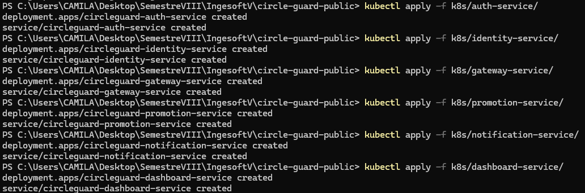

### 3.6 Verificación de pods y servicios

```powershell
kubectl get pods -n circleguard
```

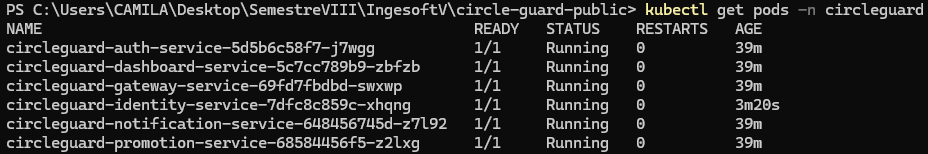

```powershell
kubectl get services -n circleguard
```

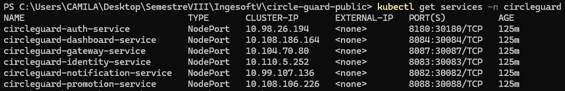

### 3.7 Resumen de puertos expuestos

| Microservicio | Puerto interno | NodePort | URL de acceso |
|---|---|---|---|
| auth-service | 8180 | 30180 | `http://localhost:30180` |
| identity-service | 8083 | 30083 | `http://localhost:30083` |
| gateway-service | 8087 | 30087 | `http://localhost:30087` |
| promotion-service | 8088 | 30088 | `http://localhost:30088` |
| notification-service | 8082 | 30082 | `http://localhost:30082` |
| dashboard-service | 8084 | 30084 | `http://localhost:30084` |
