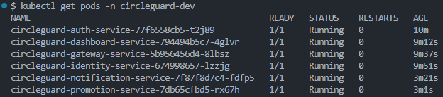
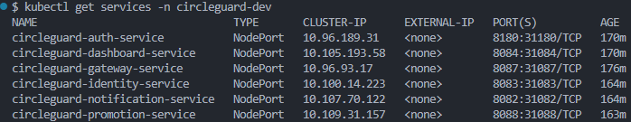

# Punto 2 — Pipelines en Entorno de Desarrollo (Dev Environment)

## Introducción

El objetivo de este punto es definir los pipelines de CI/CD que permitan construir, probar y desplegar los seis microservicios de **CircleGuard** en un entorno de desarrollo local. Se utiliza un único archivo `Jenkinsfile.dev` en la raíz del repositorio y un **Multibranch Pipeline** en Jenkins, de manera que cada rama del repositorio tenga su propio historial de ejecuciones.

### Estrategia de namespaces por entorno

El proyecto adopta la convención de **un namespace de Kubernetes por tipo de entorno**:

| Entorno | Namespace K8s | Archivo de namespace | Tag de imagen Docker |
|---|---|---|---|
| Desarrollo | `circleguard-dev` | `k8s/namespace-dev.yaml` | `:dev` |
| Stage | `circleguard-stage` | `k8s/namespace-stage.yaml` *(punto 4)* | `:stage` |
| Producción | `circleguard` | `k8s/namespace.yaml` *(punto 5)* | `:latest` |

Este aislamiento garantiza que los despliegues de cada entorno no interfieran entre sí. Los NodePorts son **cluster-wide** (no se pueden repetir entre namespaces), por lo que el entorno dev usa el rango `31xxx` para coexistir con producción (`30xxx`) en el mismo clúster.

### ¿Por qué Multibranch Pipeline?

Un **Multibranch Pipeline** escanea automáticamente las ramas del repositorio y crea un sub-job por cada rama que contenga el archivo de pipeline configurado (`Jenkinsfile.dev`). Esto permite que la rama `master` y cualquier rama de feature tengan historial de builds independiente, sin configuración manual por rama.

### Servicios incluidos

| Servicio | Puerto interno | NodePort dev (31xxx) | NodePort prod (30xxx) |
|---|---|---|---|
| `circleguard-auth-service` | 8180 | 31180 | 30180 |
| `circleguard-identity-service` | 8083 | 31083 | 30083 |
| `circleguard-gateway-service` | 8087 | 31087 | 30087 |
| `circleguard-promotion-service` | 8088 | 31088 | 30088 |
| `circleguard-notification-service` | 8082 | 31082 | 30082 |
| `circleguard-dashboard-service` | 8084 | 31084 | 30084 |

---

## Configuración del Multibranch Pipeline en Jenkins

### Paso 1 — Crear nuevo item

1. En el dashboard de Jenkins, hacer clic en **"New Item"**.
2. Ingresar el nombre: `circleguard-dev`.
3. Seleccionar el tipo **"Multibranch Pipeline"** y hacer clic en **OK**.


### Paso 2 — Configurar la fuente del repositorio

En la sección **Branch Sources → Add source → Git**:

| Campo | Valor |
|---|---|
| Project Repository | URL del repositorio (local o remoto) |

### Paso 3 — Configurar el Script Path

En la sección **Build Configuration**:

| Campo | Valor |
|---|---|
| Mode | `by Jenkinsfile` |
| Script Path | `Jenkinsfile.dev` |

Esto le indica a Jenkins que el pipeline de desarrollo se define en `Jenkinsfile.dev` en la raíz del repositorio, en lugar del `Jenkinsfile` estándar.


### Paso 4 — Escaneo de ramas

Al guardar, Jenkins realiza automáticamente un **Branch Indexing**: descubre todas las ramas que contengan `Jenkinsfile.dev` y crea un sub-job para cada una.


---

## Prerequisito: infraestructura externa

Los microservicios con dependencias de base de datos (auth, identity, dashboard, promotion) fallan al iniciar si PostgreSQL o Neo4j no están disponibles. La infraestructura debe estar activa **antes** de disparar el pipeline:

```bash
docker-compose -f docker-compose.dev.yml up -d
docker-compose -f docker-compose.dev.yml ps
```

Los pods de Kubernetes se conectan a los contenedores de Docker Compose a través de `host.docker.internal` (nombre de host especial que resuelve al host desde dentro de un contenedor).

---

## Estructura del `Jenkinsfile.dev`

```
circle-guard-public/
├── Jenkinsfile.dev              ← pipeline del entorno dev
└── k8s/
    ├── namespace-dev.yaml       ← namespace exclusivo del entorno dev
    ├── configmap-infra.yaml
    └── <service>/
        ├── deployment.yaml
        └── service.yaml
```

### Variables de entorno

```groovy
environment {
    KUBE_NAMESPACE = 'circleguard-dev'
    ENV_TAG        = 'dev'
}
```

`KUBE_NAMESPACE` determina el namespace destino de todos los `kubectl` del pipeline. `ENV_TAG` es el tag estable de la imagen Docker para este entorno.

---

### Stage: Checkout

```groovy
stage('Checkout') {
    steps {
        checkout scm
    }
}
```

Clona o actualiza el código fuente usando la configuración SCM del Multibranch Pipeline.

---

### Stage: Infraestructura K8s Base

```groovy
stage('Infraestructura K8s Base') {
    steps {
        sh 'kubectl apply -f k8s/namespace-dev.yaml'
        sh "sed 's/namespace: circleguard/namespace: circleguard-dev/g' k8s/configmap-infra.yaml | kubectl apply -f -"
    }
}
```

Aplica los recursos de Kubernetes compartidos **antes** de que los servicios individuales se desplieguen:

- **`k8s/namespace-dev.yaml`** — crea el namespace `circleguard-dev` si no existe.
- **ConfigMap con `sed`** — los manifiestos en `k8s/` tienen `namespace: circleguard` (producción). El pipeline usa `sed` para sustituir el namespace al vuelo, sin modificar los archivos originales. Esta misma técnica se repite en cada stage de deploy.

---

### Stage: Servicios (parallel)

```groovy
stage('Servicios') {
    parallel {
        stage('auth-service') { stages { ... } }
        stage('identity-service') { stages { ... } }
        // ... 4 más
    }
}
```

El bloque `parallel` ejecuta los seis servicios de forma **concurrente**. Cada uno avanza a través de sus cinco sub-stages de forma independiente, reduciendo el tiempo total del pipeline.

---

### Sub-stages por servicio

Cada servicio tiene los mismos cinco sub-stages. Se usa `auth-service` como ejemplo representativo.

#### Sub-stage 1: Build

```groovy
stage('Build auth-service') {
    steps {
        sh './gradlew :services:circleguard-auth-service:bootJar -x test --no-daemon'
    }
}
```

Genera el JAR ejecutable de Spring Boot omitiendo los tests (`-x test`). El flag `--no-daemon` deshabilita el Gradle Daemon para entornos CI donde los procesos no persisten entre builds.

#### Sub-stage 2: Tests

```groovy
stage('Tests auth-service') {
    steps {
        catchError(buildResult: 'UNSTABLE', stageResult: 'UNSTABLE') {
            sh './gradlew :services:circleguard-auth-service:test --no-daemon'
        }
    }
    post {
        always {
            junit allowEmptyResults: true, skipPublishingChecks: true,
                  testResults: 'services/circleguard-auth-service/build/test-results/test/*.xml'
        }
    }
}
```

Puntos clave:

- **`catchError(buildResult: 'UNSTABLE', stageResult: 'UNSTABLE')`** — si los tests fallan, el pipeline marca el build como `UNSTABLE` en vez de `FAILED`, permitiendo que los stages de Docker y Deploy continúen. Un build `UNSTABLE` genera artefactos desplegables pero señala que hay tests a corregir.
- **`junit ... skipPublishingChecks: true`** — publica los XML de resultados en la pestaña Test Results de Jenkins. `skipPublishingChecks` suprime el warning `No suitable checks publisher found` que aparece cuando no hay integración con GitHub Checks API.
- `post { always { ... } }` garantiza que los resultados se publiquen aunque el stage falle.

##### Configuración de tests por servicio

| Servicio | Base de datos en tests | Notas |
|---|---|---|
| auth-service | H2 in-memory | — |
| identity-service | H2 (modo PostgreSQL) | — |
| gateway-service | N/A | Redis mockeado |
| promotion-service | PostgreSQL + Neo4j vía TestContainers | Requiere Docker daemon en el agente |
| notification-service | N/A | Kafka mockeado con `@MockBean` |
| dashboard-service | H2 in-memory | — |


#### Sub-stage 3: Docker Build

```groovy
stage('Docker auth-service') {
    steps {
        sh "docker build -t circleguard-auth-service:${BUILD_NUMBER} -f services/circleguard-auth-service/Dockerfile ."
        sh "docker tag circleguard-auth-service:${BUILD_NUMBER} circleguard-auth-service:${ENV_TAG}"
    }
}
```

Se generan dos tags por build:

| Tag | Propósito |
|---|---|
| `:<BUILD_NUMBER>` (e.g., `:42`) | Identificador inmutable de cada build; permite rollback |
| `:dev` | Tag estable que referencian los manifiestos K8s del entorno dev |

El Dockerfile usa **multi-stage build**: el stage `builder` compila con el JDK 21, y el stage final usa solo el JRE, produciendo imágenes de ~230–280 MB.

#### Sub-stage 4: Deploy Dev

```groovy
stage('Deploy Dev auth-service') {
    steps {
        sh '''
            sed 's/namespace: circleguard/namespace: circleguard-dev/g' k8s/auth-service/deployment.yaml \
                | sed 's|:latest|:dev|g' \
                | kubectl apply -f -
            sed 's/namespace: circleguard/namespace: circleguard-dev/g' k8s/auth-service/service.yaml \
                | sed 's/nodePort: 30/nodePort: 31/g' \
                | kubectl apply -f -
            kubectl rollout restart deployment/circleguard-auth-service -n ${KUBE_NAMESPACE}
        '''
    }
}
```

Se aplican tres transformaciones con `sed` sobre los manifiestos base antes de pasarlos a `kubectl`. Los archivos en `k8s/` **no se modifican**; `sed` opera sobre stdout y `kubectl apply -f -` lee desde stdin:

| Sustitución | Original (k8s base) | Resultado en dev |
|---|---|---|
| Namespace | `namespace: circleguard` | `namespace: circleguard-dev` |
| Tag de imagen | `:latest` | `:dev` |
| NodePort | `nodePort: 30xxx` | `nodePort: 31xxx` |

El reemplazo de NodePort es necesario porque los NodePorts son **cluster-wide**: producción ya ocupa el rango `30xxx`, y Kubernetes rechaza el apply si se intenta usar el mismo puerto en otro namespace.

`kubectl rollout restart` fuerza el reinicio de los pods aunque el tag `:dev` no cambie, garantizando que se cargue la imagen recién construida.

#### Sub-stage 5: Health Check

```groovy
stage('Health auth-service') {
    steps {
        sh 'kubectl rollout status deployment/circleguard-auth-service -n ${KUBE_NAMESPACE} --timeout=300s'
    }
}
```

Espera hasta que el Deployment alcance `successfully rolled out`, verificando que los pods pasaron el `readinessProbe` (GET `/actuator/health/readiness`). El timeout de 300s contempla el tiempo de inicio de Spring Boot + Flyway migrations + establecimiento de conexiones a base de datos.

---

### Bloque post

```groovy
post {
    always {
        junit allowEmptyResults: true, skipPublishingChecks: true,
              testResults: '**/build/test-results/test/*.xml'
    }
    success {
        echo 'Dev environment (circleguard-dev) actualizado exitosamente para todos los servicios.'
    }
    failure {
        echo 'Pipeline fallido — revisar los logs del stage correspondiente.'
    }
}
```

El `junit` del bloque `post always` es un agregado final de todos los XML del workspace, complementando los reportes individuales por servicio publicados dentro de cada stage.

---

## Problemas encontrados y soluciones

Durante la implementación se identificaron y corrigieron varios problemas. Se documentan aquí como referencia.

### WeakKeyException en identity-service

**Síntoma:** `io.jsonwebtoken.security.WeakKeyException` al cargar el contexto de Spring en los tests.

**Causa:** El `application.yml` de test no tenía la propiedad `jwt.secret`. Al intentar crear la clave HMAC con `Keys.hmacShaKeyFor(secret.getBytes())`, JJWT rechazaba una cadena vacía por no alcanzar los 256 bits mínimos requeridos.

**Solución:** Agregar `jwt.secret` al `application.yml` de test con un valor de al menos 32 caracteres:

```yaml
# services/circleguard-identity-service/src/test/resources/application.yml
jwt:
  secret: "test-secret-key-for-testing-only-1234567890ab"
```

---

### AssertionError 403 en HealthStatusControllerTest (promotion-service)

**Síntoma:** Los tests que esperaban `200 OK` recibían `403 Forbidden`.

**Causa:** El controlador usa `@PreAuthorize("hasRole('HEALTH_CENTER')")`, que internamente verifica la authority `ROLE_HEALTH_CENTER`. El test usaba `@WithMockUser(authorities = "HEALTH_CENTER")`, que crea la authority `HEALTH_CENTER` sin el prefijo `ROLE_`.

**Solución:** Cambiar a `@WithMockUser(roles = "HEALTH_CENTER")`, que sí genera `ROLE_HEALTH_CENTER`:

```java
// Antes (incorrecto)
@WithMockUser(authorities = "HEALTH_CENTER")

// Después (correcto)
@WithMockUser(roles = "HEALTH_CENTER")
```

---

### IllegalArgumentException en notification-service

**Síntoma:** El contexto de Spring no levantaba en `ExposureNotificationListenerTest` y `NotificationRetryTest`.

**Causa:** `LmsService` es una interfaz sin implementación concreta. Cualquier bean que la requiera falla al crear el contexto si no existe un mock o una implementación registrada. Además, no había `application-test.yml` para el perfil de test.

**Solución:**
1. Agregar `@MockBean private LmsService lmsService;` en ambas clases de test.
2. Crear `src/test/resources/application-test.yml` con la configuración mínima para el perfil `test`.

---

### NodePort already allocated

**Síntoma:** `spec.ports[0].nodePort: Invalid value: 30180: provided port is already allocated` al hacer `kubectl apply` del service.yaml.

**Causa:** Los NodePorts son **cluster-wide**. El namespace `circleguard` (producción) ya tenía registrados los puertos `30xxx`. Kubernetes rechaza registrar el mismo puerto en cualquier otro namespace.

**Solución:** Aplicar `sed 's/nodePort: 30/nodePort: 31/g'` al `service.yaml` de cada servicio en el stage Deploy Dev, mapeando todos los NodePorts al rango `31xxx` exclusivo del entorno dev.

---

### CrashLoopBackOff en pods con dependencias de base de datos

**Síntoma:** auth, identity, dashboard y promotion en estado `CrashLoopBackOff`; gateway y notification en `Running`.

**Causa:** Los contenedores de Docker Compose (PostgreSQL, Neo4j) no estaban activos. Flyway intentaba migrar al iniciar Spring Boot y fallaba con `Connection refused` en `host.docker.internal:5433`.

**Solución:** Asegurarse de ejecutar `docker-compose -f docker-compose.dev.yml up -d` antes de lanzar el pipeline.

---

## Verificación post-pipeline

### Pods en el namespace dev

```bash
kubectl get pods -n circleguard-dev
```

```
NAME                                                READY   STATUS    RESTARTS   AGE
circleguard-auth-service-579886bb58-746bm           1/1     Running   0          66s
circleguard-dashboard-service-54ffcdcdb9-pktzr      1/1     Running   0          65s
circleguard-gateway-service-5d9955ffbb-dtstj        1/1     Running   0          17m
circleguard-identity-service-646fd79b56-wddvb       1/1     Running   0          65s
circleguard-notification-service-7979d9b464-ckk9c   1/1     Running   0          9m
circleguard-promotion-service-dfb4c4dcc-f5t5d       1/1     Running   0          65s
```



### Servicios y NodePorts

```bash
kubectl get services -n circleguard-dev
```

```
NAME                              TYPE       CLUSTER-IP    PORT(S)          AGE
circleguard-auth-service          NodePort   10.96.x.x     8180:31180/TCP   5m
circleguard-identity-service      NodePort   10.96.x.x     8083:31083/TCP   5m
circleguard-gateway-service       NodePort   10.96.x.x     8087:31087/TCP   5m
circleguard-promotion-service     NodePort   10.96.x.x     8088:31088/TCP   5m
circleguard-notification-service  NodePort   10.96.x.x     8082:31082/TCP   5m
circleguard-dashboard-service     NodePort   10.96.x.x     8084:31084/TCP   5m
```



### Health checks

```bash
curl http://localhost:31180/actuator/health   # auth-service
curl http://localhost:31083/actuator/health   # identity-service
curl http://localhost:31087/actuator/health   # gateway-service
curl http://localhost:31088/actuator/health   # promotion-service
curl http://localhost:31082/actuator/health   # notification-service
curl http://localhost:31084/actuator/health   # dashboard-service
```

Respuesta esperada: `{ "status": "UP" }`


### Imágenes Docker

```bash
docker images | grep circleguard
```

Cada servicio genera dos tags: `:dev` (estable para el entorno) y `:<BUILD_NUMBER>` (para rollback):

```
REPOSITORY                        TAG    IMAGE ID       CREATED
circleguard-auth-service          dev    a1b2c3d4e5f6   2 minutes ago
circleguard-auth-service          42     a1b2c3d4e5f6   2 minutes ago
circleguard-identity-service      dev    b2c3d4e5f6a1   2 minutes ago
...
```

---

## Análisis y Observaciones

### Decisiones de diseño

**Namespace `circleguard-dev`**: el aislamiento por namespace permite que dev y producción coexistan en el mismo clúster sin colisiones de nombres ni recursos compartidos. `kubectl delete namespace circleguard-dev` limpia el entorno completo sin afectar producción.

**Tag `:dev` vs `:latest`**: reservar `:latest` para producción evita ambigüedad al revisar qué imagen corre en cada entorno. El tag `:dev` siempre apunta al último build del entorno de desarrollo.

**`sed` sobre manifiestos en tiempo de ejecución**: los archivos `k8s/` base son la fuente de verdad para todos los entornos. Cada pipeline aplica sus propias transformaciones sin bifurcar los manifiestos. El mismo `deployment.yaml` sirve para dev, stage y producción.

**`catchError` en los stages de test**: marcar los fallos de test como `UNSTABLE` en lugar de `FAILED` permite que el pipeline continúe hacia Docker y Deploy. Esto es intencional: el entorno dev debe actualizarse aunque haya tests rojos, pero el estado `UNSTABLE` notifica al equipo que hay trabajo pendiente en los tests.

### Consideraciones operacionales

| Aspecto | Detalle |
|---|---|
| **Infraestructura externa** | PostgreSQL, Neo4j, Kafka, Redis y OpenLDAP deben estar activos antes de lanzar el pipeline |
| **TestContainers en promotion-service** | Requiere Docker daemon accesible desde el proceso de test; está disponible porque Jenkins comparte el socket `/var/run/docker.sock` |
| **`imagePullPolicy: Never`** | Las imágenes deben existir en el mismo daemon Docker que usa el clúster (Docker Desktop integra ambos) |
| **Tiempo de startup** | Spring Boot + Flyway + conexión a BD puede tomar hasta 60–80s por pod; de ahí el `--timeout=300s` |
