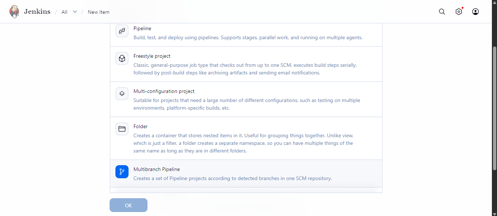
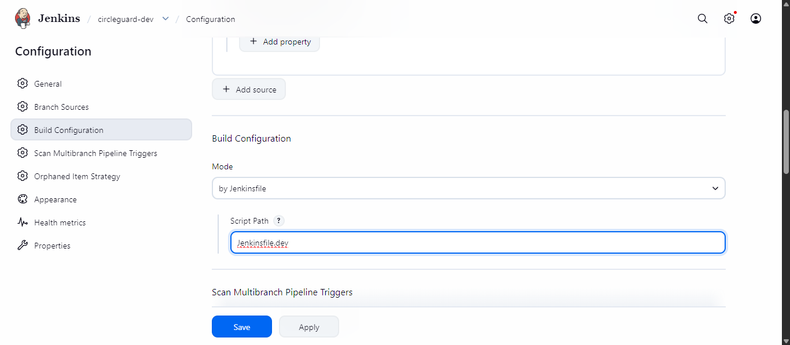
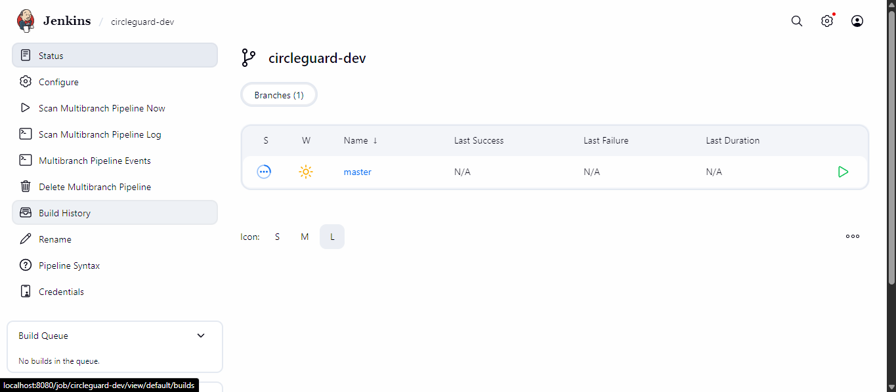
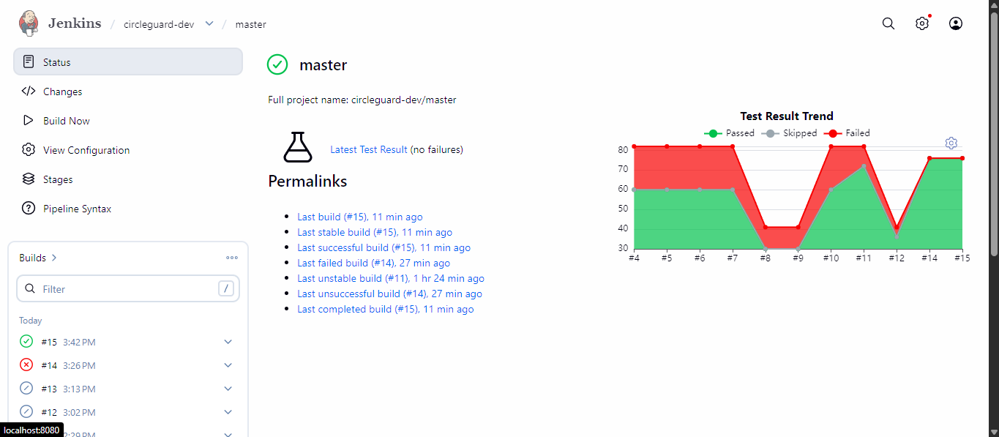

# Punto 2 — Pipelines en Entorno de Desarrollo (Dev Environment)

## Introducción

El objetivo de este punto es definir los pipelines de CI/CD que permitan construir, probar y desplegar los seis microservicios seleccionados de **CircleGuard** en un entorno de desarrollo local. Se utiliza un único archivo `Jenkinsfile.dev` en la raíz del repositorio y un **Multibranch Pipeline** en Jenkins, de manera que cada rama del repositorio tenga su propio historial de ejecuciones.

### Estrategia de namespaces por entorno

El proyecto adopta la convención de **un namespace de Kubernetes por tipo de entorno**:

| Entorno | Namespace K8s | Archivo de namespace | Tag de imagen Docker |
|---|---|---|---|
| Desarrollo | `circleguard-dev` | `k8s/namespace-dev.yaml` | `:dev` |
| Stage | `circleguard-stage` | `k8s/namespace-stage.yaml` *(punto 4)* | `:stage` |
| Producción | `circleguard` | `k8s/namespace.yaml` *(punto 5)* | `:latest` |

Este aislamiento garantiza que los despliegues de cada entorno no interfieran entre sí y que sea posible identificar a simple vista qué versión de la imagen se ejecuta en cada entorno por su tag.

### ¿Por qué Multibranch Pipeline?

Un **Multibranch Pipeline** en Jenkins escanea automáticamente las ramas de un repositorio Git y crea un sub-job por cada rama que contenga el archivo de pipeline configurado (`Jenkinsfile.dev` en este caso). Esto permite que:

- La rama `master` tenga su propio historial de builds de desarrollo.
- Ramas de feature tengan sus propios pipelines aislados.
- El mismo archivo de pipeline aplica a todas las ramas sin configuración manual por rama.

### Servicios incluidos en el pipeline

| Servicio | Puerto interno | NodePort dev (31xxx) | NodePort prod (30xxx) |
|---|---|---|---|
| `circleguard-auth-service` | 8180 | 31180 | 30180 |
| `circleguard-identity-service` | 8083 | 31083 | 30083 |
| `circleguard-gateway-service` | 8087 | 31087 | 30087 |
| `circleguard-promotion-service` | 8088 | 31088 | 30088 |
| `circleguard-notification-service` | 8082 | 31082 | 30082 |
| `circleguard-dashboard-service` | 8084 | 31084 | 30084 |

> Los NodePorts son **cluster-wide**: no se pueden repetir entre namespaces. El entorno dev usa el rango `31xxx` para coexistir con producción (`30xxx`) en el mismo clúster.

---

## Configuración del Multibranch Pipeline en Jenkins

### Paso 1 — Crear nuevo item

1. En el dashboard de Jenkins, hacer clic en **"New Item"** (o "Nueva tarea").
2. Ingresar el nombre: `circleguard-dev`.
3. Seleccionar el tipo **"Multibranch Pipeline"**.
4. Hacer clic en **OK**.



### Paso 2 — Configurar la fuente del repositorio

En la sección **Branch Sources**, hacer clic en **"Add source"** y seleccionar **Git**:

| Campo | Valor |
|---|---|
| Project Repository | URL del repositorio (local o remoto) |

### Paso 3 — Configurar el Script Path

En la sección **Build Configuration**:

| Campo | Valor |
|---|---|
| Mode | `by Jenkinsfile` |
| Script Path | `Jenkinsfile.dev` |

> Esto le indica a Jenkins que el pipeline de desarrollo se define en `Jenkinsfile.dev` en la raíz del repositorio, en lugar del `Jenkinsfile` estándar.



### Paso 4 — Escaneo de ramas

Al guardar la configuración, Jenkins realiza automáticamente un **Branch Indexing** (escaneo de ramas). Descubrirá todas las ramas que contengan `Jenkinsfile.dev` y creará un sub-job para cada una.



---

## El archivo `Jenkinsfile.dev`

El pipeline está ubicado en la raíz del repositorio:

```
circle-guard-public/
├── Jenkinsfile.dev              ← pipeline del entorno dev
└── k8s/
    ├── namespace-dev.yaml       ← namespace exclusivo del entorno dev
    ├── configmap-infra.yaml
    └── <service>/
        ├── deployment.yaml
        └── service.yaml
```

### Variables de entorno del pipeline

```groovy
environment {
    KUBE_NAMESPACE = 'circleguard-dev'
    ENV_TAG        = 'dev'
}
```

| Variable | Valor | Uso |
|---|---|---|
| `KUBE_NAMESPACE` | `circleguard-dev` | Namespace de Kubernetes destino del despliegue |
| `ENV_TAG` | `dev` | Tag de la imagen Docker para este entorno |

---

### Stage: Checkout

```groovy
stage('Checkout') {
    steps {
        checkout scm
    }
}
```

`checkout scm` clona o actualiza el código fuente del repositorio en el workspace de Jenkins, usando la configuración de SCM del Multibranch Pipeline.

---

### Stage: Infraestructura K8s Base

```groovy
stage('Infraestructura K8s Base') {
    steps {
        sh 'kubectl apply -f k8s/namespace-dev.yaml'
        sh "sed 's/namespace: circleguard/namespace: circleguard-dev/g' k8s/configmap-infra.yaml | kubectl apply -f -"
    }
}
```

Este stage aplica los recursos de Kubernetes compartidos **antes** de que los servicios individuales se desplieguen:

**`k8s/namespace-dev.yaml`** — Crea el namespace `circleguard-dev` si no existe:

```yaml
apiVersion: v1
kind: Namespace
metadata:
  name: circleguard-dev
```

**ConfigMap con `sed`** — Los manifiestos en `k8s/` tienen `namespace: circleguard` (el namespace de producción). El pipeline usa `sed` para sustituir el namespace al vuelo, sin modificar los archivos originales:

```bash
sed 's/namespace: circleguard/namespace: circleguard-dev/g' k8s/configmap-infra.yaml | kubectl apply -f -
```

Esta técnica se repite en los stages de deploy de cada servicio para los manifiestos de Deployment y Service. Los archivos fuente **no se modifican**; la sustitución ocurre solo en la tubería hacia `kubectl`.

---

### Stage: Servicios (parallel)

```groovy
stage('Servicios') {
    parallel {
        stage('auth-service') { stages { ... } }
        stage('identity-service') { stages { ... } }
        stage('gateway-service') { stages { ... } }
        stage('promotion-service') { stages { ... } }
        stage('notification-service') { stages { ... } }
        stage('dashboard-service') { stages { ... } }
    }
}
```

El bloque `parallel` le indica a Jenkins que ejecute los seis servicios de forma **concurrente**. Cada uno avanza a través de sus sub-stages de forma independiente, reduciendo el tiempo total del pipeline.


---

### Sub-stages por servicio

Cada servicio tiene los mismos cinco sub-stages. Se usa `auth-service` como ejemplo.

#### Sub-stage 1: Build

```groovy
stage('Build auth-service') {
    steps {
        sh './gradlew :services:circleguard-auth-service:bootJar -x test --no-daemon'
    }
}
```

| Flag | Significado |
|---|---|
| `:services:circleguard-auth-service:bootJar` | Genera el JAR ejecutable de Spring Boot |
| `-x test` | Omite las pruebas durante el build (se ejecutan en el siguiente stage) |
| `--no-daemon` | Deshabilita el Gradle Daemon para entornos CI |

#### Sub-stage 2: Tests

```groovy
stage('Tests auth-service') {
    steps {
        sh './gradlew :services:circleguard-auth-service:test --no-daemon'
    }
    post {
        always {
            junit allowEmptyResults: true,
                  testResults: 'services/circleguard-auth-service/build/test-results/test/*.xml'
        }
    }
}
```

- Ejecuta las pruebas con JUnit 5 (`useJUnitPlatform()` en el `build.gradle.kts` raíz).
- **`promotion-service`** usa **TestContainers** (Neo4j + PostgreSQL), por lo que requiere Docker en el agente.
- `post { always { junit ... } }` publica los XML aunque el stage falle.

##### Configuración de pruebas por servicio

| Servicio | Base de datos en tests | Dependencias externas | N° clases de test |
|---|---|---|---|
| auth-service | H2 in-memory | Ninguna | 1 |
| identity-service | H2 (modo PostgreSQL) | Ninguna | 3 |
| gateway-service | N/A | Ninguna (Redis mockeado) | 2 |
| promotion-service | PostgreSQL + Neo4j via TestContainers | **Docker daemon** | 8 |
| notification-service | N/A | Ninguna (Kafka mockeado) | 7 |
| dashboard-service | H2 in-memory | Ninguna | 1 |



#### Sub-stage 3: Docker Build

```groovy
stage('Docker auth-service') {
    steps {
        sh "docker build -t circleguard-auth-service:${BUILD_NUMBER} -f services/circleguard-auth-service/Dockerfile ."
        sh "docker tag circleguard-auth-service:${BUILD_NUMBER} circleguard-auth-service:${ENV_TAG}"
    }
}
```

- **Tag con `${BUILD_NUMBER}`**: identifica la imagen con el número exacto del build de Jenkins (e.g., `circleguard-auth-service:42`), para mantener historial.
- **Tag con `${ENV_TAG}` (`:dev`)**: es el tag que referencian los manifiestos de Kubernetes del entorno dev.

La convención de tags por entorno queda así:

| Entorno | Tag estable | Ejemplo |
|---|---|---|
| Dev | `:dev` | `circleguard-auth-service:dev` |
| Stage | `:stage` | `circleguard-auth-service:stage` |
| Producción | `:latest` | `circleguard-auth-service:latest` |

El tag de build number (`:<BUILD_NUMBER>`) siempre se genera en todos los entornos para poder hacer rollback a cualquier build específico.

##### Dockerfile del auth-service (referencia)

```dockerfile
# Stage 1: build JAR
FROM eclipse-temurin:21-jdk-jammy AS builder
WORKDIR /workspace
COPY gradlew .
COPY gradle gradle
COPY build.gradle.kts .
COPY settings.gradle.kts .
COPY services/circleguard-auth-service services/circleguard-auth-service
RUN sed -i 's/\r$//' gradlew && chmod +x gradlew && \
    ./gradlew :services:circleguard-auth-service:bootJar --no-daemon -x test

# Stage 2: runtime image
FROM eclipse-temurin:21-jre-jammy
WORKDIR /app
COPY --from=builder /workspace/services/circleguard-auth-service/build/libs/*.jar app.jar
EXPOSE 8180
ENTRYPOINT ["java", "-jar", "app.jar"]
```

El mismo patrón multi-stage aplica a los seis servicios, cambiando el nombre del servicio y el puerto. El stage de runtime usa solo el JRE (no el JDK), manteniendo las imágenes en ~230–280 MB.


#### Sub-stage 4: Deploy Dev

```groovy
stage('Deploy Dev auth-service') {
    steps {
        sh '''
            sed 's/namespace: circleguard/namespace: circleguard-dev/g' k8s/auth-service/deployment.yaml \
                | sed 's|:latest|:dev|g' \
                | kubectl apply -f -
            sed 's/namespace: circleguard/namespace: circleguard-dev/g' k8s/auth-service/service.yaml \
                | kubectl apply -f -
            kubectl rollout restart deployment/circleguard-auth-service -n ${KUBE_NAMESPACE}
        '''
    }
}
```

Este stage aplica dos transformaciones mediante `sed` antes de pasar los manifiestos a `kubectl`:

| Sustitución | Original | Resultado en dev |
|---|---|---|
| Namespace | `namespace: circleguard` | `namespace: circleguard-dev` |
| Tag de imagen | `:latest` | `:dev` |

Los archivos originales en `k8s/` **no se modifican**; `sed` opera sobre la salida estándar y `kubectl apply -f -` lee desde stdin.

`kubectl rollout restart` fuerza el reinicio de los pods incluso cuando el tag de la imagen no cambia (`:dev` siempre apunta a la build más reciente del entorno), lo que garantiza que Kubernetes levante los pods con la nueva imagen local.

##### Manifiestos K8s del auth-service (referencia — valores originales)

```yaml
# k8s/auth-service/deployment.yaml (fragmento)
metadata:
  namespace: circleguard          ← sed reemplaza a circleguard-dev
spec:
  containers:
    - image: circleguard-auth-service:latest   ← sed reemplaza a :dev
      imagePullPolicy: Never
      readinessProbe:
        httpGet:
          path: /actuator/health/readiness
          port: 8180
        initialDelaySeconds: 30
        periodSeconds: 10
        failureThreshold: 5
```

#### Sub-stage 5: Health Check

```groovy
stage('Health auth-service') {
    steps {
        sh 'kubectl rollout status deployment/circleguard-auth-service -n ${KUBE_NAMESPACE} --timeout=300s'
    }
}
```

`kubectl rollout status` espera hasta que el Deployment alcance `successfully rolled out`, verificando que los pods pasaron el `readinessProbe` (GET `/actuator/health/readiness`). Falla si los pods no quedan `Ready` en 120 segundos.

---

### Bloque post

```groovy
post {
    always {
        junit allowEmptyResults: true,
              testResults: '**/build/test-results/test/*.xml'
    }
    success {
        echo 'Dev environment (circleguard-dev) actualizado exitosamente para todos los servicios.'
    }
    failure {
        echo 'Pipeline fallido — revisar los logs del stage correspondiente.'
    }
}
```

---

## Archivo `Jenkinsfile.dev` completo

```groovy
pipeline {
    agent any

    environment {
        KUBE_NAMESPACE = 'circleguard-dev'
        ENV_TAG        = 'dev'
    }

    stages {

        stage('Checkout') {
            steps {
                checkout scm
            }
        }

        stage('Infraestructura K8s Base') {
            steps {
                sh 'kubectl apply -f k8s/namespace-dev.yaml'
                sh "sed 's/namespace: circleguard/namespace: circleguard-dev/g' k8s/configmap-infra.yaml | kubectl apply -f -"
            }
        }

        stage('Servicios') {
            parallel {

                stage('auth-service') {
                    stages {
                        stage('Build auth-service') {
                            steps {
                                sh './gradlew :services:circleguard-auth-service:bootJar -x test --no-daemon'
                            }
                        }
                        stage('Tests auth-service') {
                            steps {
                                sh './gradlew :services:circleguard-auth-service:test --no-daemon'
                            }
                            post {
                                always {
                                    junit allowEmptyResults: true,
                                          testResults: 'services/circleguard-auth-service/build/test-results/test/*.xml'
                                }
                            }
                        }
                        stage('Docker auth-service') {
                            steps {
                                sh "docker build -t circleguard-auth-service:${BUILD_NUMBER} -f services/circleguard-auth-service/Dockerfile ."
                                sh "docker tag circleguard-auth-service:${BUILD_NUMBER} circleguard-auth-service:${ENV_TAG}"
                            }
                        }
                        stage('Deploy Dev auth-service') {
                            steps {
                                sh '''
                                    sed 's/namespace: circleguard/namespace: circleguard-dev/g' k8s/auth-service/deployment.yaml \
                                        | sed 's|:latest|:dev|g' \
                                        | kubectl apply -f -
                                    sed 's/namespace: circleguard/namespace: circleguard-dev/g' k8s/auth-service/service.yaml \
                                        | kubectl apply -f -
                                    kubectl rollout restart deployment/circleguard-auth-service -n ${KUBE_NAMESPACE}
                                '''
                            }
                        }
                        stage('Health auth-service') {
                            steps {
                                sh 'kubectl rollout status deployment/circleguard-auth-service -n ${KUBE_NAMESPACE} --timeout=300s'
                            }
                        }
                    }
                }

                stage('identity-service') {
                    stages {
                        stage('Build identity-service') {
                            steps {
                                sh './gradlew :services:circleguard-identity-service:bootJar -x test --no-daemon'
                            }
                        }
                        stage('Tests identity-service') {
                            steps {
                                sh './gradlew :services:circleguard-identity-service:test --no-daemon'
                            }
                            post {
                                always {
                                    junit allowEmptyResults: true,
                                          testResults: 'services/circleguard-identity-service/build/test-results/test/*.xml'
                                }
                            }
                        }
                        stage('Docker identity-service') {
                            steps {
                                sh "docker build -t circleguard-identity-service:${BUILD_NUMBER} -f services/circleguard-identity-service/Dockerfile ."
                                sh "docker tag circleguard-identity-service:${BUILD_NUMBER} circleguard-identity-service:${ENV_TAG}"
                            }
                        }
                        stage('Deploy Dev identity-service') {
                            steps {
                                sh '''
                                    sed 's/namespace: circleguard/namespace: circleguard-dev/g' k8s/identity-service/deployment.yaml \
                                        | sed 's|:latest|:dev|g' \
                                        | kubectl apply -f -
                                    sed 's/namespace: circleguard/namespace: circleguard-dev/g' k8s/identity-service/service.yaml \
                                        | kubectl apply -f -
                                    kubectl rollout restart deployment/circleguard-identity-service -n ${KUBE_NAMESPACE}
                                '''
                            }
                        }
                        stage('Health identity-service') {
                            steps {
                                sh 'kubectl rollout status deployment/circleguard-identity-service -n ${KUBE_NAMESPACE} --timeout=300s'
                            }
                        }
                    }
                }

                stage('gateway-service') {
                    stages {
                        stage('Build gateway-service') {
                            steps {
                                sh './gradlew :services:circleguard-gateway-service:bootJar -x test --no-daemon'
                            }
                        }
                        stage('Tests gateway-service') {
                            steps {
                                sh './gradlew :services:circleguard-gateway-service:test --no-daemon'
                            }
                            post {
                                always {
                                    junit allowEmptyResults: true,
                                          testResults: 'services/circleguard-gateway-service/build/test-results/test/*.xml'
                                }
                            }
                        }
                        stage('Docker gateway-service') {
                            steps {
                                sh "docker build -t circleguard-gateway-service:${BUILD_NUMBER} -f services/circleguard-gateway-service/Dockerfile ."
                                sh "docker tag circleguard-gateway-service:${BUILD_NUMBER} circleguard-gateway-service:${ENV_TAG}"
                            }
                        }
                        stage('Deploy Dev gateway-service') {
                            steps {
                                sh '''
                                    sed 's/namespace: circleguard/namespace: circleguard-dev/g' k8s/gateway-service/deployment.yaml \
                                        | sed 's|:latest|:dev|g' \
                                        | kubectl apply -f -
                                    sed 's/namespace: circleguard/namespace: circleguard-dev/g' k8s/gateway-service/service.yaml \
                                        | kubectl apply -f -
                                    kubectl rollout restart deployment/circleguard-gateway-service -n ${KUBE_NAMESPACE}
                                '''
                            }
                        }
                        stage('Health gateway-service') {
                            steps {
                                sh 'kubectl rollout status deployment/circleguard-gateway-service -n ${KUBE_NAMESPACE} --timeout=300s'
                            }
                        }
                    }
                }

                stage('promotion-service') {
                    stages {
                        stage('Build promotion-service') {
                            steps {
                                sh './gradlew :services:circleguard-promotion-service:bootJar -x test --no-daemon'
                            }
                        }
                        stage('Tests promotion-service') {
                            steps {
                                sh './gradlew :services:circleguard-promotion-service:test --no-daemon'
                            }
                            post {
                                always {
                                    junit allowEmptyResults: true,
                                          testResults: 'services/circleguard-promotion-service/build/test-results/test/*.xml'
                                }
                            }
                        }
                        stage('Docker promotion-service') {
                            steps {
                                sh "docker build -t circleguard-promotion-service:${BUILD_NUMBER} -f services/circleguard-promotion-service/Dockerfile ."
                                sh "docker tag circleguard-promotion-service:${BUILD_NUMBER} circleguard-promotion-service:${ENV_TAG}"
                            }
                        }
                        stage('Deploy Dev promotion-service') {
                            steps {
                                sh '''
                                    sed 's/namespace: circleguard/namespace: circleguard-dev/g' k8s/promotion-service/deployment.yaml \
                                        | sed 's|:latest|:dev|g' \
                                        | kubectl apply -f -
                                    sed 's/namespace: circleguard/namespace: circleguard-dev/g' k8s/promotion-service/service.yaml \
                                        | kubectl apply -f -
                                    kubectl rollout restart deployment/circleguard-promotion-service -n ${KUBE_NAMESPACE}
                                '''
                            }
                        }
                        stage('Health promotion-service') {
                            steps {
                                sh 'kubectl rollout status deployment/circleguard-promotion-service -n ${KUBE_NAMESPACE} --timeout=300s'
                            }
                        }
                    }
                }

                stage('notification-service') {
                    stages {
                        stage('Build notification-service') {
                            steps {
                                sh './gradlew :services:circleguard-notification-service:bootJar -x test --no-daemon'
                            }
                        }
                        stage('Tests notification-service') {
                            steps {
                                sh './gradlew :services:circleguard-notification-service:test --no-daemon'
                            }
                            post {
                                always {
                                    junit allowEmptyResults: true,
                                          testResults: 'services/circleguard-notification-service/build/test-results/test/*.xml'
                                }
                            }
                        }
                        stage('Docker notification-service') {
                            steps {
                                sh "docker build -t circleguard-notification-service:${BUILD_NUMBER} -f services/circleguard-notification-service/Dockerfile ."
                                sh "docker tag circleguard-notification-service:${BUILD_NUMBER} circleguard-notification-service:${ENV_TAG}"
                            }
                        }
                        stage('Deploy Dev notification-service') {
                            steps {
                                sh '''
                                    sed 's/namespace: circleguard/namespace: circleguard-dev/g' k8s/notification-service/deployment.yaml \
                                        | sed 's|:latest|:dev|g' \
                                        | kubectl apply -f -
                                    sed 's/namespace: circleguard/namespace: circleguard-dev/g' k8s/notification-service/service.yaml \
                                        | kubectl apply -f -
                                    kubectl rollout restart deployment/circleguard-notification-service -n ${KUBE_NAMESPACE}
                                '''
                            }
                        }
                        stage('Health notification-service') {
                            steps {
                                sh 'kubectl rollout status deployment/circleguard-notification-service -n ${KUBE_NAMESPACE} --timeout=300s'
                            }
                        }
                    }
                }

                stage('dashboard-service') {
                    stages {
                        stage('Build dashboard-service') {
                            steps {
                                sh './gradlew :services:circleguard-dashboard-service:bootJar -x test --no-daemon'
                            }
                        }
                        stage('Tests dashboard-service') {
                            steps {
                                sh './gradlew :services:circleguard-dashboard-service:test --no-daemon'
                            }
                            post {
                                always {
                                    junit allowEmptyResults: true,
                                          testResults: 'services/circleguard-dashboard-service/build/test-results/test/*.xml'
                                }
                            }
                        }
                        stage('Docker dashboard-service') {
                            steps {
                                sh "docker build -t circleguard-dashboard-service:${BUILD_NUMBER} -f services/circleguard-dashboard-service/Dockerfile ."
                                sh "docker tag circleguard-dashboard-service:${BUILD_NUMBER} circleguard-dashboard-service:${ENV_TAG}"
                            }
                        }
                        stage('Deploy Dev dashboard-service') {
                            steps {
                                sh '''
                                    sed 's/namespace: circleguard/namespace: circleguard-dev/g' k8s/dashboard-service/deployment.yaml \
                                        | sed 's|:latest|:dev|g' \
                                        | kubectl apply -f -
                                    sed 's/namespace: circleguard/namespace: circleguard-dev/g' k8s/dashboard-service/service.yaml \
                                        | kubectl apply -f -
                                    kubectl rollout restart deployment/circleguard-dashboard-service -n ${KUBE_NAMESPACE}
                                '''
                            }
                        }
                        stage('Health dashboard-service') {
                            steps {
                                sh 'kubectl rollout status deployment/circleguard-dashboard-service -n ${KUBE_NAMESPACE} --timeout=300s'
                            }
                        }
                    }
                }

            }
        }

    }

    post {
        always {
            junit allowEmptyResults: true,
                  testResults: '**/build/test-results/test/*.xml'
        }
        success {
            echo 'Dev environment (circleguard-dev) actualizado exitosamente para todos los servicios.'
        }
        failure {
            echo 'Pipeline fallido — revisar los logs del stage correspondiente.'
        }
    }
}
```

---

## Ejecución del pipeline

### Trigger manual

Desde el dashboard del Multibranch Pipeline, seleccionar la rama deseada (e.g., `master`) y hacer clic en **"Build Now"**.


### Trigger automático (webhook)

Jenkins puede configurarse para ejecutar el pipeline automáticamente al detectar nuevos commits. En **Branch Sources → Add**, configurar un webhook o activar el **Scan Repository** periódico.


---

## Resultados de pruebas

Tras cada ejecución, Jenkins recopila los archivos XML de JUnit de todos los servicios y los publica en la pestaña **Test Results**.

| Servicio | Clases de test |
|---|---|
| auth-service | `LoginControllerTest` |
| identity-service | `IdentityVaultControllerTest`, `IdentityMappingRepositoryTest`, `IdentityEncryptionConverterTest` |
| gateway-service | `GateControllerTest`, `QrValidationServiceTest` |
| promotion-service | `HealthStatusControllerTest`, `SurveyListenerTest`, `PromotionPerformanceTest`, `AdministrativeCorrectionTest`, `FloorServiceTest`, `HealthStatusReevaluationTest`, `HealthStatusServiceTest`, `StatusLifecycleTest` |
| notification-service | `ExposureNotificationListenerTest`, `LmsServiceTest`, `NotificationDispatcherTest`, `NotificationRetryTest`, `PriorityAlertListenerTest`, `RoomReservationServiceTest`, `TemplateServiceTest` |
| dashboard-service | `AnalyticsControllerTest` |


---

## Imágenes Docker generadas

Después de la ejecución exitosa del pipeline, verificar las imágenes generadas:

```bash
docker images | grep circleguard
```

Salida esperada (build #42 como ejemplo):

```
REPOSITORY                              TAG    IMAGE ID       CREATED         SIZE
circleguard-auth-service                dev    a1b2c3d4e5f6   2 minutes ago   ~250MB
circleguard-auth-service                42     a1b2c3d4e5f6   2 minutes ago   ~250MB
circleguard-identity-service            dev    b2c3d4e5f6a1   2 minutes ago   ~250MB
circleguard-identity-service            42     b2c3d4e5f6a1   2 minutes ago   ~250MB
circleguard-gateway-service             dev    c3d4e5f6a1b2   2 minutes ago   ~230MB
circleguard-gateway-service             42     c3d4e5f6a1b2   2 minutes ago   ~230MB
circleguard-promotion-service           dev    d4e5f6a1b2c3   2 minutes ago   ~280MB
circleguard-promotion-service           42     d4e5f6a1b2c3   2 minutes ago   ~280MB
circleguard-notification-service        dev    e5f6a1b2c3d4   2 minutes ago   ~260MB
circleguard-notification-service        42     e5f6a1b2c3d4   2 minutes ago   ~260MB
circleguard-dashboard-service           dev    f6a1b2c3d4e5   2 minutes ago   ~240MB
circleguard-dashboard-service           42     f6a1b2c3d4e5   2 minutes ago   ~240MB
```

Cada servicio tiene dos tags: el tag `:dev` (estable para el entorno) y el tag con el número de build (`:42`) que permite hacer rollback a cualquier versión anterior.


---

## Estado del clúster Kubernetes

### Verificar pods en el namespace de dev

```bash
kubectl get pods -n circleguard-dev
```

Salida esperada:

```
NAME                                              READY   STATUS    RESTARTS   AGE
circleguard-auth-service-6d8f9b7c4-xk2p9         1/1     Running   0          90s
circleguard-identity-service-7f9c8b6d5-lm3q8     1/1     Running   0          90s
circleguard-gateway-service-5b7d9c8f6-nm4r7      1/1     Running   0          90s
circleguard-promotion-service-4c6e8d9b7-op5s6    1/1     Running   0          90s
circleguard-notification-service-3b5f7e9c8-pq6t  1/1     Running   0          90s
circleguard-dashboard-service-2a4d6e8b9-qr7u5    1/1     Running   0          90s
```


### Verificar servicios y NodePorts

```bash
kubectl get services -n circleguard-dev
```

Salida esperada:

```
NAME                              TYPE       CLUSTER-IP    PORT(S)          AGE
circleguard-auth-service          NodePort   10.96.x.x     8180:30180/TCP   5m
circleguard-identity-service      NodePort   10.96.x.x     8083:30083/TCP   5m
circleguard-gateway-service       NodePort   10.96.x.x     8087:30087/TCP   5m
circleguard-promotion-service     NodePort   10.96.x.x     8088:30088/TCP   5m
circleguard-notification-service  NodePort   10.96.x.x     8082:30082/TCP   5m
circleguard-dashboard-service     NodePort   10.96.x.x     8084:30084/TCP   5m
```


### Verificar health de los servicios

```bash
curl http://localhost:31180/actuator/health   # auth-service
curl http://localhost:31083/actuator/health   # identity-service
curl http://localhost:31087/actuator/health   # gateway-service
curl http://localhost:31088/actuator/health   # promotion-service
curl http://localhost:31082/actuator/health   # notification-service
curl http://localhost:31084/actuator/health   # dashboard-service
```

Respuesta esperada:

```json
{ "status": "UP" }
```


---

## Análisis y Observaciones

### Beneficios del diseño adoptado

| Decisión | Beneficio |
|---|---|
| Namespace `circleguard-dev` | Aislamiento total del entorno dev; los recursos no colisionan con stage ni producción |
| Tag `:dev` (no `:latest`) | Claridad sobre qué imagen pertenece a qué entorno; `:latest` queda reservado para producción |
| Tag con `BUILD_NUMBER` | Permite rollback a cualquier build anterior con `docker tag <name>:<N> <name>:dev` |
| `sed` sobre manifiestos en tiempo de pipeline | Los archivos `k8s/` base no se modifican; cada entorno aplica su propia transformación |
| `parallel` con sub-stages secuenciales | Los 6 servicios se construyen y despliegan concurrentemente, reduciendo el tiempo total |
| `kubectl rollout restart` | Fuerza el reinicio de pods aunque el tag de imagen no cambie, garantizando que se use la imagen local más reciente |

### Consideraciones importantes

| Aspecto | Detalle |
|---|---|
| **TestContainers en promotion-service** | Requiere Docker daemon disponible en el agente Jenkins |
| **`imagePullPolicy: Never`** | Las imágenes deben existir en el mismo daemon Docker que usa el clúster (Docker Desktop o `eval $(minikube docker-env)`) |
| **Infraestructura externa** | PostgreSQL, Neo4j, Kafka, Redis y OpenLDAP deben estar activos antes de que los pods inicien |
| **Tiempo de readiness** | `initialDelaySeconds: 30` + `failureThreshold: 5` + `periodSeconds: 10` = hasta 80s por pod |

### Secuencia completa para preparar y ejecutar

```bash
# 1. Levantar infraestructura (PostgreSQL, Neo4j, Kafka, Redis, LDAP)
docker-compose -f docker-compose.dev.yml up -d

# 2. Verificar que la infraestructura esté activa
docker-compose -f docker-compose.dev.yml ps

# 3. Disparar el pipeline desde Jenkins (rama master) o ejecutar localmente:
./gradlew :services:circleguard-auth-service:test --no-daemon

# 4. Verificar estado del cluster después del pipeline
kubectl get pods -n circleguard-dev
kubectl get services -n circleguard-dev

# 5. Verificar imágenes con tags dev
docker images | grep circleguard
```
