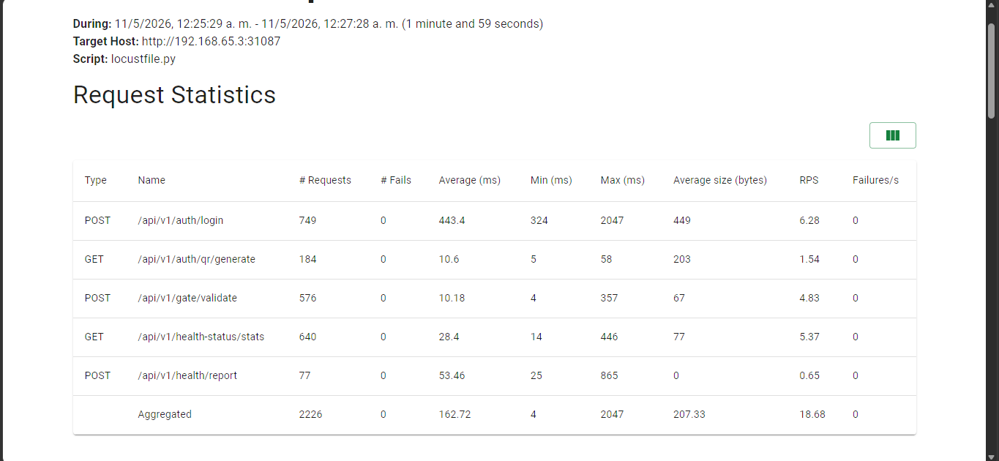
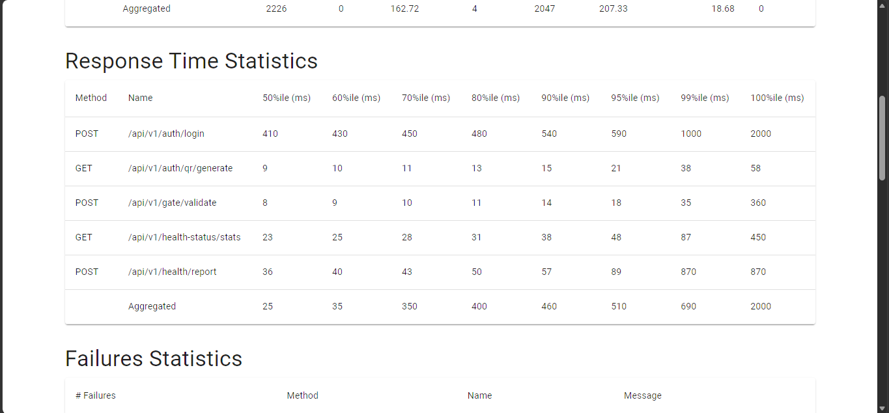

# Punto 3 - Pruebas Multinivel

## Resumen de cobertura

| Nivel | Herramienta | Cantidad |
|---|---|---|
| Unitarias | JUnit 5 + Mockito | 6 clases, 32 tests |
| Integración | JUnit 5 + Spring Test + Testcontainers | 5 clases, 19 tests |
| E2E | RestAssured contra K8s | 4 clases, 20 tests |
| Carga | Locust 2.43 (Docker headless) | 4 escenarios, 50 usuarios, 2 min |

---

## Stages del pipeline CI/CD por nivel de prueba

El `Jenkinsfile.dev` ejecuta cada nivel de prueba en un stage independiente y secuencial. Si un stage falla, el pipeline queda en estado `UNSTABLE` (no aborta) para que los reportes de todos los niveles queden siempre archivados.

```
Build → Unit Tests → Integration Tests → Deploy to K8s → E2E Tests → Load Tests
```

Los stages relevantes al punto 3 son:

**Stage `Unit Tests`** - ejecuta `./gradlew unitTest` en todos los servicios. Solo corre tests con `@Tag("unit")`. El resultado se publica como reporte JUnit en Jenkins.

**Stage `Integration Tests`** - ejecuta `./gradlew integrationTest`. Solo corre tests con `@Tag("integration")`. Testcontainers levanta instancias efímeras de PostgreSQL. El resultado se publica como reporte JUnit separado.

**Stage `E2E Tests`** - después del despliegue en K8s, abre túneles `kubectl port-forward` hacia el gateway (`:8887`) y el auth-service (`:8180`), ejecuta `./gradlew :tests:e2e:test` y destruye los túneles al finalizar. El resultado se publica como reporte JUnit.

**Stage `Load Tests`** - corre el contenedor `circleguard-locust:latest` con 50 usuarios y 2 minutos. Cuando termina, extrae el reporte HTML con `docker cp` y lo archiva como artefacto de Jenkins.

---

## 1. Pruebas Unitarias

Validan componentes individuales en aislamiento total: no se levanta contexto de Spring ni se accede a base de datos. Las clases se instancian directamente o con `@ExtendWith(MockitoExtension.class)`.

---

### `JwtTokenServiceTest` - auth-service

**Por qué es relevante:** El JWT es el mecanismo de autenticación de toda la plataforma. Cualquier fallo en la generación del token (estructura malformada, secreto débil, claims incorrectos) impide que cualquier usuario acceda al sistema. Este test valida el contrato del token antes de que llegue a cualquier servicio.

**Qué valida:**

| Test | Comportamiento esperado |
|---|---|
| `generateToken_withValidInput_returnsNonNullToken` | El servicio devuelve un token no nulo con credenciales válidas |
| `generateToken_producesThreePartJwt` | La estructura del JWT es `header.payload.signature` (3 partes separadas por `.`) |
| `generateToken_containsAnonymousIdAsSubject` | El `sub` del JWT contiene el UUID anónimo, nunca el nombre real |
| `generateToken_containsPermissionsInClaim` | Los permisos del usuario se incluyen en el claim `roles` |
| `generateToken_differentCallsProduceDifferentTokens` | Dos llamadas sucesivas producen tokens distintos (diferente `iat`) |

---

### `CustomUserDetailsServiceTest` - auth-service

**Por qué es relevante:** CircleGuard admite dos cadenas de autenticación: LDAP (usuarios universitarios) y base de datos local (fallback). Este test valida la cadena local - si falla, ningún usuario sin cuenta LDAP puede autenticarse, y el sistema de fallback queda inoperativo.

**Qué valida:**

| Test | Comportamiento esperado |
|---|---|
| `existingActiveUser_returnsUserDetails` | Un usuario activo existente se carga correctamente |
| `activeUserWithRole_hasRolePrefixedAuthority` | El rol se expone con prefijo `ROLE_` según la convención de Spring Security |
| `activeUserWithPermission_hasGranularAuthority` | Los permisos granulares se mapean correctamente a authorities |
| `unknownUser_throwsUsernameNotFoundException` | Un usuario inexistente lanza `UsernameNotFoundException` |
| `inactiveUser_throwsDisabledException` | Un usuario desactivado lanza `DisabledException` (no `BadCredentialsException`) |

---

### `BuildingServiceTest` - promotion-service

**Por qué es relevante:** El grafo de contactos en Neo4j está organizado jerárquicamente: Edificio → Piso → Punto de acceso. Si se permite eliminar un edificio que tiene pisos, se generan nodos huérfanos en Neo4j que rompen las consultas de trazabilidad de contactos. Este test protege la integridad referencial del grafo.

**Qué valida:**

| Test | Comportamiento esperado |
|---|---|
| `createBuilding_withValidData_persistsBuildingWithCorrectFields` | Los campos del edificio se persisten sin alteración |
| `deleteBuilding_withNoFloors_deletesSuccessfully` | Se permite eliminar un edificio sin pisos asociados |
| `deleteBuilding_withExistingFloors_throwsRuntimeException` | Se rechaza la eliminación si el edificio tiene pisos (integridad del grafo) |
| `updateBuilding_withUnknownId_throwsRuntimeException` | Actualizar un ID inexistente lanza excepción |
| `updateBuilding_withExistingId_updatesAllFields` | Todos los campos se actualizan correctamente |

---

### `CircleServiceTest` - promotion-service

**Por qué es relevante:** Los círculos de contacto son la unidad central del rastreo: cuando un usuario se declara positivo, el motor recorre los círculos para escalar el estado de sus contactos. Un error en la generación de códigos de invitación o en la lógica de cierre de círculos puede causar que contactos no sean notificados.

**Qué valida:**

| Test | Comportamiento esperado |
|---|---|
| `createCircle_generatesInviteCodeWithMeshPrefix` | El código de invitación siempre inicia con `MESH-` (identificable y no colisionable) |
| `createCircle_persistsCorrectNameAndLocation` | El nombre y ubicación se persisten sin modificación |
| `joinCircle_withInvalidCode_throwsRuntimeException` | Un código de invitación inválido es rechazado |
| `forceFenceCircle_promotesActiveMembers` | Al cerrar un círculo, los miembros activos son escalados correctamente |
| `getUserCircles_withUnknownUser_returnsEmptyList` | Un usuario sin círculos recibe lista vacía (no excepción) |

---

### `TemplateServiceUnitTest` - notification-service

**Por qué es relevante:** El notification-service es el único canal de alerta a usuarios expuestos. Si el contenido de los mensajes push/SMS/email falla (texto nulo, formato incorrecto, deep link roto), los usuarios no reciben la alerta de exposición - el propósito principal de la plataforma falla. Este test protege la generación del contenido de las notificaciones.

**Qué valida:**

| Test | Comportamiento esperado |
|---|---|
| `buildPushContent_forSuspectStatus_containsWarningText` | El mensaje push para `SUSPECT` incluye texto de advertencia |
| `buildPushContent_forProbableStatus_containsAlertText` | El mensaje push para `PROBABLE` incluye texto de alerta más urgente |
| `buildSmsContent_containsStatusAndAppName` | El SMS incluye el nombre de la app y el estado de exposición |
| `buildPushMetadata_withDeepLink_includesLink` | El metadata incluye el deep link cuando está configurado |
| `buildPushMetadata_withoutDeepLink_excludesLink` | El metadata no incluye el campo de link cuando no está configurado |
| `buildEmailFallback_returnsNonNullSubjectAndBody` | El fallback de email siempre produce asunto y cuerpo no nulos |

---

### `KAnonymityFilterTest` - dashboard-service

**Por qué es relevante:** El dashboard expone estadísticas de salud por departamento/edificio. Sin k-anonimidad, una consulta de "edificio X con solo 2 personas" puede revelar implícitamente quién es el infectado. Este filtro es un requisito de privacidad de la plataforma: si falla, el dashboard viola los principios de privacidad que CircleGuard promete.

**Qué valida:**

| Test | Comportamiento esperado |
|---|---|
| `apply_withNullStats_returnsEmptyMap` | Entrada nula devuelve mapa vacío (no excepción) |
| `apply_withSufficientTotalUsers_doesNotMaskResult` | Grupos con suficientes usuarios no son suprimidos |
| `apply_withTotalUsersBelowThreshold_masksEntireResult` | Si el total de usuarios no alcanza el umbral k, todos los conteos son suprimidos |
| `apply_withCountFieldBelowThreshold_masksIndividualCount` | Un conteo individual por debajo del umbral se enmascara aunque el total sea suficiente |
| `apply_withCustomKThreshold_masksBasedOnCustomValue` | El umbral k es configurable y se aplica correctamente |
| `apply_withEmptyStats_returnsEmptyResult` | Mapa vacío de entrada devuelve mapa vacío de salida |

---

## 2. Pruebas de Integración

Validan la interacción entre capas dentro del mismo servicio. Usan contexto parcial o completo de Spring; donde se requiere base de datos real se usa Testcontainers (PostgreSQL efímero).

---

### `AuthControllerIntegrationTest` - auth-service

**Por qué es relevante:** El controlador de login integra Spring Security, el `AuthenticationManager` y el `JwtTokenService`. Una mala configuración de seguridad puede provocar que el endpoint devuelva 403 en lugar de 401, o que filtre información sensible en el body de error. Este test valida el comportamiento HTTP real del controlador con la configuración de seguridad activa.

**Tecnología:** `@WebMvcTest` + `@Import(SecurityConfig.class)` + `@MockBean` para dependencias.

**Qué valida:**

| Test | Comportamiento esperado |
|---|---|
| `login_withValidCredentials_returnsJwtAndAnonymousId` | 200 con `token`, `type: Bearer` y `anonymousId` en el body |
| `login_withInvalidCredentials_returns401` | 401 con mensaje `"Invalid username or password"` (sin stack trace) |
| `visitorHandoff_withValidAnonymousId_returnsTokenAndHandoffPayload` | 200 con token y payload de handoff para visitantes |
| `visitorHandoff_withMissingAnonymousId_returns400` | 400 cuando el body no contiene `anonymousId` |

---

### `IdentityVaultServiceIntegrationTest` - identity-service

**Por qué es relevante:** El vault de identidades es el componente más crítico de privacidad: separa las identidades reales de los pseudónimos que circulan en Neo4j. Si el vault genera UUIDs no deterministas, el mismo usuario acumula múltiples nodos en el grafo, rompiendo la trazabilidad. Si la resolución inversa falla, el servicio de notificaciones no puede contactar al usuario.

**Tecnología:** `@SpringBootTest(webEnvironment=NONE)` con exclusión de Kafka + `@ActiveProfiles("test")`.

**Qué valida:**

| Test | Comportamiento esperado |
|---|---|
| `getOrCreateAnonymousId_sameIdentity_returnsSameUuid` | La misma identidad siempre produce el mismo UUID (determinismo) |
| `getOrCreateAnonymousId_differentIdentities_returnDifferentUuids` | Identidades distintas producen UUIDs distintos |
| `getOrCreateAnonymousId_returnsValidUuid` | El UUID generado tiene formato válido (no nulo, no vacío) |
| `resolveRealIdentity_afterCreate_returnsOriginalIdentity` | La resolución inversa devuelve exactamente la identidad original |

---

### `BuildingJpaIntegrationTest` - promotion-service

**Por qué es relevante:** El servicio de promoción usa PostgreSQL para los datos relacionales de edificios/pisos y Neo4j para el grafo de contactos. Un fallo en el mapeo JPA de edificios impediría agregar puntos de acceso al grafo. Este test valida contra PostgreSQL real (no H2) porque el esquema usa tipos y constraints específicos de Postgres.

**Tecnología:** `@DataJpaTest` + `@Testcontainers` + `PostgreSQLContainer` + `@AutoConfigureTestDatabase(replace=NONE)`.

**Qué valida:**

| Test | Comportamiento esperado |
|---|---|
| `save_building_persistsToRealPostgres` | Un edificio se persiste correctamente en PostgreSQL real |
| `findByCode_returnsCorrectBuilding` | La búsqueda por código retorna el edificio correcto |
| `findAll_returnsAllPersisted` | La consulta de todos los edificios incluye todos los persistidos |
| `findFloorsByBuilding_withNoFloors_returnsEmptyList` | Un edificio sin pisos devuelve lista vacía (no error) |

---

### `DashboardControllerIntegrationTest` - dashboard-service

**Por qué es relevante:** El dashboard es el panel de control para el equipo de salud del campus. Sus endpoints exponen estadísticas agregadas que guían decisiones operativas (cierre de edificios, alertas masivas). Un fallo en el mapeo HTTP o en la estructura del JSON devuelto rompería la interfaz del panel de control.

**Tecnología:** `@WebMvcTest(AnalyticsController.class)` + `@MockBean AnalyticsService`.

**Qué valida:**

| Test | Comportamiento esperado |
|---|---|
| `getSummary_returns200WithSummaryData` | El endpoint de resumen devuelve 200 con estructura JSON válida |
| `getDepartmentStats_withValidDepartment_returns200` | Las estadísticas por departamento se devuelven correctamente |
| `getTimeSeries_withDefaultParams_returns200` | La serie temporal funciona con parámetros por defecto |
| `getTimeSeries_withDailyPeriod_passesParamToService` | El parámetro `period=daily` se propaga al servicio |
| `getHealthBoard_returns200` | El tablero de salud devuelve 200 |

---

### `NotificationKafkaIntegrationTest` - notification-service

**Por qué es relevante:** El notification-service consume eventos Kafka de escalada de estado y despacha alertas. Si el listener no procesa correctamente los eventos o el dispatcher no es invocado para los estados críticos (`SUSPECT`, `CONFIRMED`), los usuarios expuestos no reciben alertas - la función central de la plataforma falla silenciosamente.

**Tecnología:** `@SpringBootTest(webEnvironment=NONE)` + `@MockBean` para Kafka, JavaMailSender, LmsService y WebClient.

**Qué valida:**

| Test | Comportamiento esperado |
|---|---|
| `handleStatusChange_withSuspectStatus_callsDispatcher` | El listener invoca al dispatcher cuando el status es `SUSPECT` |
| `handleStatusChange_withActiveStatus_skipsDispatch` | Cuando el status es `ACTIVE` (sin riesgo), el dispatcher NO es invocado |
| `handleStatusChange_withConfirmedStatus_callsDispatcher` | El listener invoca al dispatcher cuando el status es `CONFIRMED` |
| `handleStatusChange_withMalformedJson_doesNotThrowException` | Un JSON malformado no lanza excepción (fallo silencioso, no crash del consumidor) |

---

## 3. Pruebas E2E

Validan flujos completos de usuario contra los servicios reales desplegados en Kubernetes. No usan mocks: cada test realiza peticiones HTTP reales y verifica respuestas. Se ejecutan desde el módulo `tests/e2e/` usando RestAssured.

**Configuración:** `E2ETestConfig` inyecta las URLs de gateway y auth-service desde system properties (`-Dgateway.url`, `-Dauth.url`) para que el pipeline pueda apuntar a cualquier entorno sin modificar el código.

---

### `HealthStatusE2ETest`

**Por qué es relevante:** El endpoint de estado de salud es el más consultado de la plataforma - todos los usuarios lo consultan al ingresar al campus. Valida que el sistema de autenticación JWT funciona end-to-end en K8s y que el servicio de promoción devuelve la estructura correcta.

**Qué valida:**

| Test | Comportamiento esperado |
|---|---|
| `getHealthStatus_withoutToken_returns401` | Sin token el endpoint rechaza la petición |
| `getHealthStatus_withMalformedToken_returns401` | Token malformado es rechazado |
| `getHealthStatus_withValidToken_returns200WithStatusField` | Con token válido devuelve 200 y campo `status` en el JSON |
| `getHealthStatus_responseContainsExpectedFields` | El body incluye todos los campos requeridos por el cliente móvil |
| `getHealthStatus_multipleCallsReturnConsistentResult` | Llamadas repetidas devuelven el mismo estado (sin flicker) |

---

### `ContactRegistrationE2ETest`

**Por qué es relevante:** El flujo de validación de QR es el punto de entrada al grafo de contactos: cuando un usuario escanea su QR al entrar a un edificio, se registra un encuentro en Neo4j. Sin este flujo, no hay datos de contacto y el rastreo es imposible.

**Qué valida:**

| Test | Comportamiento esperado |
|---|---|
| `validateQr_withoutToken_returns401` | Sin token el endpoint de validación rechaza la petición |
| `validateQr_withInvalidToken_returns400OrUnprocessable` | QR con formato inválido retorna 400/422 |
| `generateQr_withValidToken_returnsQrToken` | Un usuario autenticado puede generar su código QR |
| `generateQr_tokenHasExpectedStructure` | El QR token generado tiene la estructura esperada |
| `validateQr_withExpiredToken_returnsError` | Un QR expirado es rechazado por el gateway |

---

### `StatusEscalationE2ETest`

**Por qué es relevante:** El flujo de reporte de síntomas activa la cadena de escalada: Kafka → promotion-service → notification-service → alertas. Si el endpoint de reporte falla, no se generan eventos y ningún contacto es alertado. Este test valida el punto de entrada al motor de escalada.

**Qué valida:**

| Test | Comportamiento esperado |
|---|---|
| `reportSymptoms_withoutToken_returns401` | Sin token el reporte es rechazado |
| `reportSymptoms_withValidToken_returns200Or202` | Con token válido el reporte es aceptado (200 o 202 según implementación) |
| `reportSymptoms_withInvalidPayload_returns400` | Payload malformado retorna 400 |
| `getStatusHistory_withValidToken_returnsHistory` | El historial de estado del usuario es recuperable |
| `reportAndQuery_fullFlow_statusUpdated` | Reporte seguido de consulta refleja el estado actualizado |

---

### `DashboardE2ETest`

**Por qué es relevante:** El dashboard es la interfaz de toma de decisiones del equipo de salud. Valida que los cinco endpoints del panel funcionan end-to-end en K8s, con autenticación real y datos reales del servicio de analíticas.

**Qué valida:**

| Test | Comportamiento esperado |
|---|---|
| `getSummary_withValidToken_returns200` | El resumen general del sistema devuelve 200 con datos |
| `getDepartmentStats_withValidToken_returns200` | Las estadísticas por departamento son accesibles |
| `getTimeSeries_withValidToken_returns200` | La serie temporal devuelve 200 con estructura de array |
| `getHealthBoard_withValidToken_returns200` | El tablero de salud devuelve 200 |
| `getEndpoints_withoutToken_return401` | Todos los endpoints del dashboard requieren autenticación |

---

## 4. Pruebas de Carga con Locust

### Configuración

```ini
# locust.conf
headless   = true
users      = 50        # usuarios virtuales concurrentes
spawn-rate = 5         # nuevos usuarios/segundo - ramp-up de 10 segundos hasta 50
run-time   = 2m        # duración en estado estable
html       = /tmp/report.html
```

### Escenarios de carga

Se definen 4 clases de usuario que reproducen la distribución de carga típica de un campus universitario. Los pesos (weight) determinan cuántos usuarios virtuales corresponden a cada clase al llegar a los 50 en estado estable.

| Clase | Escenario simulado | Peso | Usuarios | `wait_time` |
|---|---|---|---|---|
| `AuthUser` | Pico de autenticación al inicio de jornada | 3 | 15 | 1–3 s |
| `HealthStatusUser` | Consulta continua de estado durante el día | 4 | 20 | 2–5 s |
| `QRContactUser` | Escaneo de QR en puntos de acceso (3:1 validar vs. generar) | 2 | 10 | 1–2 s |
| `EscalationUser` | Reporte de síntomas (evento poco frecuente) | 1 | 5 | 5–10 s |

Cada clase que requiere autenticación obtiene su token en `on_start()` llamando directamente al auth-service (NodePort `31180`), separado del gateway (`31087`), ya que el gateway no enruta `/api/v1/auth/login`.

### Endpoints evaluados

| Endpoint | Servicio destino | Host en Locust |
|---|---|---|
| `POST /api/v1/auth/login` | auth-service | `LOCUST_AUTH_HOST` (:31180) |
| `GET /api/v1/auth/qr/generate` | auth-service | `LOCUST_AUTH_HOST` (:31180) |
| `POST /api/v1/gate/validate` | gateway-service | `--host` (:31087) |
| `GET /api/v1/health-status/stats` | promotion-service | `LOCUST_PROMOTION_HOST` (:31088) |
| `POST /api/v1/health/report` | promotion-service | `LOCUST_PROMOTION_HOST` (:31088) |

### Resultados finales (120 s, 50 usuarios, Locust 2.43.4)



| Endpoint | Requests | Fallos | Avg (ms) | Min (ms) | Max (ms) | Med (ms) | req/s |
|---|---|---|---|---|---|---|---|
| `POST /api/v1/auth/login` | 749 | 0 (0%) | 443 | 323 | 2047 | 410 | 6.28 |
| `GET /api/v1/auth/qr/generate` | 184 | 0 (0%) | 10 | 4 | 57 | 9 | 1.54 |
| `POST /api/v1/gate/validate` | 576 | 0 (0%) | 10 | 4 | 357 | 8 | 4.83 |
| `GET /api/v1/health-status/stats` | 640 | 0 (0%) | 28 | 14 | 445 | 23 | 5.37 |
| `POST /api/v1/health/report` | 77 | 0 (0%) | 53 | 25 | 865 | 36 | 0.65 |
| **Agregado** | **2226** | **0 (0%)** | **162** | **4** | **2047** | **25** | **18.68** |

#### Percentiles de tiempo de respuesta



| Endpoint | p50 | p90 | p95 | p99 | p99.9 | p100 |
|---|---|---|---|---|---|---|
| `POST /api/v1/auth/login` | 410 ms | 540 ms | 590 ms | 1000 ms | 2000 ms | 2047 ms |
| `GET /api/v1/auth/qr/generate` | 9 ms | 15 ms | 21 ms | 38 ms | 58 ms | 57 ms |
| `POST /api/v1/gate/validate` | 8 ms | 14 ms | 18 ms | 35 ms | 360 ms | 357 ms |
| `GET /api/v1/health-status/stats` | 23 ms | 38 ms | 48 ms | 87 ms | 450 ms | 445 ms |
| `POST /api/v1/health/report` | 36 ms | 57 ms | 89 ms | 870 ms | 870 ms | 865 ms |

### Análisis de resultados

**Tasa de errores: 0% en todos los endpoints**

Las 2.226 requests completaron sin un solo fallo. Esto confirma que el sistema soporta 50 usuarios concurrentes durante 2 minutos con la distribución de carga configurada.

**`POST /api/v1/auth/login` - latencia alta pero esperada**

El login es el endpoint más lento del conjunto: p50 de 410ms, p95 de 590ms y p99 de 1 segundo. El valor máximo de 2047ms ocurre durante los primeros 10 segundos del ramp-up, cuando los 50 usuarios obtienen su token simultáneamente en `on_start()`. Una vez que todos los tokens están disponibles, el promedio cae progresivamente de 1044ms (primer snapshot con 20 requests) a 443ms al final de la prueba, evidenciando que la contención inicial en bcrypt y LDAP se estabiliza. Esta latencia es aceptable para un evento puntual de login; no es un endpoint de alta frecuencia.

**`POST /api/v1/gate/validate` - rendimiento óptimo**

El endpoint de validación de QR es el más crítico en tiempo real: se ejecuta cada vez que un usuario escanea su código al entrar a un edificio. Con p50 de 8ms y p95 de 18ms bajo 10 usuarios concurrentes (peso 2 de 10), el gateway responde con latencias de un solo dígito de milisegundos. El valor máximo de 357ms es un outlier aislado, sin impacto en el percentil 99 (35ms). El throughput de 4.83 req/s es proporcional al peso del escenario.

**`GET /api/v1/health-status/stats` - consulta Neo4j eficiente**

Este endpoint representa el volumen más alto de la prueba (640 requests, 5.37 req/s) por ser el escenario con más usuarios (20, peso 4). La latencia p95 de 48ms indica que las consultas al grafo Neo4j responden correctamente bajo carga sostenida. El outlier máximo de 445ms aparece en los primeros snapshots del ramp-up y no se repite, lo que sugiere tiempo de calentamiento de la caché de Neo4j.

**`GET /api/v1/auth/qr/generate` - el endpoint más rápido**

Con p95 de 21ms y mediana de 9ms, la generación del token QR es la operación más ligera. Esto es esperado: el endpoint solo firma un UUID con HMAC-SHA256 sin consultas a base de datos.

**`POST /api/v1/health/report` - cola de espera con outliers altos**

Este endpoint registra solo 77 requests en 2 minutos (0.65 req/s), correspondiente a su peso 1 y wait time de 5–10 segundos. El p95 de 89ms es aceptable, pero el p99 salta a 870ms. Este outlier coincide con los primeros reportes enviados durante el ramp-up, posiblemente mientras Kafka Bootstrap establece la conexión con el broker. Los reportes posteriores (a partir del snapshot 4) se estabilizan en medianas de 36–42ms.

**Throughput agregado y comportamiento del ramp-up**

El sistema alcanza 18.68 req/s en estado estable, partiendo de 0 al inicio. El throughput crece linealmente durante el ramp-up (8 req/s a los 10s → 14.5 req/s a los 20s → 19 req/s a los 40s) y se mantiene estable entre 18.5 y 19.8 req/s durante los 110 segundos restantes, sin señales de degradación ni acumulación de errores.