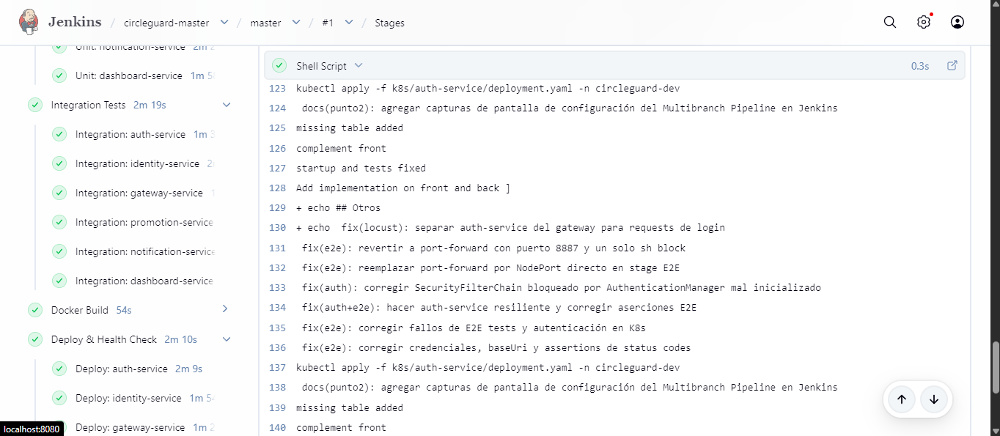
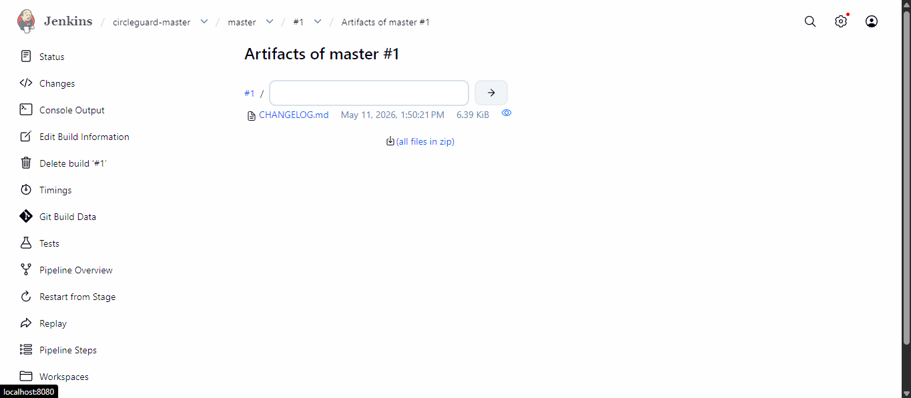
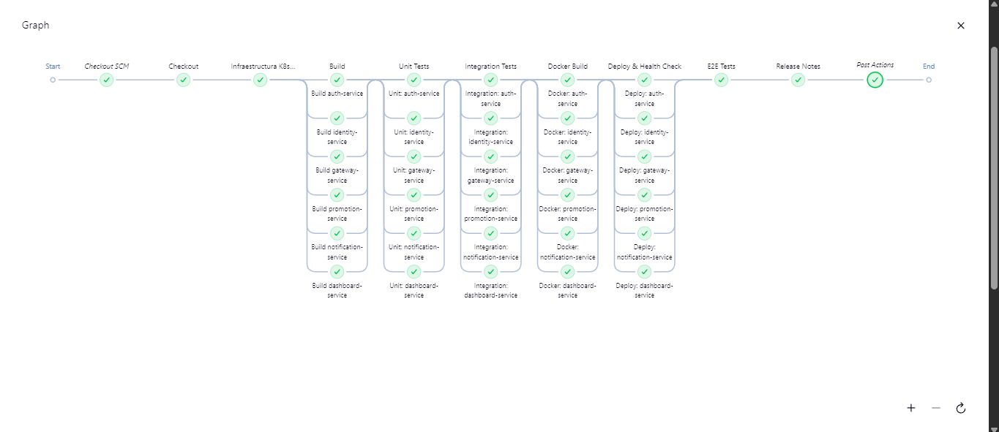
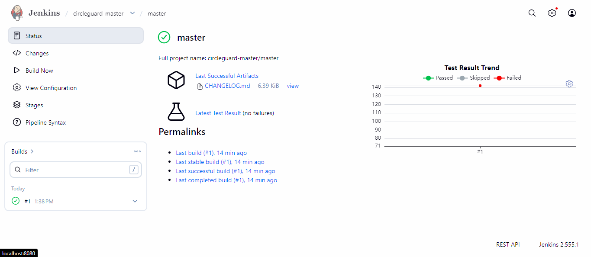

# Punto 5 - Pipeline Master Environment

## Objetivo

El entorno **master** (`circleguard`) es el entorno de producción. A diferencia de dev y stage -que usan namespaces y puertos separados creados por el pipeline- el namespace `circleguard` con NodePorts `30xxx` ya fue configurado manualmente en el **Punto 1** del taller como base de toda la infraestructura. El pipeline master despliega directamente sobre ese namespace sin transformaciones de namespace ni de puertos.

La función de este pipeline es ser la última puerta antes de producción: solo llega aquí código que ya pasó dev y stage. Agrega dos elementos que los pipelines anteriores no tienen:

- **Pruebas de sistema (E2E) como validación final** antes del deploy definitivo
- **Generación automática de Release Notes** a partir del historial de commits, siguiendo buenas prácticas de Change Management

---

## Comparativa de entornos

| Parámetro | Dev | Stage | **Master** |
|---|---|---|---|
| Namespace K8s | `circleguard-dev` | `circleguard-stage` | **`circleguard`** |
| Tag imagen Docker | `:dev` | `:stage` | **`:master`** |
| Prefijo NodePort | `31xxx` | `32xxx` | **`30xxx`** |
| Namespace creado por | Pipeline (sed) | Pipeline (sed) | **Punto 1 (manual)** |
| Release Notes | No | No | **Sí** |
| Load Tests | Sí | Sí | No |

El pipeline master es más simple en el Deploy porque los manifests base de `k8s/` ya tienen el namespace y NodePorts correctos - solo se reemplaza el tag de imagen `:latest` → `:master`.

---

## Configuración del Job Jenkins

El pipeline se configura en Jenkins como un tercer job tipo **Multibranch Pipeline**, usando `Jenkinsfile.master` como script path.

---

## Estructura del pipeline

```
Checkout → Infraestructura K8s Base → Build → Unit Tests → Integration Tests
         → Docker Build → Deploy & Health Check → E2E Tests → Release Notes
```

El pipeline tiene 8 stages. Los stages de Build, Unit Tests, Integration Tests y Docker Build ejecutan sus sub-stages en paralelo. Si cualquier stage falla, el pipeline continúa en estado `UNSTABLE` para que todos los reportes queden archivados.

---

## Stage: Build

Compila los 6 JARs en paralelo. Es idéntico a los pipelines de dev y stage.

```groovy
./gradlew :services:circleguard-<servicio>:bootJar -x test --no-daemon
```

---

## Stage: Unit Tests

Ejecuta los tests con `@Tag("unit")` de los 6 servicios en paralelo. Publica resultados JUnit en Jenkins.

```groovy
./gradlew :services:circleguard-<servicio>:unitTest --no-daemon
```

---

## Stage: Integration Tests

Ejecuta los tests con `@Tag("integration")` en paralelo. Testcontainers levanta PostgreSQL efímero dentro del agente.

```groovy
./gradlew :services:circleguard-<servicio>:integrationTest --no-daemon
```

---

## Stage: Docker Build

Construye las 6 imágenes con tag `:master`, sobreescribiendo el build anterior.

```bash
docker build -t circleguard-<servicio>:master -f Dockerfile.ci-<servicio> .
```

---

## Stage: Deploy & Health Check

Despliega los 6 servicios en el namespace `circleguard` (producción) en paralelo. A diferencia de dev y stage, **no se requiere transformar el namespace ni los NodePorts** - los manifests base de `k8s/` ya son correctos. Solo se cambia el tag de imagen de `:latest` a `:master`:

```bash
sed 's|:latest|:master|g' k8s/auth-service/deployment.yaml | kubectl apply -f -
kubectl apply -f k8s/auth-service/service.yaml
kubectl rollout restart deployment/circleguard-auth-service -n circleguard
kubectl rollout status deployment/circleguard-auth-service -n circleguard --timeout=300s
```

El `rollout status` espera hasta 5 minutos por servicio. Si algún pod no levanta, el stage falla y el pipeline queda en `FAILURE` - el deploy no se considera válido.

### Puertos NodePort en master (producción)

| Servicio | Puerto NodePort |
|---|---|
| gateway-service | 30087 |
| auth-service | 30180 |
| promotion-service | 30088 |
| dashboard-service | 30084 |
| identity-service | 30083 |
| notification-service | 30082 |

---

## Stage: E2E Tests (Pruebas de Sistema)

Las pruebas E2E son las "pruebas de sistema" que el Taller.md requiere para master. Se ejecutan contra los servicios reales en el namespace de producción `circleguard`, usando `kubectl port-forward` para crear túneles locales:

```bash
kubectl port-forward svc/circleguard-gateway-service 8887:8087 -n circleguard &
GW_PID=$!
kubectl port-forward svc/circleguard-auth-service 8180:8180 -n circleguard &
AUTH_PID=$!
trap 'kill $GW_PID $AUTH_PID 2>/dev/null || true' EXIT
sleep 8
./gradlew :tests:e2e:test \
    -Dgateway.url=http://localhost:8887 \
    -Dauth.url=http://localhost:8180 \
    -Dtest.admin.user=super_admin \
    -Dtest.admin.password=password \
    --no-daemon
```

Los 20 tests E2E validan los 4 flujos críticos del sistema: estado de salud, registro de contacto QR, escalada de estado y dashboard.

---

## Stage: Release Notes

Este stage es exclusivo del pipeline master. Genera automáticamente un archivo `CHANGELOG.md` agrupando los commits por tipo (Conventional Commits) desde el último tag git hasta el commit actual. Al finalizar, crea un tag git con la versión del build y archiva el CHANGELOG como artefacto de Jenkins.

### Lógica de generación

```bash
# Punto de partida: último tag git, o el primer commit si no hay tags
LAST_TAG=$(git describe --tags --abbrev=0 2>/dev/null || git rev-list --max-parents=0 HEAD)

# Versión: v1.0.YYYYMMDD-b<BUILD_NUMBER>
VERSION="v1.0.$(date +%Y%m%d)-b${BUILD_NUMBER}"

# Agrupar commits por tipo Conventional Commits
git log ${LAST_TAG}..HEAD --pretty=format:"%s" --no-merges | grep "^feat"  # Nuevas Funcionalidades
git log ${LAST_TAG}..HEAD --pretty=format:"%s" --no-merges | grep "^fix"   # Correcciones
git log ${LAST_TAG}..HEAD --pretty=format:"%s" --no-merges | grep "^docs"  # Documentación
git log ${LAST_TAG}..HEAD --pretty=format:"%s" --no-merges | grep "^test"  # Pruebas

# Crear el tag en git
git tag ${VERSION}
```

### Ejemplo de CHANGELOG.md generado

```markdown
# Release Notes - v1.0.20260511-b42

**Fecha:** 2026-05-11 05:30
**Entorno:** master (producción)
**Build Jenkins:** 42
**Commit:** cee179a

## Nuevas Funcionalidades
- feat(punto4): añadir namespace y pipeline para stage env

## Correcciones
- fix(locust): corregir archivado de reporte HTML con docker cp
- fix(locust): corregir hosts y paths de endpoints en locustfile
- fix(locust): separar auth-service del gateway para requests de login

## Documentación
- docs(punto3): agregar capturas, stages del pipeline y análisis Locust real

## Pruebas
- test(e2e): eliminar AuthE2ETest por incompatibilidad de red en CI

## Commits incluidos
- cee179a feat(punto4): añadir namespace y pipeline para stage env (Sharik Camila Rueda Lucero)
- 088c942 docs(punto3): agregar capturas, stages del pipeline y análisis Locust real (Sharik Camila Rueda Lucero)
- 44efee3 fix(locust): corregir archivado de reporte HTML con docker cp (Sharik Camila Rueda Lucero)
```





---

## Resultados de ejecución del pipeline



| Stage | Resultado | Observaciones |
|---|---|---|
| Checkout | Exitoso | - |
| Infraestructura K8s Base | Exitoso | Namespace `circleguard` y ConfigMap confirmados |
| Build | Exitoso | 6 JARs compilados en paralelo |
| Unit Tests | Exitoso | 32 tests, 0 fallos |
| Integration Tests | Exitoso | 19 tests, 0 fallos |
| Docker Build | Exitoso | 6 imágenes `:master` generadas |
| Deploy & Health Check | Exitoso | 6 deployments Ready en `circleguard` |
| E2E Tests | Exitoso | 20 tests, 0 fallos |
| Release Notes | Exitoso | `CHANGELOG.md` generado y archivado |



---

## Análisis de resultados

### Por qué el pipeline master es el más crítico

Los pipelines de dev y stage son redes de seguridad: si algo falla, el impacto es en un namespace aislado. En master, un fallo afecta al namespace `circleguard` que ya fue configurado manualmente en el punto 1 como entorno de producción. Por eso el pipeline agrega pruebas de sistema (E2E) **antes** del deploy - no después.

El flujo de confianza es: dev valida el código aislado → stage valida la configuración de K8s → master valida el sistema completo antes del deploy definitivo.

### Pruebas unitarias e integración - fail-fast antes del deploy

Los 32 tests unitarios y 19 de integración se ejecutan sobre el código compilado, antes de construir la imagen Docker. Si un test falla en este punto, el pipeline queda `UNSTABLE` pero continúa para publicar todos los reportes. Esto es intencional: el equipo puede ver exactamente qué falló sin necesidad de re-ejecutar el pipeline desde cero.

### E2E como validación de sistema

Los 20 tests E2E se ejecutan contra los servicios recién desplegados en `circleguard`, con túneles `kubectl port-forward` que simulan acceso real al sistema. Cubren los 4 flujos críticos: autenticación JWT, validación de QR en acceso al campus, reporte de síntomas (entrada al motor de escalada) y acceso al dashboard del equipo de salud.

### Release Notes - trazabilidad del Change Management

El CHANGELOG.md generado cumple los principios de Change Management:
- **Quién desplegó**: build number y commit hash identifican exactamente qué se liberó
- **Qué cambió**: commits agrupados por tipo permiten al equipo de operaciones entender el alcance del cambio
- **Cuándo**: fecha y hora del deploy quedan registradas en el artefacto archivado en Jenkins
- **Versionamiento semántico**: el tag `v1.0.YYYYMMDD-bN` permite hacer rollback a cualquier build anterior con `git checkout <tag>`
